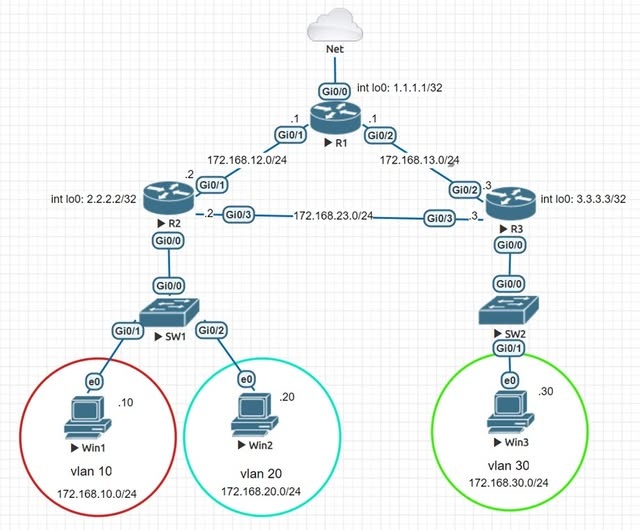

# CCNP ENCOR LAB | CẤU HÌNH QoS POLICY & SHAPE – KIỂM SOÁT TRAFFIC TRÊN ROUTER CISCO

##  1. GIỚI THIỆU

Trong thực tế, không phải traffic nào đi qua router cũng nên được xử lý giống nhau.

Có những traffic cần được ưu tiên và giữ tốc độ ổn định, có traffic chỉ được phép sử dụng một mức bandwidth nhất định, thậm chí một số loại traffic phải bị drop hoàn toàn.

Trong bài lab này, mình thực hành mô hình **QoS (Quality of Service)** gồm **3 Router Cisco, 2 Switch và 3 PC**, tập trung vào các kỹ thuật:

- **Traffic Classification:** Phân loại lưu lượng mạng.
- **DSCP Marking:** Đánh dấu mức độ ưu tiên của traffic.
- **Traffic Policing:** Giới hạn băng thông và xử lý traffic vượt ngưỡng.
- **Traffic Shaping:** Điều tiết tốc độ truyền bằng cơ chế hàng đợi.
- **Policy Verification:** Kiểm tra hiệu quả của QoS Policy.

Workflow chính:

**Classify → Mark DSCP → Police/Shape → Verify**

---

## 2. NETWORK TOPOLOGY



### 2.1. Thiết bị sử dụng

| Thiết bị | Vai trò |
|---|---|
| R1 | Core Router |
| R2 | Router kết nối VLAN 10 và VLAN 20 |
| R3 | Router kết nối VLAN 30 |
| SW1 | Switch kết nối Win1 và Win2 |
| SW2 | Switch kết nối Win3 |
| Win1 | Client VLAN 10 |
| Win2 | Client VLAN 20 |
| Win3 | Client VLAN 30 |

### 2.2. IP Addressing

| Network | Subnet |
|---|---|
| VLAN 10 | 172.168.10.0/24 |
| VLAN 20 | 172.168.20.0/24 |
| VLAN 30 | 172.168.30.0/24 |
| R1 – R2 | 172.168.12.0/24 |
| R1 – R3 | 172.168.13.0/24 |
| R2 – R3 | 172.168.23.0/24 |

**Loopback Interfaces:**

- R1: `1.1.1.1/32`
- R2: `2.2.2.2/32`
- R3: `3.3.3.3/32`

---

## 3. BƯỚC 1 – DỰNG TOPOLOGY VÀ KIỂM TRA CONNECTIVITY

Trước khi cấu hình QoS, mình hoàn thiện phần network cơ bản.

Các công việc chính:

1. Đặt hostname và IP Address cho Router/Switch.
2. Cấu hình OSPF giữa R1, R2 và R3.
3. Cấu hình Router-on-a-Stick cho các VLAN.
4. Thiết lập Default Gateway cho các PC.
5. Kiểm tra connectivity giữa các subnet.

### Verification

Trên Router Cisco:

```
show ip interface brief
show ip route
show ip ospf neighbor
```

Kiểm tra kết nối:

```
ping 172.168.10.10
ping 172.168.20.20
ping 172.168.30.30
```

**Mục tiêu:** Routing phải hoạt động bình thường trước khi triển khai QoS.

Nếu VLAN hoặc routing chưa thông, khi kiểm tra QoS sẽ rất dễ nhầm giữa lỗi network và lỗi policy.

---

## 4. BƯỚC 2 – CLASSIFY TRAFFIC TRÊN R2

Phần quan trọng nhất bắt đầu từ R2.

Traffic từ VLAN 10 và VLAN 20 được chia thành hai nhóm:

- **Local Traffic:** Traffic đi đến các network nội bộ.
- **External Traffic:** Traffic đi ra ngoài mạng.

### 4.1. Phân loại traffic bằng ACL

Mình sử dụng `class-map`, VLAN matching và ACL để xác định traffic.

Ví dụ ACL nhận diện traffic có destination thuộc dải mạng nội bộ:

```
ip access-list extended local
 permit ip any 172.168.0.0 0.0.255.255
```

Sau đó tạo các class-map để kết hợp VLAN và ACL.

Ví dụ:

- `vlan10-local`
- `vlan10-external`
- `vlan20-local`
- `vlan20-external`

### 4.2. DSCP Marking

Sau khi phân loại, traffic được đánh dấu bằng các giá trị DSCP.

| VLAN | Traffic Type | DSCP |
|---|---|---|
| VLAN 10 | Local | EF |
| VLAN 10 | External | AF11 |
| VLAN 20 | Local | EF |
| VLAN 20 | External | AF12 |

**Ý nghĩa:**

- **EF (Expedited Forwarding):** DSCP thường sử dụng cho traffic cần độ trễ thấp.
- **AF11:** Assured Forwarding, Class 1, Drop Precedence 1.
- **AF12:** Assured Forwarding, Class 1, Drop Precedence 2.

Lưu ý: DSCP chỉ là giá trị đánh dấu. Để thực sự ưu tiên hoặc giới hạn traffic, cần có QoS Policy tương ứng.

### 4.3. Apply QoS Policy

Sau khi xây dựng policy-map, mình apply theo chiều **input** trên các sub-interface phù hợp của R2.

Kiểm tra:

```
show policy-map interface
```

Khi verify, mình tập trung vào:

- Class nào đang match traffic.
- Số packet/byte được phân loại.
- Giá trị DSCP được đánh dấu.
- Counter có tăng khi tạo traffic hay không.

**Kết quả mong đợi:** Traffic được phân loại vào đúng các class và đánh dấu DSCP EF, AF11 hoặc AF12 theo policy.

---

## 5. BƯỚC 3 – TRAFFIC POLICING & SHAPING TRÊN R2

Sau khi hoàn thành DSCP Marking, mình tiếp tục sử dụng những giá trị DSCP này để kiểm soát traffic.

### 5.1. Tạo Class-map

**Class AF11:**

```
class-map match-all af11
 match dscp af11
```

**Class AF12:**

```
class-map match-all af12
 match dscp af12
```

**Class EF:**

```
class-map match-all ef
 match dscp ef
```

### 5.2. Traffic Policing

Với AF11, traffic được police ở mức:

**CIR = 20,000 bps (20 Kbps)**

- Conform: Transmit.
- Exceed: Drop.

Với AF12:

**CIR = 18,000 bps (18 Kbps)**

- Conform: Giữ DSCP AF12.
- Exceed: Remark thành DSCP AF13.

| Traffic Class | CIR | Conform Action | Exceed Action |
|---|---|---|---|
| AF11 | 20 Kbps | Transmit | Drop |
| AF12 | 18 Kbps | Transmit | Remark AF13 |

**Điểm cần hiểu:** Policing kiểm soát tốc độ bằng cách xử lý các packet vượt ngưỡng. Tùy chính sách, packet vượt ngưỡng có thể bị drop hoặc remark.

### 5.3. Traffic Shaping

Riêng traffic EF được cấu hình shaping với:

- **CIR:** 20,000 bps.
- **Bc:** 80,000 bits.

Shaping không đơn thuần drop traffic vượt tốc độ như policing. Nó sử dụng cơ chế queue để điều tiết tốc độ truyền trung bình.

### 5.4. Apply Output Policy

Policy được apply theo chiều **output** trên các interface cần kiểm soát.

Kiểm tra:

```
show policy-map interface
```

Những thông số quan trọng cần quan sát:

- `conformed`
- `exceeded`
- `queue`
- `shape rate`
- `drop`

### 5.5. Verification

Với AF11:

- Kiểm tra số packet conform.
- Kiểm tra số packet exceed.
- Xác nhận traffic vượt ngưỡng bị drop.

Với AF12:

- Kiểm tra packet conform.
- Kiểm tra packet exceed được remark thành AF13.

Với EF:

- Xác nhận shaping rate ở mức 20 Kbps.
- Kiểm tra queue và các counter liên quan.

**Kết quả cần xác nhận:** EF được shape theo tốc độ cấu hình, trong khi AF11 và AF12 được xử lý bằng policing đúng với policy.

---

## 6. BƯỚC 4 – XỬ LÝ TRAFFIC ĐẶC THÙ TRÊN R3

Phần cuối của bài lab được triển khai trên R3.

Mục tiêu là phân loại và xử lý hai nhóm traffic:

1. Telnet Traffic.
2. HTTP Traffic có URL thuộc danh sách cần chặn.

### 6.1. Classify Telnet Traffic

Sử dụng NBAR để nhận diện Telnet:

```
match protocol telnet
```

Traffic Telnet được áp dụng shaping:

**CIR = 2,000,000 bps (2 Mbps)**

**Bc = 8,000,000 bits**

### 6.2. Classify HTTP URL

Nhận diện HTTP traffic có URL chứa những pattern:

```
*.net*
*.exe*
*.eml*
```

Mục tiêu là xây dựng policy để drop traffic thuộc những nhóm URL này.

Lưu ý: Khả năng match URL phụ thuộc vào IOS/NBAR và phiên bản hỗ trợ. Với HTTPS được mã hóa, không thể giả định router luôn đọc được toàn bộ URL.

### 6.3. QoS Policy trên R3

| Traffic | Action | Bandwidth |
|---|---|---|
| Telnet | Shape | 2 Mbps |
| HTTP URL match | Drop | — |

Policy được apply theo chiều output trên:

- `GigabitEthernet0/2`
- `GigabitEthernet0/3`

### 6.4. Verification

Kiểm tra:

```
show policy-map interface g0/2
```

Và:

```
show policy-map interface g0/3
```

Các thông số cần xác nhận:

- Telnet traffic match đúng class.
- Shaping rate là 2 Mbps.
- Bc là 8 Mbps.
- HTTP traffic match vào class tương ứng.
- Counter drop tăng khi có traffic phù hợp.

**Kết quả cần đạt:** Router nhận diện đúng traffic và áp dụng hành động theo QoS Policy đã cấu hình.

---

## 7. QOS TROUBLESHOOTING & VERIFICATION

Một trong những phần quan trọng nhất của QoS Lab là kiểm tra xem policy có thực sự hoạt động hay không.

### Các lệnh kiểm tra

```
show class-map
show policy-map
show policy-map interface
show running-config
show ip interface brief
show ip route
```

### Troubleshooting Checklist

- [ ] Interface đang hoạt động bình thường.
- [ ] OSPF Neighbor đã được thiết lập.
- [ ] Các VLAN có thể liên lạc đúng thiết kế.
- [ ] ACL match đúng source/destination.
- [ ] Class-map nhận diện đúng traffic.
- [ ] DSCP được đánh dấu chính xác.
- [ ] Service-policy được apply đúng interface.
- [ ] Policy được apply đúng chiều input/output.
- [ ] Policing counters hoạt động.
- [ ] Shaping rate đúng với cấu hình.
- [ ] Drop/Remark counters phản ánh traffic kiểm thử.

Nếu traffic không được xử lý như mong muốn, mình kiểm tra lần lượt:

**ACL → Class-map → Policy-map → Interface Direction → Counters**

Thay vì chỉ nhìn vào running-config, cần tạo traffic thực tế và theo dõi counters để xác nhận QoS đang hoạt động.

---

## 8. KẾT LUẬN

Điểm quan trọng nhất mình rút ra từ bài lab này là:

**QoS không đơn giản chỉ là giới hạn bandwidth.**

Một workflow QoS hoàn chỉnh có thể triển khai theo chuỗi:

**Classify → Mark DSCP → Police/Shape → Verify**

Qua bài lab, mình hiểu rõ hơn:

- Cách phân loại traffic dựa trên VLAN, ACL và protocol.
- Cách đánh dấu DSCP theo từng nhóm lưu lượng.
- Sự khác biệt giữa Traffic Policing và Traffic Shaping.
- Cách sử dụng Policy-map để kiểm soát traffic.
- Cách kiểm tra QoS thông qua counters trên router Cisco.
- Cách troubleshooting khi QoS Policy không hoạt động như mong muốn.

Đây là một bài lab phù hợp để luyện tập kiến thức **CCNP ENCOR (350-401)**, đặc biệt trong phần **Quality of Service (QoS)**.

Điều quan trọng không chỉ là ghi nhớ câu lệnh, mà phải hiểu traffic đang được phân loại ở đâu, được đánh dấu như thế nào và được kiểm soát tại interface nào.

---

