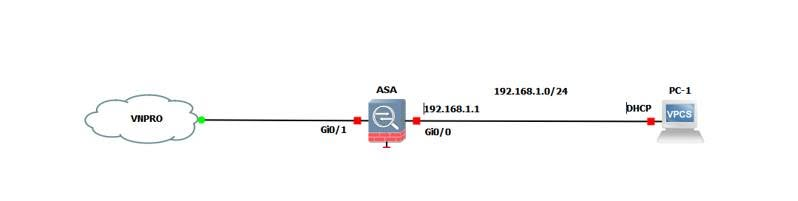

# CISCO ASA LAB – BASIC FIREWALL CONFIGURATION WITH ASDM

## Giới thiệu

Bài lab làm quen với thiết bị Firewall Cisco ASA **(Adaptive Security Appliance)**, cấu hình ASA thông qua **ASDM (Adaptive Security Device Manager)**.

Chúng ta sẽ cấu hình Cisco ASA để máy tính trong mạng LAN có thể:

- Nhận địa chỉ IP tự động từ DHCP Server.
- Kết nối đến Firewall Cisco ASA.
- Truy cập mạng bên ngoài thông qua NAT/PAT.
- Kiểm tra kết nối và các chính sách bảo mật cơ bản.

---

## 1. MÔ HÌNH LAB

### 1.1. Network Topology



Các thành phần trong hệ thống:

| Thiết bị | Vai trò |
|---|---|
|Môi trường|GNS3|
| Cisco ASA | Firewall, DHCP Server, NAT/PAT |
| PC-1 | Client trong mạng LAN |
| Cloud | Mô phỏng mạng Outside/Internet |

Tải GNS3 [tại đây](https://www.gns3.com/software/download)

Tải Cisco ASA [tại đây](https://gns3.com/marketplace/appliances/cisco-asa)

Tải asav9-12-4-18.qcow2 [tại đây](https://upw.io/4wb/asav9-12-4-18.qcow2)

### 1.2. Thông số cấu hình

| Interface | Nameif | Security Level | IP Address |
|---|---|---|---|
| Gi0/0 | inside | 100 | 192.168.1.1/24 |
| Gi0/1 | outside | 0 | DHCP |

**Mạng LAN:** `192.168.1.0/24`

**Default Gateway của PC:** `192.168.1.1`

### 1.3. Luồng hoạt động

```text
PC-1
  |
  | DHCP Client
  | Network: 192.168.1.0/24
  |
  v
Cisco ASA Firewall
  |
  | Gi0/0 - Inside
  | IP: 192.168.1.1/24
  | Security Level: 100
  |
  | NAT/PAT
  |
  | Gi0/1 - Outside
  | IP: DHCP
  | Security Level: 0
  |
  v
VNPRO Cloud / Internet
```

---

## 2. MỤC TIÊU LAB

Trong bài Lab này, chúng ta thực hiện:

- [ ] Cấu hình địa chỉ IP cho Interface Inside.
- [ ] Cấu hình Interface Outside nhận IP bằng DHCP.
- [ ] Cho phép quản trị ASA thông qua ASDM.
- [ ] Tạo tài khoản Administrator.
- [ ] Cấu hình ASA làm DHCP Server.
- [ ] Cấu hình NAT Overload (PAT).
- [ ] Kiểm tra Security Policy cho lưu lượng đi ra Outside.
- [ ] Kiểm tra kết nối từ PC đến ASA.
- [ ] Kiểm tra khả năng truy cập mạng bên ngoài.

---

## 3. BƯỚC 1 – CHUẨN BỊ ASA ĐỂ TRUY CẬP ASDM

### 3.1. Cấu hình Interface Inside

Truy cập Cisco ASA bằng CLI và thực hiện:

```cisco
enable
configure terminal

interface GigabitEthernet0/0
 nameif inside
 security-level 100
 ip address 192.168.1.1 255.255.255.0
 no shutdown
exit
```

**Giải thích:**

- `nameif inside`: Đặt tên cho vùng mạng nội bộ.
- `security-level 100`: Thiết lập mức độ tin cậy cao nhất.
- `ip address`: Cấu hình địa chỉ IP của Interface.
- `no shutdown`: Kích hoạt Interface.

### 3.2. Tạo tài khoản quản trị

```cisco
username admin password vnpro privilege 15
aaa authentication http console LOCAL
```

Tài khoản sử dụng trong môi trường Lab:

| Thông số | Giá trị |
|---|---|
| Username | admin |
| Password | vnpro |
| Privilege | 15 |

> ⚠️ **Lưu ý:** Đây chỉ là tài khoản mẫu dành cho môi trường Lab. Trong môi trường Production, cần sử dụng mật khẩu mạnh và quản lý tài khoản theo nguyên tắc Least Privilege.

### 3.3. Kích hoạt HTTP Server

Để cho phép ASDM quản trị ASA qua HTTPS:

```cisco
http server enable
http 192.168.1.0 255.255.255.0 inside
```

Lệnh trên cho phép các thiết bị trong mạng `192.168.1.0/24` truy cập giao diện quản trị ASA qua Interface Inside.

### 3.4. Truy cập ASDM

Trên máy tính quản trị cùng mạng Inside, mở trình duyệt và truy cập:

```text
https://192.168.1.1
```

Sau đó:

1. Truy cập giao diện quản trị Cisco ASA.
2. Chọn **Install ASDM Launcher** nếu phiên bản ASA hỗ trợ.
3. Cài đặt và mở ASDM.
4. Nhập địa chỉ IP ASA.
5. Đăng nhập bằng tài khoản Administrator.

> **Lưu ý:** Máy VPCS trong topology chỉ dùng để kiểm tra mạng qua CLI, không có trình duyệt để chạy ASDM. Cần sử dụng một máy tính hoặc VM có trình duyệt, kết nối được đến mạng Inside để quản trị qua ASDM. Phiên bản ASDM và Java cũng cần tương thích với ASA.

---

## 4. BƯỚC 2 – CẤU HÌNH INTERFACE BẰNG ASDM

Sau khi đăng nhập thành công vào ASDM, truy cập:

**Configuration → Device Setup → Interface Setup → Interfaces**

Tại đây, chúng ta có thể quản lý các Interface của Firewall.

### 4.1. Cấu hình Interface Inside

Thiết lập:

| Thông số | Giá trị |
|---|---|
| Interface | GigabitEthernet0/0 |
| Interface Name | inside |
| Security Level | 100 |
| IP Address | 192.168.1.1 |
| Subnet Mask | 255.255.255.0 |
| Enable Interface | Yes |

Sau khi hoàn thành, nhấn **Apply**.

### 4.2. Cấu hình Interface Outside

Chọn Interface `GigabitEthernet0/1` và cấu hình:

| Thông số | Giá trị |
|---|---|
| Interface Name | outside |
| Security Level | 0 |
| IP Address | DHCP |
| Enable Interface | Yes |

Trong phần IP Address, chọn:

- **Obtain Address via DHCP**
- **Obtain Default Route using DHCP**

Sau đó nhấn **Apply** để đẩy cấu hình xuống ASA.

### 4.3. Kiểm tra bằng CLI

```cisco
show interface ip brief
show route
show running-config interface GigabitEthernet0/0
show running-config interface GigabitEthernet0/1
```

**Kết quả mong đợi:**

- Gi0/0 hoạt động với IP `192.168.1.1`.
- Gi0/1 nhận IP từ DHCP Server phía Outside.
- ASA có Default Route trỏ về mạng Outside.

---

## 5. BƯỚC 3 – CẤU HÌNH DHCP SERVER

Cisco ASA có thể hoạt động như một DHCP Server để tự động cấp địa chỉ IP cho các thiết bị trong mạng Inside.

### 5.1. Truy cập DHCP Server trong ASDM

Đi đến:

**Configuration → Device Management → DHCP → DHCP Server**

Sau đó:

1. Chọn Interface **Inside**.
2. Chọn **Edit**.
3. Tích chọn **Enable DHCP Server**.
4. Cấu hình DHCP Address Pool.
5. Nhập DNS Server.
6. Chọn **OK**.
7. Chọn **Apply**.

### 5.2. Thông số DHCP

Ví dụ:

| Thông số | Giá trị |
|---|---|
| DHCP Interface | inside |
| DHCP Pool | 192.168.1.100 – 192.168.1.150 |
| Subnet Mask | 255.255.255.0 |
| Default Gateway | 192.168.1.1 |
| DNS Server | 8.8.8.8 |

### 5.3. Cấu hình DHCP bằng CLI

Có thể thực hiện tương đương bằng lệnh:

```cisco
configure terminal

dhcpd address 192.168.1.100-192.168.1.150 inside
dhcpd dns 8.8.8.8
dhcpd enable inside
```

Kiểm tra:

```cisco
show dhcpd binding
show running-config dhcpd
```

**Kết quả mong đợi:**

PC trong mạng LAN có thể nhận IP tự động từ DHCP Server trên ASA.

---

## 6. BƯỚC 4 – CẤU HÌNH NAT OVERLOAD (PAT)

Để các thiết bị trong mạng Inside có thể truy cập mạng Outside, cần cấu hình NAT/PAT.

### 6.1. Mục đích

Mạng Inside sử dụng dải địa chỉ:

```text
192.168.1.0/24
```

Trong khi Interface Outside nhận địa chỉ IP từ DHCP Server.

PAT cho phép nhiều thiết bị trong mạng Inside sử dụng chung địa chỉ IP của Interface Outside khi truy cập mạng bên ngoài.

### 6.2. Cấu hình PAT bằng CLI

```cisco
configure terminal

object network INSIDE-NET
 subnet 192.168.1.0 255.255.255.0
 nat (inside,outside) dynamic interface
```

**Giải thích:**

- `object network INSIDE-NET`: Tạo Network Object.
- `subnet`: Xác định mạng cần NAT.
- `nat (inside,outside)`: Chỉ định chiều NAT từ Inside ra Outside.
- `dynamic interface`: Sử dụng IP của Interface Outside để thực hiện PAT.

### 6.3. Kiểm tra NAT

```cisco
show nat
show xlate
```

Các lệnh trên giúp kiểm tra cấu hình NAT và các bản ghi dịch địa chỉ đang hoạt động.

> **Lưu ý:** Cú pháp NAT trên áp dụng cho ASA 8.3 trở lên. Phiên bản ASA cũ có thể sử dụng cú pháp NAT khác.

---

## 7. BƯỚC 5 – KIỂM TRA SECURITY POLICY

Cisco ASA sử dụng Security Level để kiểm soát lưu lượng giữa các Interface.

Trong bài Lab này:

| Interface | Security Level |
|---|---|
| Inside | 100 |
| Outside | 0 |

### Nguyên tắc cơ bản

Theo mặc định, khi không có ACL hoặc chính sách khác hạn chế:

- Traffic từ **Inside → Outside** được phép khởi tạo kết nối.
- Traffic từ **Outside → Inside** không được tự động cho phép khởi tạo kết nối.
- ASA theo dõi trạng thái của những kết nối được hỗ trợ để cho phép traffic phản hồi phù hợp.

Đối với ICMP, có thể cần cấu hình ICMP Inspection để quản lý lưu lượng phản hồi.

### Kiểm tra Access Rule

```cisco
show access-list
show running-config access-group
show service-policy
```

Các lệnh này giúp kiểm tra chính sách lọc và xử lý lưu lượng trên ASA.

---

## 8. BƯỚC 6 – KIỂM TRA KẾT NỐI

### 8.1. Kiểm tra DHCP trên PC

Nếu sử dụng Windows:

```cmd
ipconfig /renew
ipconfig /all
```

Nếu sử dụng VPCS trong GNS3/EVE-NG:

```text
ip dhcp
show ip
```

**Kết quả mong đợi:**

```text
IP Address     : 192.168.1.100
Subnet Mask    : 255.255.255.0
Default Gateway: 192.168.1.1
```

Địa chỉ được cấp thực tế có thể khác nhau tùy vào DHCP Pool.

### 8.2. Kiểm tra kết nối đến ASA

Trên PC thực hiện:

```text
ping 192.168.1.1
```

**Kết quả mong đợi:**

PC nhận được phản hồi từ địa chỉ IP của ASA.

Điều này xác nhận PC có kết nối Layer 3 đến Interface Inside của Firewall.

### 8.3. Kiểm tra kết nối ra Outside

Thực hiện Ping đến một địa chỉ ngoài mạng Inside có thể truy cập được:

```text
ping 8.8.8.8
```

Nếu ICMP được phép trên đường đi và thiết bị đích phản hồi, kết quả Ping thành công cho thấy kết nối IP ra ngoài hoạt động.

Trường hợp Ping thất bại, cần kiểm tra:

- Default Route trên ASA.
- Địa chỉ IP của Interface Outside.
- Cấu hình NAT/PAT.
- Security Policy và ICMP Inspection.
- Khả năng kết nối của mạng VNPRO Cloud.

### 8.4. Kiểm tra trên Cisco ASA

```cisco
show interface ip brief
show route
show nat
show xlate
show connection
show dhcpd binding
```

Các lệnh này giúp xác định trạng thái Interface, bảng định tuyến, NAT, session và DHCP.

---

## 9. KIẾN THỨC ĐẠT ĐƯỢC

Sau khi hoàn thành bài Lab, chúng ta có thể thực hành và hiểu rõ:

| Công nghệ | Kiến thức |
|---|---|
| Cisco ASA | Cấu hình Firewall cơ bản |
| ASDM | Quản trị Firewall bằng GUI |
| Interface Configuration | Inside, Outside và Security Level |
| DHCP Server | Cấp địa chỉ IP tự động |
| NAT/PAT | Chuyển đổi địa chỉ IP và Port |
| Security Policy | Kiểm soát lưu lượng giữa các vùng mạng |
| Troubleshooting | Kiểm tra Interface, Route, NAT và Connection |

### Luồng hoạt động cần nắm vững

```text
PC Client
    |
    v
DHCP IP Assignment
    |
    v
Inside Interface
    |
    v
Cisco ASA Firewall
    |
    +--> Security Policy
    |
    +--> NAT/PAT
    |
    v
Outside Interface
    |
    v
Internet
```

---

## 10. KẾT LUẬN

Bài Lab **Cisco ASA Basic Configuration with ASDM** giúp làm quen với các tính năng cơ bản của Cisco ASA Firewall:

- Cấu hình và quản lý Interface.
- Quản trị Firewall thông qua ASDM.
- Triển khai DHCP Server.
- Cấu hình NAT Overload (PAT).
- Kiểm soát traffic giữa các vùng mạng.
- Kiểm tra và xử lý sự cố kết nối.

Điểm quan trọng khi học Firewall không chỉ là nhớ câu lệnh cấu hình, mà còn phải hiểu rõ cách Firewall xử lý lưu lượng theo từng giai đoạn:

**PC → Inside → Security Policy → NAT/PAT → Outside → Internet**

Khi hiểu được luồng này, chúng ta có thể tiếp tục triển khai các bài Lab nâng cao như:

**Access Control List (ACL), Static NAT, DMZ, Site-to-Site VPN và Remote Access VPN.**

---

**Topics:** `Cisco ASA` · `ASDM` · `Firewall` · `Network Security` · `DHCP` · `NAT` · `PAT` · `GNS3` · `CCNA Security`