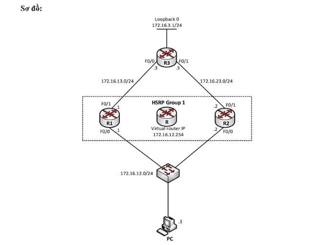

# CISCO HSRP – INTERFACE TRACKING & IP SLA GATEWAY FAILOVER LAB

## Giới thiệu

**HSRP KHÔNG CHỈ DỰ PHÒNG ROUTER – KẾT HỢP TRACKING & IP SLA ĐỂ TỰ ĐỘNG CHUYỂN GATEWAY**

Trong mạng doanh nghiệp, việc sử dụng một Router duy nhất làm Default Gateway tạo ra **Single Point of Failure (SPOF)**.

Khi Gateway gặp sự cố, các thiết bị trong LAN vẫn có thể hoạt động nhưng không thể truy cập ra các mạng bên ngoài.

Trong bài lab này, mình sử dụng **HSRP – Hot Standby Router Protocol** để xây dựng Gateway dự phòng giữa R1 và R2.

Sau đó, mở rộng bằng **Interface Tracking** và **IP SLA** nhằm xử lý một tình huống thực tế hơn:

> Router vẫn hoạt động, interface vẫn UP, nhưng đường đi phía trên đã gặp sự cố.

Workflow của bài lab:

**HSRP → Interface Tracking → IP SLA → Static Routing → Failover Verification**

---

## 1. Mục tiêu Lab

Sau khi hoàn thành bài lab, có thể:

- Hiểu nguyên lý hoạt động của HSRP Active/Standby.
- Cấu hình Virtual IP làm Default Gateway cho LAN.
- Thiết lập HSRP Priority và Preempt.
- Sử dụng Interface Tracking để giám sát uplink.
- Sử dụng IP SLA để kiểm tra khả năng kết nối tới destination.
- Kết hợp IP SLA với Object Tracking và HSRP.
- Thiết lập Static Route dự phòng.
- Kiểm tra quá trình Failover khi xảy ra sự cố.

---

## 2. Network Topology



### Thành phần hệ thống

| Thiết bị | Interface | IP Address | Vai trò |
|---|---|---|---|
| R1 | F0/0 | 172.16.12.1/24 | HSRP Primary |
| R1 | F0/1 | 172.16.13.1/24 | Uplink tới R3 |
| R2 | F0/0 | 172.16.12.2/24 | HSRP Standby |
| R2 | F0/1 | 172.16.23.2/24 | Uplink tới R3 |
| R3 | F0/0 | 172.16.13.3/24 | Kết nối R1 |
| R3 | F0/1 | 172.16.23.3/24 | Kết nối R2 |
| R3 | Loopback0 | 172.16.3.1/24 | Destination kiểm tra |
| PC | NIC | 172.16.12.3/24 | LAN Client |
| HSRP | Virtual IP | 172.16.12.254 | Default Gateway |

### Network sử dụng

| Network | Subnet |
|---|---|
| LAN | 172.16.12.0/24 |
| R1 – R3 | 172.16.13.0/24 |
| R2 – R3 | 172.16.23.0/24 |
| Loopback R3 | 172.16.3.0/24 |

**Thông số HSRP**

- HSRP Group: `1`
- Virtual IP: `172.16.12.254`
- R1 Priority: `150`
- R2 Priority: `100` (mặc định)
- Preempt: Enabled

---

## 3. HSRP – Xây dựng Gateway ảo

### 3.1. Nguyên lý hoạt động

R1 và R2 cùng kết nối vào mạng LAN `172.16.12.0/24`.

Thay vì để PC sử dụng trực tiếp IP của R1 hoặc R2 làm Default Gateway, mình tạo một Virtual IP:

`172.16.12.254`

PC chỉ cần cấu hình:

```text
IP Address      : 172.16.12.3
Subnet Mask     : 255.255.255.0
Default Gateway : 172.16.12.254
```

### 3.2. Cấu hình HSRP trên R1

```cisco
conf t
interface f0/0
 standby 1 ip 172.16.12.254
 standby 1 priority 150
 standby 1 preempt
end
```

### 3.3. Cấu hình HSRP trên R2

```cisco
conf t
interface f0/0
 standby 1 ip 172.16.12.254
 standby 1 preempt
end
```

### 3.4. Kiểm tra HSRP

```cisco
show standby brief
show standby
```

**Trạng thái mong đợi:**

| Router | Priority | HSRP State |
|---|---|---|
| R1 | 150 | Active |
| R2 | 100 | Standby |

Priority mặc định của HSRP là `100`.

R1 được cấu hình Priority `150`, vì vậy R1 trở thành Active Router.

Traffic bình thường:

```text
PC
 |
 v
Virtual Gateway (172.16.12.254)
 |
 v
R1 (ACTIVE)
 |
 v
R3
 |
 v
Loopback0 (172.16.3.1)
```

**Điểm quan trọng:**

PC không cần biết Router nào đang Active. PC chỉ sử dụng Default Gateway `172.16.12.254`. Thiết bị HSRP Active sẽ tiếp nhận traffic thông qua Virtual MAC Address.

---

## 4. Failure Scenario #1 – Active Router bị DOWN

### 4.1. Mô phỏng sự cố

Shutdown interface LAN trên R1:

```cisco
R1# conf t
R1(config)# interface f0/0
R1(config-if)# shutdown
```

### 4.2. Kết quả mong đợi

HSRP phát hiện Active Router không còn tham gia Group 1.

R2 chuyển trạng thái:

```text
STANDBY → ACTIVE
```

Virtual IP vẫn giữ nguyên:

```text
172.16.12.254
```

Traffic chuyển sang đường dự phòng:

```text
PC
 |
 v
Virtual Gateway
 |
 v
R2 (ACTIVE)
 |
 v
R3
```

### 4.3. Verification

Trên R2:

```cisco
show standby brief
```

Từ PC:

```bash
ping 172.16.3.1
```

**Kết luận:**

HSRP cho phép chuyển đổi Default Gateway mà không cần thay đổi cấu hình IP trên PC.

Khôi phục R1 trước khi chuyển sang phần tiếp theo:

```cisco
conf t
interface f0/0
 no shutdown
end
```

Với Preempt được bật, R1 có thể giành lại quyền Active khi tham gia lại HSRP Group và có Priority cao hơn.

---

## 5. Failure Scenario #2 – Router vẫn hoạt động nhưng Uplink bị DOWN

Đây là tình huống thực tế đáng chú ý hơn.

Giả sử:

- R1 vẫn hoạt động bình thường.
- F0/0 trên R1 vẫn UP.
- R1 vẫn đang giữ vai trò HSRP Active.
- Nhưng F0/1 kết nối tới R3 bị lỗi.

Traffic có thể bị gián đoạn:

```text
PC → R1 (ACTIVE) → X → R3
```

HSRP cơ bản không tự động biết rằng đường uplink F0/1 đã bị lỗi nếu interface chạy HSRP là F0/0 vẫn hoạt động.

### 5.1. Cấu hình Interface Tracking trên R1

```cisco
conf t

track 1 interface f0/1 line-protocol

interface f0/0
 standby 1 track 1 decrement 60

end
```

### 5.2. Cơ chế hoạt động

R1 có Priority ban đầu:

```text
150
```

Khi F0/1 DOWN:

```text
Priority = 150 - 60
         = 90
```

Trong khi R2 vẫn có:

```text
Priority = 100
```

Do R2 có Priority cao hơn và đã bật `preempt`, R2 có thể giành quyền Active.

| Router | Trước lỗi | Sau lỗi |
|---|---|---|
| R1 | 150 – Active | 90 – Standby |
| R2 | 100 – Standby | 100 – Active |

### 5.3. Mô phỏng Uplink Failure

Trên R1:

```cisco
conf t
interface f0/1
 shutdown
end
```

### 5.4. Kiểm tra

```cisco
show track 1
show standby brief
show interfaces f0/1
```

**Kết quả mong đợi:**

- Track 1 chuyển sang Down.
- Priority của R1 giảm xuống 90.
- R2 trở thành Active.
- Traffic từ PC được chuyển qua R2.

```text
PC → R2 → R3
```

**Kết luận:**

Interface Tracking giúp HSRP giám sát trạng thái của các interface quan trọng, thay vì chỉ phụ thuộc vào interface đang chạy HSRP.

Khôi phục interface trước khi thực hiện IP SLA:

```cisco
conf t
interface f0/1
 no shutdown
end
```

---

## 6. Failure Scenario #3 – Interface UP nhưng Destination không Reachable

Interface Tracking vẫn có giới hạn.

Ví dụ:

- F0/1 trên R1 vẫn UP/UP.
- Kết nối vật lý vẫn tồn tại.
- Tuy nhiên, một sự cố phía xa khiến R1 không thể truy cập destination.
- Interface Tracking không phát hiện được lỗi này.

Để giải quyết, mình sử dụng **IP SLA – IP Service Level Agreements**.

IP SLA cho phép Router chủ động gửi các gói kiểm tra nhằm xác định khả năng kết nối tới một địa chỉ IP đích.

### 6.1. Cấu hình IP SLA trên R1

```cisco
conf t

ip sla 1
 icmp-echo 172.16.3.1 source-ip 172.16.13.1
 frequency 10
exit

ip sla schedule 1 start-time now life forever

end
```

Giải thích:

| Lệnh | Chức năng |
|---|---|
| `ip sla 1` | Tạo IP SLA Operation 1 |
| `icmp-echo` | Gửi ICMP Echo tới destination |
| `source-ip` | Sử dụng Source IP của R1 |
| `frequency 10` | Kiểm tra mỗi 10 giây |
| `ip sla schedule` | Kích hoạt IP SLA liên tục |

### 6.2. Tạo Object Tracking

```cisco
conf t

track 2 ip sla 1 reachability

end
```

Object Tracking theo dõi trạng thái Reachability của IP SLA Operation 1.

Nếu IP SLA thành công:

```text
Track 2 = UP
```

Nếu IP SLA thất bại:

```text
Track 2 = DOWN
```

### 6.3. Liên kết Tracking với HSRP

Trên R1:

```cisco
conf t

interface f0/0
 standby 1 track 2 decrement 60

end
```

### 6.4. Cơ chế Failover

R1 không chỉ kiểm tra:

> Interface có UP không?

Mà còn kiểm tra:

> Router có thực sự truy cập được destination phía ngoài không?

Nếu IP SLA không nhận được phản hồi từ `172.16.3.1`, Track 2 chuyển sang Down.

Khi chỉ Track 2 bị Down, Priority R1 giảm:

```text
150 → 90
```

R2 vẫn giữ Priority `100`.

Kết quả:

```text
R1: ACTIVE  → STANDBY
R2: STANDBY → ACTIVE
```

Traffic được chuyển:

```text
PC
 |
 v
R2 (ACTIVE)
 |
 v
R3
```

### 6.5. Verification

Trên R1:

```cisco
show ip sla configuration
show ip sla statistics
show track 2
show standby brief
```

Trên R2:

```cisco
show standby brief
```

Kiểm tra từ PC:

```bash
ping 172.16.3.1
```

**Lưu ý:** Nếu đồng thời giữ Track 1 và Track 2 trên cùng HSRP Group, các mức decrement sẽ được cộng dồn khi cả hai Track đều Down. Với hai mức decrement bằng 60, Priority của R1 có thể giảm từ 150 xuống 30.

---

## 7. Static Routing – Đảm bảo đường đi dự phòng

HSRP chỉ giải quyết vấn đề Default Gateway phía LAN.

Để traffic thực sự được chuyển tiếp thành công, hệ thống Routing phía sau cũng phải được cấu hình phù hợp.

### 7.1. Static Route trên R1

```cisco
conf t

ip route 172.16.3.0 255.255.255.0 172.16.13.3

end
```

Đường đi:

```text
R1 → 172.16.13.3 → R3
```

### 7.2. Static Route trên R2

```cisco
conf t

ip route 172.16.3.0 255.255.255.0 172.16.23.3

end
```

Đường đi:

```text
R2 → 172.16.23.3 → R3
```

### 7.3. Floating Static Route trên R3

```cisco
conf t

ip route 172.16.12.0 255.255.255.0 172.16.13.1 5

ip route 172.16.12.0 255.255.255.0 172.16.23.2 10

end
```

Trong cấu hình này:

| Route | Next Hop | AD | Vai trò |
|---|---|---|---|
| Primary | 172.16.13.1 | 5 | Đường chính qua R1 |
| Backup | 172.16.23.2 | 10 | Đường dự phòng qua R2 |

R3 ưu tiên Route có Administrative Distance thấp hơn.

Khi Route chính không còn hợp lệ và bị loại khỏi bảng định tuyến, Route dự phòng có thể được sử dụng.

**Lưu ý quan trọng:** HSRP Failover không đồng nghĩa với việc Floating Static Route trên R3 tự động chuyển đổi. Nếu Route chính qua R1 vẫn tồn tại, R3 có thể tiếp tục sử dụng Route đó. Vì vậy cần kiểm tra cả đường đi và đường về khi thử nghiệm IP SLA Failover.

### 7.4. Kiểm tra Routing Table

```cisco
show ip route
show ip route static
```

Kiểm tra đường đi:

```cisco
traceroute 172.16.3.1
```

---

## 8. Verification – Kiểm chứng toàn bộ Lab

Sau khi hoàn thành cấu hình, thực hiện kiểm tra các trường hợp sau.

| Test Case | Tình huống | Kết quả mong đợi |
|---|---|---|
| TC01 | R1 và R2 hoạt động bình thường | R1 Active, R2 Standby |
| TC02 | Shutdown R1 F0/0 | R2 trở thành Active |
| TC03 | Khôi phục R1 F0/0 | R1 giành lại Active |
| TC04 | Shutdown R1 F0/1 | Track 1 Down, R2 Active |
| TC05 | Destination IP SLA không reachable | Track 2 Down, R2 Active |
| TC06 | Khôi phục kết nối | R1 trở lại Active khi Priority phục hồi |
| TC07 | Kiểm tra Routing | Có đường đi và đường về phù hợp |

### Các lệnh Troubleshooting

**HSRP**

```cisco
show standby
show standby brief
```

**Interface Tracking**

```cisco
show track
show track 1
show track 2
```

**IP SLA**

```cisco
show ip sla configuration
show ip sla statistics
```

**Routing**

```cisco
show ip route
show ip route static
```

**Connectivity**

```cisco
ping 172.16.3.1
traceroute 172.16.3.1
```

Khi Troubleshooting, cần kiểm tra đồng thời:

- HSRP State của R1 và R2.
- Priority hiện tại của mỗi Router.
- Trạng thái UP/DOWN của Track Object.
- Kết quả IP SLA.
- Routing Table ở cả R1, R2 và R3.
- Khả năng kết nối End-to-End từ PC tới Loopback R3.

---

## 9. So sánh các cơ chế dự phòng

| Tiêu chí | HSRP | Interface Tracking | IP SLA Tracking |
|---|---|---|---|
| Gateway Redundancy | ✅ | Kết hợp HSRP | Kết hợp HSRP |
| Phát hiện Active Router mất kết nối LAN | ✅ | ✅ | ✅ |
| Phát hiện Uplink Interface DOWN | Không trực tiếp | ✅ | Có thể |
| Phát hiện Interface UP nhưng Destination mất kết nối | ❌ | ❌ | ✅ |
| Điều chỉnh HSRP Priority | Theo cấu hình | ✅ | ✅ |
| Giám sát Reachability End-to-End | ❌ | ❌ | ✅ |

---

## 10. Tổng kết Lab

Sau khi hoàn thành, bài lab minh họa ba cấp độ dự phòng Gateway.

### Level 1 – HSRP Basic Failover

```text
R1 DOWN
   |
   v
HSRP phát hiện lỗi
   |
   v
R2 trở thành ACTIVE
```

### Level 2 – HSRP + Interface Tracking

```text
R1 vẫn hoạt động
   |
   v
Uplink F0/1 DOWN
   |
   v
Track 1 DOWN
   |
   v
HSRP Priority giảm
   |
   v
R2 trở thành ACTIVE
```

### Level 3 – HSRP + IP SLA Tracking

```text
R1 vẫn hoạt động
   |
   v
Interface vẫn UP/UP
   |
   v
Destination không Reachable
   |
   v
IP SLA thất bại
   |
   v
Track 2 DOWN
   |
   v
HSRP Priority giảm
   |
   v
R2 trở thành ACTIVE
```

### Key Takeaways

**HSRP không đơn thuần là hai Router sử dụng chung một Default Gateway.**

Khi kết hợp Interface Tracking và IP SLA, HSRP có thể thay đổi Router Active dựa trên trạng thái kết nối quan trọng của hệ thống.

Ba bài học chính:

1. **HSRP** cung cấp cơ chế Gateway Redundancy.
2. **Interface Tracking** giúp phát hiện lỗi Uplink vật lý hoặc Line Protocol.
3. **IP SLA Tracking** giúp phát hiện các lỗi Reachability mà trạng thái Interface UP/DOWN không thể phản ánh.

Tuy nhiên, để đảm bảo Failover hoạt động End-to-End, cần thiết kế đồng bộ cả Gateway Redundancy và Routing.

**HSRP + Tracking + IP SLA + Routing = Gateway Failover linh hoạt và đáng tin cậy hơn.**

---

## Công nghệ sử dụng

- Cisco IOS
- Hot Standby Router Protocol (HSRP)
- HSRP Priority & Preempt
- Interface Tracking
- Object Tracking
- IP SLA ICMP Echo
- Static Routing
- Floating Static Route
- Cisco Packet Tracer / GNS3 / EVE-NG (tùy thiết bị và tính năng IOS hỗ trợ)

---
