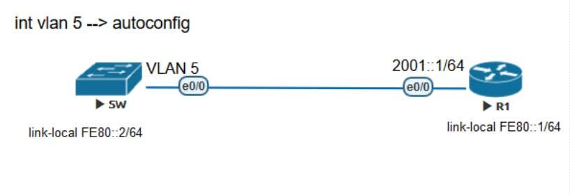

# IPv6 FIRST HOP SECURITY – RA GUARD: CHẶN ROUTER ADVERTISEMENT GIẢ MẠO

## 1. Giới thiệu

Trong mạng IPv6, **Router Advertisement (RA)** là một thành phần quan trọng của giao thức Neighbor Discovery (NDP), giúp các thiết bị:

- Xác định **Default Gateway**.
- Nhận thông tin **IPv6 Prefix**.
- Tự động cấu hình địa chỉ IPv6 thông qua **SLAAC**.
- Nhận các thông tin cấu hình mạng bổ sung.

Tuy nhiên, nếu một thiết bị không được phép gửi **Rogue Router Advertisement** vào mạng, các host có thể nhận thông tin gateway hoặc prefix không hợp lệ.

Đây chính là lúc **IPv6 RA Guard** phát huy tác dụng.

## 2. Mục tiêu bài lab

**RA Guard** là một tính năng thuộc nhóm **IPv6 First Hop Security**, được triển khai trên switch nhằm kiểm soát và ngăn chặn các gói Router Advertisement đến từ những cổng không được phép.

Trong bài lab, chúng ta thực hiện:

- Cấu hình IPv6 trên Router R1.
- Tạo VLAN 5 và cấu hình IPv6 SLAAC trên Switch.
- Kiểm tra IPv6 Neighbor Binding.
- Tạo và áp dụng RA Guard Policy.
- Quan sát sự thay đổi khi Router Advertisement bị chặn.
- Hiểu cách phân biệt cổng kết nối Router và cổng kết nối Host.

## 3. Mô hình thực hành



**Thông tin địa chỉ IPv6:**

| Thiết bị | Interface | IPv6 Address | Link-local |
|---|---|---|---|
| R1 | Ethernet0/0 | 2001::1/64 | FE80::1 |
| SW1 | VLAN 5 | SLAAC | FE80::2 |

**Mô hình kết nối:**

```text
                  VLAN 5
           +------------------+
           |                  |
      +---------+        +---------+
      |   SW1   |        |   R1    |
      +---------+        +---------+
        Et0/0                Et0/0
     FE80::2              FE80::1
     SLAAC                2001::1/64
```

**Nguyên lý hoạt động:**

```text
R1
 |
 | Router Advertisement
 v
SW1 (Ethernet0/0)
 |
 +--> RA được phép  --> VLAN 5 nhận thông tin SLAAC
 |
 +--> RA bị chặn    --> VLAN 5 không nhận RA mới
```

---

## 4. Cấu hình IPv6 trên Router R1

Kích hoạt IPv6 Routing:

```cisco
R1(config)# ipv6 unicast-routing
```

Cấu hình interface kết nối đến Switch:

```cisco
R1(config)# interface e0/0
R1(config-if)# no ip address
R1(config-if)# ipv6 address FE80::1 link-local
R1(config-if)# ipv6 address 2001::1/64
R1(config-if)# no shutdown
```

**Giải thích:**

- `ipv6 unicast-routing`: kích hoạt chức năng định tuyến IPv6.
- `ipv6 address FE80::1 link-local`: cấu hình địa chỉ IPv6 Link-local.
- `ipv6 address 2001::1/64`: cấu hình IPv6 Global Unicast.
- Router R1 đóng vai trò gửi các gói Router Advertisement xuống VLAN 5.

**Kiểm tra:**

```cisco
R1# show ipv6 interface e0/0
R1# show ipv6 interface brief
```

---

## 5. Cấu hình VLAN trên Switch

### 5.1. Tạo VLAN 5

```cisco
SW1(config)# vlan 5
SW1(config-vlan)# name RA
SW1(config-vlan)# exit
```

### 5.2. Cấu hình Access Port

```cisco
SW1(config)# interface e0/0
SW1(config-if)# switchport mode access
SW1(config-if)# switchport access vlan 5
SW1(config-if)# no shutdown
```

### 5.3. Cấu hình IPv6 trên SVI

```cisco
SW1(config)# interface vlan 5
SW1(config-if)# ipv6 address FE80::2 link-local
SW1(config-if)# ipv6 address autoconfig
SW1(config-if)# no shutdown
```

**Giải thích:**

Lệnh:

```cisco
ipv6 address autoconfig
```

Cho phép SVI sử dụng cơ chế **Stateless Address Autoconfiguration (SLAAC)** để tự động cấu hình IPv6 dựa trên thông tin Prefix nhận được từ Router Advertisement.

Khi nhận được RA hợp lệ từ R1, SVI có thể tự động tạo IPv6 Global Unicast Address và nhận thông tin Default Router.

**Kiểm tra:**

```cisco
SW1# show ipv6 interface vlan 5
SW1# show ipv6 interface brief
```

---

## 6. Kiểm tra IPv6 Neighbor Binding

Cấu hình Neighbor Binding theo cú pháp hỗ trợ của thiết bị lab:

```cisco
SW1(config)# ipv6 neighbor binding vlan 5 2001::/64 int e0/0
SW1(config)# ipv6 neighbor binding max-entries 200
```

Kiểm tra:

```cisco
SW1# show ipv6 neighbor binding
```

**Ví dụ kết quả:**

```text
IPv6 address    Link-Layer addr    Interface    VLAN
2001::/64       any                Et0/0         5
```

Bảng Neighbor Binding giúp theo dõi thông tin ánh xạ địa chỉ IPv6 với interface và VLAN.

> **Lưu ý:** Neighbor Binding và RA Guard là hai chức năng khác nhau. Không bắt buộc phải cấu hình Neighbor Binding để RA Guard hoạt động. Khả năng hỗ trợ và cú pháp phụ thuộc phiên bản Cisco IOS/IOS XE.

---

## 7. Cấu hình IPv6 RA Guard

### 7.1. Tạo RA Guard Policy

```cisco
SW1(config)# ipv6 nd raguard policy RAGUARD
SW1(config-nd-raguard)# device-role host
SW1(config-nd-raguard)# exit
```

**Giải thích:**

- `ipv6 nd raguard policy RAGUARD`: tạo RA Guard Policy.
- `device-role host`: xác định các cổng áp dụng policy là cổng kết nối Host.
- Các gói Router Advertisement đi vào cổng được phân loại là Host sẽ bị chặn.

### 7.2. Áp dụng RA Guard Policy

```cisco
SW1(config)# interface e0/0
SW1(config-if)# ipv6 raguard attach-policy RAGUARD
```

> ⚠️ **Quan trọng:** Trong mô hình lab, Et0/0 thực tế đang kết nối đến Router R1. Việc áp dụng `device-role host` lên cổng này chỉ nhằm mô phỏng tình huống chặn RA để quan sát kết quả. Trong mạng thực tế, cổng kết nối Router hợp lệ cần sử dụng chính sách cho phép Router Advertisement.

### 7.3. Kiểm tra RA Guard

```cisco
SW1# show ipv6 nd raguard policy RAGUARD
```

Kiểm tra policy đã được áp dụng đúng interface và thiết bị nhận diện đúng vai trò cổng.

---

## 8. Kiểm tra và quan sát kết quả

### Trước khi bật RA Guard

```cisco
SW1# show ipv6 interface vlan 5
```

Khi RA từ R1 được xử lý bình thường, SVI có thể nhận:

- ✅ IPv6 Global Unicast Address thông qua SLAAC.
- ✅ Default Router.
- ✅ IPv6 Prefix 2001::/64.

### Sau khi áp dụng RA Guard

Tiếp tục kiểm tra:

```cisco
SW1# show ipv6 interface vlan 5
```

Khi policy `device-role host` được áp dụng lên Et0/0:

- ❌ Router Advertisement từ R1 bị chặn.
- ❌ SVI không thể nhận thông tin RA mới từ R1 qua cổng này.
- ❌ SLAAC không thể sử dụng những RA đã bị chặn để tạo địa chỉ mới.
- ✅ Địa chỉ Link-local FE80::2 vẫn tồn tại.

**Lưu ý:** Địa chỉ Global Unicast hoặc Default Router đã học từ trước có thể vẫn tồn tại đến khi hết thời hạn hợp lệ. Vì vậy, không nên kết luận rằng chúng sẽ biến mất ngay sau khi bật RA Guard.

### So sánh kết quả

| Tiêu chí | RA được phép | RA bị chặn |
|---|---|---|
| Router Advertisement | Được xử lý | Bị chặn |
| Nhận Prefix mới | Có | Không |
| Tạo địa chỉ SLAAC mới | Có thể | Không từ RA bị chặn |
| Link-local IPv6 | Hoạt động | Hoạt động |
| Nhận Default Router mới | Có thể | Không từ RA bị chặn |

---

## 9. Cấu hình RA Guard đúng trong môi trường thực tế

Trong hệ thống mạng thực tế, cần phân biệt hai loại cổng.

**Host-facing Port:**

```cisco
SW1(config)# ipv6 nd raguard policy HOST-PORT
SW1(config-nd-raguard)# device-role host
```

**Router-facing Port:**

```cisco
SW1(config)# ipv6 nd raguard policy ROUTER-PORT
SW1(config-nd-raguard)# device-role router
```

Áp dụng policy phù hợp trên từng cổng:

```cisco
SW1(config)# interface e0/0
SW1(config-if)# ipv6 raguard attach-policy ROUTER-PORT
```

**Nguyên tắc triển khai:**

- **Host Port:** ngăn thiết bị đầu cuối gửi Rogue RA.
- **Router Port:** cho phép Router hợp lệ gửi RA.
- Không áp dụng nhầm Host Policy lên cổng kết nối Router hợp lệ vì có thể làm gián đoạn SLAAC và quá trình học Default Router của các thiết bị.

---

## 10. Kiến thức rút ra

Qua bài lab, chúng ta hiểu được:

1. **Router Advertisement** đóng vai trò quan trọng trong IPv6 Neighbor Discovery.
2. **SLAAC** giúp thiết bị tự động tạo địa chỉ IPv6 mà không bắt buộc phải sử dụng DHCPv6.
3. **RA Guard** giúp ngăn chặn các Router Advertisement giả mạo từ những cổng không được phép.
4. **Device-role host** và **device-role router** cần được áp dụng đúng vị trí.
5. Kiểm tra trạng thái trước và sau khi cấu hình giúp xác nhận tác động của chính sách bảo mật.

### Các kiến thức liên quan

- IPv6 Security
- IPv6 First Hop Security
- IPv6 Neighbor Discovery Protocol (NDP)
- Stateless Address Autoconfiguration (SLAAC)
- Rogue Router Advertisement
- Cisco Switch Security
- CCNP Enterprise

---

## Kết luận

**IPv6 RA Guard không đơn giản chỉ là một câu lệnh cấu hình trên Switch.**

Đây là một cơ chế bảo vệ quan trọng giúp kiểm soát nguồn phát Router Advertisement, giảm nguy cơ thiết bị không hợp lệ giả mạo Router và cung cấp thông tin Default Gateway hoặc Prefix sai cho Host.

Bài lab giúp thực hành đầy đủ quy trình:

**Configure → Verify → Observe → Troubleshoot → Secure**

Qua đó, người học có thể hiểu rõ hơn cách triển khai và kiểm tra các tính năng **IPv6 First Hop Security** trong hệ thống mạng doanh nghiệp.
