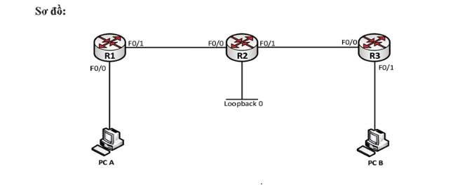

# CISCO IPv6 STATIC ROUTING & OSPFv3 LAB

## Giới thiệu

**IPv6 Routing trên Cisco Router – Static Route và OSPFv3**

IPv6 đang dần trở thành tiêu chuẩn trong các hệ thống mạng hiện đại. Vì vậy, việc nắm vững cách cấu hình và triển khai định tuyến IPv6 là kiến thức quan trọng đối với những người học **CCNA** và **CCNP ENCOR**.

Trong bài lab này, mình triển khai mô hình gồm **3 Cisco Router** và thực hành định tuyến IPv6 bằng hai phương pháp phổ biến:

- **IPv6 Static Routing:** Định tuyến tĩnh bằng cách khai báo đường đi thủ công.
- **OSPFv3:** Giao thức định tuyến động dành cho IPv6, giúp các router tự động trao đổi thông tin định tuyến.

Mục tiêu là hiểu nguyên lý hoạt động, thực hiện cấu hình và kiểm tra khả năng kết nối giữa các mạng IPv6.

---

## 1. Mô hình mạng (Network Topology)



### Thành phần hệ thống

| Thiết bị | Vai trò |
|---|---|
| R1 | Router kết nối mạng LAN PC-A |
| R2 | Router trung gian, có Loopback0 |
| R3 | Router kết nối mạng LAN PC-B |
| PC-A | Thiết bị đầu cuối tại LAN 1 |
| PC-B | Thiết bị đầu cuối tại LAN 2 |

### Mô hình kết nối

```text
PC-A ── R1 ── R2 ── R3 ── PC-B
                │
             Loopback0
```

**Mục tiêu:**

- Cấu hình địa chỉ IPv6 trên các Router.
- Kích hoạt IPv6 Unicast Routing.
- Triển khai IPv6 Static Route.
- Cấu hình OSPFv3 Area 0.
- Kiểm tra bảng định tuyến IPv6.
- Xác minh kết nối End-to-End giữa PC-A và PC-B.

---

## 2. Cấu hình địa chỉ IPv6 trên Router

Trước tiên, cần kích hoạt chức năng định tuyến IPv6 trên Cisco Router.

```cisco
Router(config)# ipv6 unicast-routing
```

Lệnh `ipv6 unicast-routing` cho phép Router thực hiện chức năng chuyển tiếp các gói tin IPv6 giữa những interface.

### Cấu hình IPv6 trên R1

```cisco
R1(config)# interface f0/0
R1(config-if)# ipv6 address 2001:1::1/64
R1(config-if)# no shutdown

R1(config)# interface f0/1
R1(config-if)# ipv6 address 2001:12::1/64
R1(config-if)# no shutdown
```

Trong đó:

- `F0/0`: Kết nối đến mạng LAN của PC-A.
- `F0/1`: Kết nối đến Router R2.
- `2001:1::/64`: Mạng IPv6 phía PC-A.
- `2001:12::/64`: Mạng IPv6 kết nối R1 và R2.

### Kiểm tra cấu hình IPv6

```cisco
R1# show ipv6 interface brief
```

Lệnh này giúp xác định:

- Địa chỉ IPv6 được gán trên từng interface.
- Trạng thái hoạt động của interface.
- Các interface đã được kích hoạt hay chưa.

> **Lưu ý:** Một lỗi thường gặp khi mới học IPv6 là quên kích hoạt `ipv6 unicast-routing`, khiến Router không thực hiện định tuyến IPv6 như mong muốn.

---

## 3. Triển khai IPv6 Static Routing

Static Routing là phương pháp định tuyến trong đó quản trị viên khai báo thủ công các đường đi đến những mạng đích.

### Cấu hình Static Route

Ví dụ, trên R1 muốn định tuyến đến mạng IPv6 phía R3:

```cisco
R1(config)# ipv6 route 2001:3::/64 2001:12::2
```

**Giải thích:**

| Thành phần | Ý nghĩa |
|---|---|
| `ipv6 route` | Khai báo tuyến tĩnh IPv6 |
| `2001:3::/64` | Mạng IPv6 đích |
| `2001:12::2` | Địa chỉ Next-Hop của R2 |

Khi R1 cần gửi gói tin đến mạng `2001:3::/64`, Router sẽ chuyển tiếp gói tin đến R2 thông qua Next-Hop `2001:12::2`.

Cần cấu hình các tuyến tương ứng trên những Router còn lại để bảo đảm lưu lượng có đường đi và đường về.

### Kiểm tra bảng định tuyến IPv6

```cisco
R1# show ipv6 route
```

Các tuyến Static Route xuất hiện với ký hiệu:

```text
S - Static
```

Có thể kiểm tra riêng tuyến tĩnh bằng:

```cisco
R1# show ipv6 route static
```

**Kết quả mong đợi:** Router nhận diện được đường đi đến các mạng IPv6 ở xa thông qua những tuyến tĩnh đã cấu hình.

---

## 4. Triển khai OSPFv3

Sau khi kiểm tra Static Routing thành công, tiếp tục thực hành định tuyến động bằng **OSPFv3 (Open Shortest Path First version 3)**.

OSPFv3 cho phép các Router trao đổi thông tin định tuyến IPv6 và tự động tính toán đường đi phù hợp.

### Bước 1: Kích hoạt OSPFv3

Trên Router R1:

```cisco
R1(config)# ipv6 router ospf 1
R1(config-rtr)# router-id 1.1.1.1
```

Trong đó:

- `1`: OSPF Process ID.
- `router-id 1.1.1.1`: Định danh Router trong OSPF.

### Bước 2: Kích hoạt OSPFv3 trên Interface

```cisco
R1(config)# interface f0/1
R1(config-if)# ipv6 ospf 1 area 0
```

Quảng bá thêm mạng LAN phía PC-A:

```cisco
R1(config)# interface f0/0
R1(config-if)# ipv6 ospf 1 area 0
```

Thực hiện cấu hình OSPFv3 tương ứng trên R2 và R3, bảo đảm các interface kết nối giữa Router được đặt trong cùng Area 0.

### Bước 3: Kiểm tra OSPF Neighbor

```cisco
R1# show ipv6 ospf neighbor
```

Khi các Router thiết lập quan hệ láng giềng thành công, trạng thái Neighbor trên liên kết Ethernet thông thường có thể đạt:

```text
FULL/DR
FULL/BDR
```

Trạng thái **FULL** cho biết các Router đã hoàn thành quá trình đồng bộ cơ sở dữ liệu OSPF.

### Bước 4: Kiểm tra OSPF Routing Table

```cisco
R1# show ipv6 route ospf
```

Các tuyến OSPFv3 trong bảng định tuyến IPv6 có thể xuất hiện với những ký hiệu:

| Ký hiệu | Ý nghĩa |
|---|---|
| `O` | OSPF Intra-Area |
| `OI` | OSPF Inter-Area |
| `OE1` | OSPF External Type 1 |
| `OE2` | OSPF External Type 2 |

> **Lưu ý:** Với mô hình OSPFv3 Single-Area (Area 0), các tuyến OSPF nội vùng thông thường sẽ xuất hiện với ký hiệu `O`. Nếu vẫn giữ Static Route đến cùng mạng đích, Router có thể ưu tiên tuyến Static vì Administrative Distance thấp hơn OSPF.

---

## 5. Kiểm tra kết nối End-to-End

Sau khi hoàn tất cấu hình định tuyến IPv6, tiến hành kiểm tra kết nối giữa các mạng LAN.

### Kiểm tra bằng Ping IPv6

Từ Router hoặc PC-A, thực hiện ping đến địa chỉ IPv6 của PC-B.

Ví dụ:

```cisco
R1# ping ipv6 2001:3::10
```

*Địa chỉ `2001:3::10` là ví dụ, cần thay bằng địa chỉ IPv6 thực tế của PC-B.*

### Kiểm tra đường đi của gói tin

```cisco
R1# traceroute ipv6 2001:3::10
```

Traceroute giúp xác định đường đi của gói tin qua các Router trung gian.

### Kết quả mong đợi

- PC-A có thể ping đến PC-B.
- Các Router nhận diện được mạng IPv6 ở xa.
- Static Route hoạt động đúng Next-Hop.
- OSPFv3 Neighbor thiết lập thành công.
- Bảng định tuyến xuất hiện các tuyến phù hợp.
- Ping đạt tỷ lệ thành công **100%** khi toàn bộ hệ thống được cấu hình chính xác.

---

## 6. Các lệnh kiểm tra và Troubleshooting

| Lệnh Cisco | Chức năng |
|---|---|
| `show ipv6 interface brief` | Kiểm tra địa chỉ và trạng thái IPv6 |
| `show ipv6 route` | Hiển thị bảng định tuyến IPv6 |
| `show ipv6 route static` | Kiểm tra các tuyến Static |
| `show ipv6 route ospf` | Kiểm tra các tuyến học qua OSPF |
| `show ipv6 ospf neighbor` | Kiểm tra trạng thái Neighbor |
| `show ipv6 ospf interface` | Kiểm tra OSPFv3 trên các interface |
| `ping ipv6 <IPv6-address>` | Kiểm tra khả năng kết nối |
| `traceroute ipv6 <IPv6-address>` | Kiểm tra đường đi của gói tin |

---

## 7. So sánh Static Routing và OSPFv3

| Tiêu chí | IPv6 Static Route | OSPFv3 |
|---|---|---|
| Phương pháp | Định tuyến tĩnh | Định tuyến động |
| Cấu hình | Thủ công | Cấu hình giao thức |
| Cập nhật đường đi | Cần can thiệp thủ công | Tự động tính toán lại |
| Khả năng mở rộng | Hạn chế | Tốt |
| Tài nguyên sử dụng | Thấp | Cao hơn Static Route |
| Môi trường phù hợp | Mạng nhỏ, ít thay đổi | Mạng doanh nghiệp, nhiều Router |

---

## 8. Kết luận

Qua bài lab **IPv6 Static Routing & OSPFv3**, có thể rút ra một số kiến thức quan trọng:

✅ Hiểu cách cấu hình và kích hoạt IPv6 Routing trên Cisco Router.

✅ Nắm được nguyên lý hoạt động của IPv6 Static Route.

✅ Biết cách triển khai OSPFv3 và thiết lập quan hệ Neighbor.

✅ Phân biệt các tuyến Static và OSPF trong IPv6 Routing Table.

✅ Sử dụng các lệnh `show`, `ping` và `traceroute` để kiểm tra, xử lý sự cố mạng.

### Kiến thức quan trọng

**Static Routing** phù hợp với những hệ thống mạng nhỏ, có topology đơn giản và ít thay đổi.

**OSPFv3** phù hợp với hệ thống mạng doanh nghiệp nhờ khả năng tự động học route, thích ứng với thay đổi topology và mở rộng linh hoạt.

> **Điểm quan trọng nhất của bài lab không chỉ là cấu hình để các thiết bị ping được nhau, mà còn phải hiểu Router lựa chọn đường đi như thế nào và cách kiểm tra thông tin định tuyến IPv6 khi hệ thống gặp sự cố.**

---

## Keywords

`Cisco` `IPv6` `Static-Routing` `OSPFv3` `CCNA` `CCNP-ENCOR` `Routing` `Network-Lab` `Cisco-IOS`