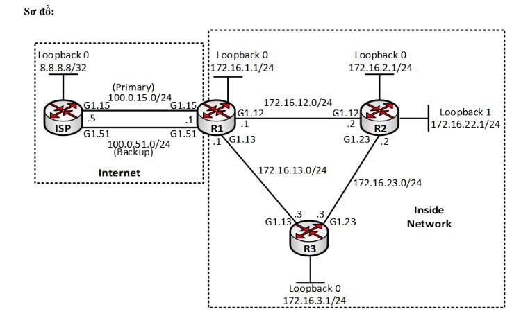

# CISCO IP SERVICES LAB | NAT + IP SLA + HSRP + GLBP

## INTERNET ĐỨT, GATEWAY DOWN – NETWORK VẪN PHẢI HOẠT ĐỘNG

**ISP chính bị đứt. Gateway mất đường đi. Router gặp sự cố.**

Nếu hệ thống chỉ có một đường Internet và một Gateway, traffic có thể bị gián đoạn ngay khi đường truyền hoặc thiết bị gặp lỗi. Với một hệ thống **High Availability**, mục tiêu là phát hiện sự cố và khôi phục kết nối theo quy trình:

**Failure → Detection → Failover → Traffic Recovery**

Bài lab IP Services này tập trung vào ba cơ chế trên Cisco IOS:

- **NAT + IP SLA + Tracking:** chuyển traffic từ đường Internet chính sang đường dự phòng khi phát hiện sự cố.
- **HSRP Tracking:** thay đổi Active Gateway khi interface hoặc đường đi phía sau không còn hoạt động.
- **GLBP Weighted Load Balancing:** cho phép nhiều Gateway cùng tham gia forwarding và hỗ trợ chia tải.

> **Mục tiêu thực hành:** Không chỉ cấu hình đúng lệnh, mà còn **chủ động tạo failure, quan sát trạng thái và kiểm chứng quá trình failover**.

---

## 1. SƠ ĐỒ MẠNG (TOPOLOGY)



### Các mạng chính trong sơ đồ

| Kết nối / Thiết bị | Network / IP | Vai trò |
|---|---|---|
| ISP Loopback0 | `8.8.8.8/32` | Địa chỉ mô phỏng đích Internet |
| ISP ↔ R1 qua `G1.15` | `100.0.15.0/24` | Uplink **Primary**; ISP `.5`, R1 `.1` |
| ISP ↔ R1 qua `G1.51` | `100.0.51.0/24` | Uplink **Backup**; ISP `.5`, R1 `.1` |
| R1 ↔ R2 | `172.16.12.0/24` | Mạng nội bộ |
| R1 ↔ R3 | `172.16.13.0/24` | Mạng nội bộ |
| R2 ↔ R3 | `172.16.23.0/24` | Mạng nội bộ |
| R1 Loopback0 | `172.16.1.1/24` | Loopback R1 |
| R2 Loopback0 | `172.16.2.1/24` | Loopback R2 |
| R2 Loopback1 | `172.16.22.1/24` | Địa chỉ Inside Local dùng để minh họa NAT |
| R3 Loopback0 | `172.16.3.1/24` | Loopback R3 |

> **Lưu ý:** Sơ đồ trên minh họa phần **NAT + IP SLA** với hai uplink đến router ISP. Các đoạn cấu hình **HSRP** (VLAN 10) và **GLBP** (`192.168.12.254`) bên dưới là những ví dụ riêng, không được thể hiện trực tiếp trên sơ đồ này.

---

## 2. INTERNET FAILOVER – NAT + IP SLA + TRACKING

### 2.1. Bài toán NAT với hai đường Internet

R1 có hai đường uplink:

- **Primary:** `G1.15` qua mạng `100.0.15.0/24`.
- **Backup:** `G1.51` qua mạng `100.0.51.0/24`.
- **Inside Local:** `172.16.22.1` (Loopback1 trên R2 theo sơ đồ).

Yêu cầu là ánh xạ một Inside Local ra hai địa chỉ khác nhau tùy đường ra:

| Đường Internet | Inside Local | Inside Global |
|---|---|---|
| Primary | `172.16.22.1` | `100.0.15.22` |
| Backup | `172.16.22.1` | `100.0.51.22` |

Nếu khai báo hai static NAT trực tiếp cho cùng một Inside Local:

```cisco
ip nat inside source static 172.16.22.1 100.0.15.22
ip nat inside source static 172.16.22.1 100.0.51.22
```

Cisco IOS có thể trả về thông báo xung đột ánh xạ:

```text
%NAT: 172.16.22.1 already mapped
```

### 2.2. Phân biệt NAT theo đường ra bằng Route-map

Sử dụng ACL và Route-map để phân biệt traffic đi qua uplink Primary và Backup:

```cisco
access-list 1 permit 172.16.22.1
!
route-map PRIMARY permit 10
 match ip address 1
 match interface g1.15
!
route-map BACKUP permit 10
 match ip address 1
 match interface g1.51
!
ip nat inside source static 172.16.22.1 100.0.15.22 route-map PRIMARY
ip nat inside source static 172.16.22.1 100.0.51.22 route-map BACKUP
```

> **Ghi nhớ:** NAT xử lý **address translation**, không tự bảo đảm đường Internet dự phòng được chọn khi uplink chính gặp lỗi. Cần kết hợp **IP SLA, Object Tracking và Floating Static Route**.

### 2.3. Cấu hình IP SLA và Tracking

Theo dõi khả năng reachability đến next-hop `100.0.15.5` thông qua đường Primary:

```cisco
ip sla 1
 icmp-echo 100.0.15.5 source-interface g1.15
 frequency 5
!
ip sla schedule 1 start-time now life forever
!
track 1 ip sla 1 reachability
```

Trong đó:

- `ip sla 1`: tạo phiên giám sát số 1.
- `icmp-echo`: kiểm tra đích thông qua ICMP.
- `frequency 5`: gửi phép đo theo chu kỳ 5 giây.
- `track 1`: liên kết kết quả giám sát với một Tracking Object.

### 2.4. Cấu hình Primary Route và Floating Static Route

```cisco
ip route 0.0.0.0 0.0.0.0 100.0.15.5 5 track 1
ip route 0.0.0.0 0.0.0.0 100.0.51.5 10
```

| Route | Next-hop | Administrative Distance | Điều kiện |
|---|---|---:|---|
| Primary | `100.0.15.5` | `5` | Chỉ hoạt động khi Track 1 Up |
| Backup | `100.0.51.5` | `10` | Được ưu tiên khi route Primary bị rút |

Khi IP SLA không còn kiểm tra được đích Primary, Track 1 chuyển sang **Down**. Route có AD `5` sẽ bị rút khỏi routing table, cho phép router lựa chọn route dự phòng có AD `10`.

### 2.5. Kiểm thử Internet Failover

**Bước 1 – Mô phỏng sự cố ở đường Primary:**

```cisco
configure terminal
interface g1.15
 shutdown
end
```

**Bước 2 – Kiểm tra trạng thái:**

```cisco
show ip sla statistics
show track 1
show ip route
show ip nat translations
```

**Bước 3 – Quan sát chuỗi chuyển đổi kỳ vọng:**

```text
ISP Primary Down
       ↓
IP SLA / Track Down
       ↓
Primary Default Route bị rút
       ↓
Backup Default Route được chọn
       ↓
Kiểm tra lại traffic và NAT qua đường Backup
```

**Khôi phục sau khi test:**

```cisco
configure terminal
interface g1.15
 no shutdown
end
```

**Kết luận phần 1:** **NAT + IP SLA + Tracking + Routing** phối hợp để hỗ trợ Internet Failover. Cần kiểm tra cả routing, NAT và khả năng kết nối thực tế sau khi chuyển tuyến.

---

## 3. GATEWAY FAILOVER – HSRP TRACKING

### 3.1. Vấn đề: Interface Up nhưng Network Path đã Down

Một router có thể vẫn ở trạng thái **Up/Up**, HSRP vẫn hoạt động, nhưng mạng upstream hoặc remote phía sau nó đã mất kết nối.

Nếu chỉ theo dõi interface, router đó có thể tiếp tục giữ vai trò Active Gateway dù không còn đường đi hữu dụng. **HSRP Tracking** cho phép điều chỉnh priority dựa trên trạng thái interface, route hoặc IP SLA.

### 3.2. Theo dõi khả năng tồn tại của một route

Ví dụ: SW1 theo dõi route `1.1.1.1/32`:

```cisco
track 2 ip route 1.1.1.1/32 reachability
```

Gắn Tracking Object vào HSRP trên VLAN 10:

```cisco
interface vlan 10
 standby 1 ip 10.1.10.254
 standby 1 priority 150
 standby 1 preempt
 standby 1 track f0/11 decrement 60
 standby 1 track 2 decrement 60
```

Với cấu hình này, một tracking condition Down sẽ làm priority bị giảm theo giá trị `decrement` tương ứng.

### 3.3. Theo dõi remote network bằng IP SLA

Có thể dùng IP SLA để kiểm tra trực tiếp một địa chỉ phía xa:

```cisco
ip sla 1
 icmp-echo 10.1.2.1 source-ip 10.1.2.2
 frequency 5
!
ip sla schedule 1 start-time now life forever
!
track 1 ip sla 1 reachability
```

Gắn Track vào HSRP group 2 trên interface tương ứng:

```cisco
standby 2 track 1 decrement 60
```

> Hai đoạn cấu hình ở mục 3.2 và 3.3 là các **ví dụ theo dõi khác nhau**; khi triển khai thực tế cần thống nhất HSRP group, interface và địa chỉ IP với topology đang sử dụng.

### 3.4. Kiểm thử HSRP Failover

Không cần tắt toàn bộ router. Có thể chủ động làm mất đường kết nối mà IP SLA đang kiểm tra, sau đó xác minh:

```cisco
show standby brief
show standby
show track
show ip sla statistics
```

**Quy trình kỳ vọng:**

```text
Upstream Path Failure
          ↓
      IP SLA Down
          ↓
      Track Down
          ↓
    HSRP Priority giảm
          ↓
   Active Gateway thay đổi
```

Việc chuyển Active chỉ xảy ra khi **priority sau khi giảm thấp hơn priority của thiết bị còn lại** và các điều kiện bầu chọn/preempt phù hợp.

**Điểm cần nhớ:** **Interface còn Up** không đồng nghĩa **Network Path còn hoạt động**.

---

## 4. GATEWAY REDUNDANCY VÀ LOAD BALANCING – GLBP

### 4.1. HSRP và GLBP khác nhau thế nào?

- **HSRP:** thông thường sử dụng một Active Gateway và một Standby Gateway cho mỗi group.
- **GLBP:** có thể cho phép nhiều router cùng tham gia forwarding thông qua các **Active Virtual Forwarder (AVF)**.

GLBP hỗ trợ **Gateway Redundancy** đồng thời có cơ chế **Gateway Load Balancing**.

### 4.2. Cấu hình GLBP Weighted Load Balancing

Ví dụ cấu hình trên R1:

```cisco
interface f0/0
 glbp 1 ip 192.168.12.254
 glbp 1 priority 150
 glbp 1 preempt
 glbp 1 timers 1 3
 glbp 1 authentication md5 key-string CISCO12
 glbp 1 load-balancing weighted
 glbp 1 weighting 200 lower 100
 glbp 1 weighting track 1 decrement 150
```

> **Lưu ý:** Phải cấu hình Tracking Object `1` phù hợp với đường uplink của mô hình GLBP trước khi sử dụng `glbp 1 weighting track 1`. Chuỗi `CISCO12` chỉ là ví dụ dùng trong lab, không nên dùng làm mật khẩu thực tế.

### 4.3. Cơ chế AVG và AVF

- **AVG (Active Virtual Gateway):** quản lý địa chỉ IP ảo và phản hồi ARP cho các client.
- **AVF (Active Virtual Forwarder):** thực hiện forwarding traffic sử dụng Virtual MAC được GLBP phân phối.
- **Weighted Load Balancing:** phân phối MAC trả về cho client dựa trên weight của các AVF đủ điều kiện.

Trong nội dung lab, tỷ lệ forwarding **2:1** giữa R1 và R2 là **mục tiêu thiết kế**; cần cấu hình weight của cả hai router và kiểm chứng thực tế, không suy ra tỷ lệ này chỉ từ cấu hình của riêng R1.

### 4.4. Kiểm thử GLBP Failover

Kiểm tra trạng thái GLBP:

```cisco
show glbp brief
show glbp
show track
```

Sau đó mô phỏng sự cố trên đường uplink mà Track 1 giám sát. Theo cấu hình ví dụ:

```text
R1 Weight = 200
      ↓ (Track 1 Down, decrement 150)
R1 Weight = 50
      ↓ (thấp hơn lower threshold = 100)
R1 không tiếp tục forwarding với điều kiện weight trước đó
      ↓
Các AVF còn khả dụng đảm nhận forwarding
```

Sau khi thay đổi, kiểm tra lại trạng thái GLBP, ARP của client và khả năng truyền traffic để xác minh **Failover** và **Load Balancing**.

---

## 5. TỔNG KẾT BÀI LAB

| Công nghệ | Chức năng | Tình huống thực hành |
|---|---|---|
| **NAT + IP SLA** | Internet redundancy và chuyển đường | Uplink Primary không còn reachable |
| **HSRP Tracking** | Dự phòng Default Gateway | Gateway vẫn Up nhưng upstream bị lỗi |
| **GLBP Weighted** | Gateway redundancy và chia tải | Weight giảm, AVF không còn đủ điều kiện |

### Ba điểm quan trọng

1. **Internet Failover:** NAT xử lý ánh xạ địa chỉ; **IP SLA + Tracking + Routing** kiểm soát việc lựa chọn đường Internet.
2. **Gateway Failover:** HSRP Tracking giúp xử lý trường hợp **interface Up nhưng đường đi thực tế không còn khả dụng**.
3. **Gateway Load Balancing:** GLBP cho phép nhiều router tham gia forwarding thay vì chỉ có một Active Gateway.

### Quy trình Troubleshooting / Failover

```text
FAILURE
   ↓
DETECTION
   ↓
TRACKING
   ↓
DECISION
   ↓
FAILOVER
   ↓
TRAFFIC RECOVERY
```

**Kết luận:** Khi làm lab Cisco IP Services, không nên chỉ dừng ở câu hỏi *“Lệnh này dùng để làm gì?”*. Điều quan trọng là hiểu được **traffic đi qua đâu, failure được phát hiện như thế nào, thiết bị ra quyết định failover ra sao và dịch vụ có thật sự phục hồi hay không**.

---
