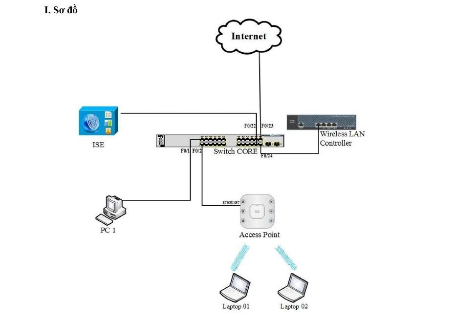

# CISCO ISE & WLC LAB – GUEST WIFI ACCESS VỚI RADIUS WEB AUTHENTICATION

## TRIỂN KHAI WIFI GUEST ACCESS VỚI CISCO ISE – WLC REDIRECT WEB PORTAL QUA RADIUS

> **KHI GUEST WIFI KẾT NỐI ĐƯỢC NHƯNG KHÔNG VÀO ĐƯỢC INTERNET – BẠN SẼ DEBUG TỪ ĐÂU?**

Trong môi trường **Enterprise Wireless**, việc tạo một SSID Guest không phải là phần khó.

Cái khó nằm ở phía sau quá trình kết nối:

- Client Association thành công nhưng không nhận đúng quyền truy cập?
- RADIUS Request đã gửi nhưng Cisco ISE không trả đúng Authorization?
- Redirect Portal không xuất hiện?
- User Login thành công nhưng traffic vẫn bị chặn?

Lúc này, vấn đề không còn đơn giản là WiFi mà là sự phối hợp giữa nhiều thành phần:

**WLC → RADIUS → Cisco ISE → Authorization Profile → Redirect ACL → VLAN → Internet**

Chỉ cần một điểm cấu hình chưa đúng, toàn bộ luồng Guest Access có thể bị lỗi.

Trong bài lab này, mình triển khai mô hình **Cisco WLC + Access Point + Cisco ISE + Switch Core** để kiểm tra toàn bộ flow xử lý của Guest Client: từ lúc kết nối SSID, xác thực qua RADIUS, Redirect Web Portal cho đến khi được cấp quyền truy cập Internet.

---

## 1. NETWORK TOPOLOGY – SƠ ĐỒ MẠNG

### 1.1. Các thành phần trong mô hình

| Thiết bị | Vai trò |
|---|---|
| Cisco ISE | RADIUS Server, Authentication, Authorization và Guest Portal |
| Cisco WLC | Quản lý WLAN, AP và Wireless Client |
| Cisco Access Point | Cung cấp kết nối WiFi cho Client |
| Switch Core | Kết nối các thành phần mạng |
| PC1 | Máy tính phục vụ quản trị và kiểm tra |
| Laptop 01 | Wireless Client |
| Laptop 02 | Wireless Client |
| Internet | Mạng ngoài phục vụ kiểm tra truy cập |

### 1.2. Bảng địa chỉ IP

| Thiết bị / Interface | Địa chỉ IP |
|---|---|
| Cisco ISE | `192.168.1.253/24` |
| Cisco WLC | `192.168.1.100/24` |
| Access Point | `192.168.1.1/24` |
| PC1 | `192.168.1.2/24` |
| Switch Core F0/23 | DHCP |
| Switch Core VLAN 1 | `192.168.1.10/24` |

**Management Network:** `192.168.1.0/24`

**Lưu ý:** Bảng địa chỉ trên thể hiện mạng quản lý theo sơ đồ ban đầu. VLAN Staff, VLAN Guest, DHCP Scope và Default Gateway cho từng mạng Client cần được cấu hình bổ sung phù hợp với topology thực tế.

Interface F0/23 chỉ có thể nhận IP DHCP trực tiếp khi thiết bị hỗ trợ cấu hình Layer 3 cho interface đó.

---

## 2. LAB OBJECTIVES – MỤC TIÊU TRIỂN KHAI

Mô hình triển khai hai SSID với hai phương thức truy cập khác nhau.

### 2.1. SSID_Staff – Internal Wireless

**Authentication:** WPA2-PSK

**Encryption:** AES

**Network:** Staff VLAN

**Access:** Internal Network

Mục tiêu:

- Client kết nối WiFi bằng Pre-Shared Key.
- WLC xác thực thông tin PSK.
- Client được đưa vào Staff VLAN.
- DHCP cấp địa chỉ IP phù hợp.
- Người dùng có thể truy cập các tài nguyên nội bộ theo policy.

### 2.2. SSID_Guest – Guest Wireless

**Authentication:** Cisco ISE Guest Web Authentication

**Protocol:** RADIUS

**Web Portal:** Cisco ISE Guest Portal

**Network:** Guest VLAN

**Access:** Internet Only

Mục tiêu:

- Guest Client kết nối SSID.
- WLC gửi thông tin Client đến Cisco ISE.
- ISE kiểm tra Authentication và Authorization Policy.
- Client chưa xác thực được chuyển hướng đến Web Portal.
- Người dùng đăng nhập Guest Portal.
- ISE cập nhật Authorization sau khi xác thực thành công.
- Guest chỉ được phép truy cập Internet theo Security Policy.

### Expected Guest Access Flow

**Client Association → RADIUS MAB → ISE Authorization → Web Redirect → Guest Login → CoA/Reauthorization → Internet Access**

Điểm quan trọng của bài lab không nằm ở việc tạo thêm một SSID mà là hiểu được:

- WLC xử lý Wireless Client như thế nào?
- ISE trả về Authorization Policy gì?
- Redirect ACL ảnh hưởng đến Web Authentication ra sao?
- Sau khi Login, quyền truy cập được cập nhật như thế nào?

---

## 3. NETWORK FOUNDATION – TÁCH STAFF VÀ GUEST TRAFFIC

Trước khi triển khai Wireless, hệ thống mạng cần đảm bảo các thành phần cơ bản hoạt động ổn định.

### 3.1. Network Requirements

- [ ] VLAN được tạo và hoạt động chính xác.
- [ ] Switch Port được cấu hình đúng Access/Trunk Mode.
- [ ] DHCP cấp địa chỉ IP phù hợp cho từng mạng.
- [ ] Default Gateway và Routing hoạt động.
- [ ] WLC có thể giao tiếp với Cisco ISE.
- [ ] Access Point có thể kết nối và đăng ký với WLC.
- [ ] DNS Resolution hoạt động.
- [ ] Guest Network có đường đi đến Internet.
- [ ] Firewall/NAT Policy được cấu hình phù hợp.

### 3.2. Network Segmentation

**Staff Network**

- Dành cho nhân viên nội bộ.
- Sử dụng Staff VLAN.
- Có thể truy cập các tài nguyên nội bộ được cho phép.

**Guest Network**

- Dành cho người dùng khách.
- Sử dụng Guest VLAN.
- Không được truy cập các tài nguyên nội bộ.
- Chỉ được truy cập Internet sau khi hoàn thành xác thực.

Việc phân tách Staff và Guest giúp giảm rủi ro truy cập trái phép vào hệ thống nội bộ.

---

## 4. STAFF WLAN – WPA2-PSK AUTHENTICATION

Đầu tiên triển khai SSID dành cho nhân viên.

### 4.1. WLAN Configuration

| Parameter | Value |
|---|---|
| SSID | `SSID_Staff` |
| Layer 2 Security | WPA2-PSK |
| Encryption | AES |
| Network | Staff VLAN |
| Authentication | Pre-Shared Key |

### 4.2. Staff Authentication Flow

**Client kết nối SSID_Staff**

↓

**WPA2-PSK Authentication**

↓

**Client được đưa vào Staff VLAN**

↓

**DHCP cấp IP**

↓

**Client truy cập mạng theo Staff Policy**

### 4.3. Verification

Kiểm tra trên Wireless Client:

- [ ] Kết nối thành công SSID_Staff.
- [ ] Nhận đúng địa chỉ IP Staff VLAN.
- [ ] Ping Default Gateway thành công.
- [ ] Truy cập tài nguyên nội bộ được phép.
- [ ] Truy cập Internet nếu policy cho phép.

**Expected Result:** Staff Client hoạt động bình thường mà không cần xác thực qua Guest Web Portal.

---

## 5. GUEST WLAN – CISCO ISE WEB AUTHENTICATION

Đây là phần quan trọng nhất của bài lab.

Khác với Staff WiFi, Guest Client không được phép truy cập Internet ngay sau khi kết nối.

Client cần trải qua:

**Authentication → Authorization → Redirect → Guest Login → Permit Access**

### 5.1. Guest WLAN Configuration

**SSID:** `SSID_Guest`

**Layer 2 Security**

| Parameter | Configuration |
|---|---|
| Layer 2 Security | None |
| MAC Filtering | Enable |
| RADIUS Server | Cisco ISE |
| AAA Override | Enable |
| NAC State | RADIUS NAC |

Các tùy chọn này phù hợp với một số dòng Cisco AireOS WLC. Tên mục và cách cấu hình có thể khác trên Catalyst 9800 hoặc phiên bản phần mềm khác.

### 5.2. RADIUS Server Configuration

Khai báo Cisco ISE trên WLC.

| Parameter | Value |
|---|---|
| RADIUS Server IP | `192.168.1.253` |
| Authentication Port | `1812/UDP` |
| Accounting Port | `1813/UDP` |
| Shared Secret | Phải trùng khớp giữa WLC và ISE |

Sau khi hoàn tất, WLC có thể trao đổi thông tin RADIUS với Cisco ISE.

### 5.3. Guest Authentication Behavior

Với mô hình Central Web Authentication sử dụng MAC Authentication Bypass (MAB):

1. Guest Client kết nối SSID_Guest.
2. WLC sử dụng MAC Filtering để thực hiện yêu cầu RADIUS.
3. Cisco ISE đánh giá Authentication và Authorization Policy.
4. ISE trả về Authorization Profile yêu cầu Web Redirect.
5. WLC áp dụng Redirect ACL và Redirect URL.
6. Client mở Cisco ISE Guest Portal.
7. Sau khi xác thực, ISE có thể sử dụng CoA để yêu cầu cập nhật phiên và quyền truy cập.

---

## 6. RADIUS FLOW – PHÂN TÍCH AUTHENTICATION VÀ AUTHORIZATION

Khi Wireless Client kết nối SSID Guest, quá trình xử lý diễn ra như sau.

### Step 1 – Client Association

Wireless Client thực hiện Association với Access Point.

Access Point tiếp nhận kết nối và chuyển thông tin Client đến WLC.

### Step 2 – RADIUS Access-Request

WLC gửi RADIUS Access-Request đến Cisco ISE.

Các thông tin có thể bao gồm:

- Client MAC Address
- Called-Station-ID
- NAS-IP-Address
- NAS-Identifier
- WLAN/SSID Information

### Step 3 – Cisco ISE Policy Evaluation

Cisco ISE kiểm tra:

- Authentication Method
- Endpoint Identity
- Authentication Policy
- Authorization Policy
- Endpoint Group

Nếu Guest chưa hoàn thành Web Authentication, Cisco ISE có thể trả về:

**RADIUS Access-Accept**

Kèm Authorization Attributes:

- Web Redirect URL
- Redirect ACL Name
- Authorization Information

### Step 4 – WLC Applies Redirect Policy

WLC nhận Authorization Result từ Cisco ISE.

Sau đó áp dụng Redirect ACL để điều khiển lưu lượng của Client.

Các yêu cầu truy cập Web phù hợp sẽ được chuyển hướng đến Cisco ISE Guest Portal.

### Step 5 – Guest Portal Authentication

Client truy cập Web Portal và thực hiện đăng nhập.

Cisco ISE kiểm tra Guest Credentials và trạng thái phiên.

### Step 6 – Change of Authorization

Khi xác thực thành công, Cisco ISE có thể gửi RADIUS CoA đến WLC.

WLC thực hiện Reauthorization và áp dụng Policy mới.

**Kết quả:** Client được truy cập mạng theo Authorization Profile sau đăng nhập.

---

## 7. REDIRECT ACL – THÀNH PHẦN QUAN TRỌNG NHẤT

Một tình huống thường gặp:

- RADIUS hoạt động bình thường.
- Cisco ISE nhận được Access-Request.
- WLC nhận Authorization Profile.
- Nhưng Guest Portal không xuất hiện.

Nguyên nhân có thể nằm ở **Redirect ACL**.

### 7.1. Redirect ACL Requirements

Guest Client cần có khả năng thực hiện các kết nối phục vụ quá trình xác thực:

- DHCP để nhận địa chỉ IP.
- DNS để phân giải tên miền.
- Truy cập Cisco ISE Guest Portal.
- Truy cập các dịch vụ được phép trước Authentication.

**Lưu ý kỹ thuật:** Trên Cisco WLC, Redirect ACL có thể sử dụng cách diễn giải Permit/Deny khác với ACL lọc traffic thông thường. Cần phân biệt traffic được Redirect và traffic được phép đi trực tiếp theo đúng nền tảng WLC đang sử dụng.

### 7.2. Common Redirect Problems

**Problem 1 – Portal không xuất hiện**

Possible Causes:

- Redirect ACL không đúng.
- ISE Portal không thể truy cập.
- DNS Resolution thất bại.
- Authorization Profile không trả đúng Redirect Attributes.

**Problem 2 – Browser Timeout**

Possible Causes:

- Routing đến Cisco ISE bị lỗi.
- Firewall chặn Portal Traffic.
- DNS không hoạt động.
- Certificate hoặc HTTPS Redirect gặp vấn đề.

**Problem 3 – Login thành công nhưng không có Internet**

Possible Causes:

- CoA không hoạt động.
- Authorization Profile chưa thay đổi.
- Client vẫn bị áp dụng Pre-Authentication Policy.
- Routing/NAT/Firewall chưa được cấu hình phù hợp.

---

## 8. CISCO ISE – AUTHORIZATION POLICY

Trên Cisco ISE, Authorization Policy quyết định Guest Client sẽ được phép thực hiện những hoạt động nào.

### 8.1. Authorization Profile

Tạo Authorization Profile:

**Profile Name:** `Guest_Web_Redirect`

Các thành phần:

| Parameter | Configuration |
|---|---|
| Web Redirection | Centralized Web Auth |
| Redirect ACL | Guest Redirect ACL trên WLC |
| Portal | Cisco ISE Guest Portal |
| Redirect URL | Được ISE cung cấp |

### 8.2. Authorization Rules

**Rule 1 – Guest chưa Authentication**

Condition:

`Wireless_MAB`

Authorization Result:

`Guest_Web_Redirect`

**Action:**

Client được chuyển hướng đến Cisco ISE Guest Portal.

**Rule 2 – Guest đã Authentication**

Condition:

Guest Session đã được xác thực và đáp ứng điều kiện Authorization Policy tương ứng.

Authorization Result:

`PermitAccess`

**Action:**

- Cho phép Guest truy cập theo chính sách.
- Không còn áp dụng Redirect Policy.
- Guest sử dụng Internet theo quyền được cấp.

Có thể sử dụng Guest Endpoint Group kết hợp trạng thái phiên để xây dựng điều kiện. Chỉ kiểm tra Endpoint Group mà không kiểm tra trạng thái xác thực có thể dẫn đến cấp quyền không đúng mong muốn.

### 8.3. Post-Authentication Flow

**Guest Login Success**

↓

**ISE Updates Session State**

↓

**RADIUS CoA**

↓

**WLC Reauthorization**

↓

**PermitAccess Policy**

↓

**Guest Internet Access**

---

## 9. TROUBLESHOOTING – PHÂN TÍCH LỖI GUEST ACCESS

### 9.1. Client kết nối nhưng không Redirect Portal

Kiểm tra:

- SSID_Guest Configuration
- MAC Filtering
- RADIUS Authentication
- ISE Live Logs
- Authorization Profile
- Redirect ACL
- DNS Resolution
- ISE Portal Reachability

### 9.2. RADIUS Timeout

Kiểm tra:

- IP Address của Cisco ISE.
- Shared Secret giữa WLC và ISE.
- UDP Port 1812.
- Routing giữa hai thiết bị.
- Firewall Policy.
- Trạng thái dịch vụ RADIUS.
- NTP và thời gian hệ thống phục vụ các cơ chế xác thực liên quan.

### 9.3. Guest Login thành công nhưng không có Internet

Kiểm tra:

- Authorization Result
- RADIUS CoA
- VLAN Mapping
- Client IP Address
- DHCP
- Default Gateway
- Routing
- NAT
- Firewall Policy

### 9.4. Troubleshooting Checklist

| Component | Verification |
|---|---|
| Access Point | AP đã Join WLC |
| WLAN | SSID_Guest Enabled |
| Client | Association Successful |
| DHCP | Client nhận IP chính xác |
| RADIUS | Access-Request/Response thành công |
| Cisco ISE | Authentication Live Logs |
| Authorization | Đúng Policy và Profile |
| Redirect ACL | Redirect hoạt động đúng |
| Guest Portal | Portal truy cập được |
| CoA | Reauthorization thành công |
| Routing/NAT | Guest có đường ra Internet |

---

## 10. LAB VERIFICATION – KIỂM TRA KẾT QUẢ

### 10.1. Staff WiFi

**Expected Results**

- [ ] WPA2-PSK Authentication thành công.
- [ ] Client nhận IP thuộc Staff VLAN.
- [ ] Ping Gateway thành công.
- [ ] Client truy cập được tài nguyên nội bộ theo Policy.
- [ ] Internet Access hoạt động nếu được cho phép.

### 10.2. Guest WiFi

**Expected Results**

- [ ] Guest kết nối SSID_Guest.
- [ ] WLC gửi RADIUS Access-Request đến ISE.
- [ ] ISE trả về Guest Redirect Authorization Profile.
- [ ] Guest được chuyển hướng đến Web Portal.
- [ ] Guest Login thành công.
- [ ] CoA/Reauthorization hoạt động.
- [ ] Client nhận quyền PermitAccess.
- [ ] Guest truy cập Internet thành công.
- [ ] Guest không thể truy cập trái phép vào Internal Network.

### 10.3. Expected Security Behavior

| Test Case | Expected Result |
|---|---|
| Staff kết nối WPA2-PSK đúng | Allow |
| Staff nhập sai PSK | Deny |
| Guest Association | Allow |
| Guest chưa xác thực truy cập Internet | Restricted / Redirect |
| Guest mở Authentication Portal | Allow |
| Guest Login thành công | Apply Post-Auth Policy |
| Guest đã xác thực truy cập Internet | Allow |
| Guest truy cập Internal Network | Deny |

---

## 11. CONCLUSION – TỔNG KẾT LAB

Qua bài lab này có thể thấy:

**Một hệ thống Enterprise Wireless không chỉ đơn giản là tạo SSID và bật Security.**

Đằng sau thao tác kết nối WiFi là sự phối hợp giữa nhiều thành phần:

**Wireless Controller + RADIUS + Cisco ISE + Redirect ACL + VLAN + Authorization Policy**

Trong đó:

- **WLC** quản lý WLAN, Client Association và thực thi Wireless Policy.
- **Cisco ISE** thực hiện Authentication và Authorization.
- **RADIUS** truyền thông tin Authentication và Authorization giữa WLC và ISE.
- **Redirect ACL** kiểm soát luồng truy cập trong quá trình Web Authentication.
- **Guest Portal** cung cấp giao diện đăng nhập cho người dùng.
- **CoA** hỗ trợ cập nhật quyền truy cập sau Authentication.
- **VLAN và Firewall** phân tách Guest Traffic khỏi Internal Network.

### Key Takeaways

1. Client kết nối WiFi thành công không đồng nghĩa với việc đã được cấp quyền truy cập Internet.
2. RADIUS Access-Accept không nhất thiết có nghĩa Client đã có Full Network Access.
3. Redirect ACL là thành phần cần kiểm tra kỹ khi Guest Portal không hoạt động.
4. Sau khi Guest Authentication thành công, Authorization Policy phải được cập nhật phù hợp.
5. Troubleshooting Wireless Enterprise cần kiểm tra toàn bộ quá trình từ Client Association đến Routing, NAT và Firewall.

**Hiểu rõ toàn bộ Authentication & Authorization Flow sẽ giúp việc triển khai, vận hành và Troubleshooting Cisco Enterprise Wireless trở nên hiệu quả hơn.**

---

## TECHNOLOGIES USED

`Cisco ISE` · `Cisco WLC` · `Cisco AP` · `RADIUS` · `MAB` · `Central Web Authentication` · `CoA` · `Redirect ACL` · `WPA2-PSK` · `VLAN` · `DHCP` · `Enterprise Wireless`

**Lab Focus:** Wireless Security | Identity-Based Access Control | Guest Network Segmentation | RADIUS Authentication | Cisco ISE Troubleshooting