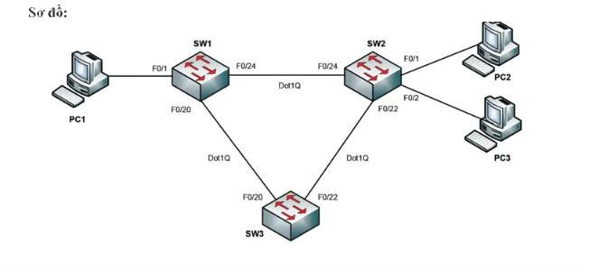

# CISCO LAYER 2 SECURITY LAB
## TRIỂN KHAI PORT SECURITY, SPAN, BPDU GUARD VÀ ROOT GUARD – KHI SWITCH KHÔNG CHỈ DÙNG ĐỂ CHUYỂN MẠCH

## 1. GIỚI THIỆU

Khi học CCNA, mình từng nghĩ Switch chỉ có nhiệm vụ chuyển tiếp Frame và chạy VLAN, Trunk hay Spanning Tree Protocol (STP).

Tuy nhiên, sau khi thực hành bài lab này, mình nhận thấy Cisco Switch còn cung cấp nhiều cơ chế bảo mật Layer 2 giúp bảo vệ hệ thống mạng trước những sự cố, thiết bị không mong muốn và các thay đổi topology ngoài ý muốn.

Trong bài lab này, mình triển khai mô hình gồm **3 Cisco Switch** kết nối với nhau thông qua các đường **802.1Q Trunk**, kết hợp cấu hình:

- **VTP (VLAN Trunking Protocol):** Đồng bộ VLAN giữa các Switch.
- **STP (Spanning Tree Protocol):** Ngăn chặn Layer 2 Loop.
- **Port Security:** Kiểm soát địa chỉ MAC trên Access Port.
- **SPAN (Switched Port Analyzer):** Giám sát và phân tích lưu lượng mạng.
- **BPDU Guard:** Bảo vệ Access Port khỏi các BPDU không mong muốn.
- **Root Guard:** Ngăn thiết bị khác chiếm quyền Root Bridge.

Điểm quan trọng của bài lab không chỉ nằm ở việc cấu hình thành công mà còn là **chủ động tạo các tình huống vi phạm, quan sát trạng thái Switch và xác minh kết quả bằng các lệnh `show`.**

---

## 2. MỤC TIÊU BÀI LAB

Sau khi hoàn thành bài thực hành, mình có thể:

- Thiết lập đường Trunk 802.1Q giữa các Cisco Switch.
- Cấu hình VTP Server và VTP Client để quản lý VLAN.
- Xác định Root Bridge cho từng VLAN.
- Triển khai Port Security với các chế độ Shutdown, Restrict và Sticky MAC.
- Cấu hình SPAN để sao chép lưu lượng phục vụ phân tích bằng Wireshark.
- Kích hoạt PortFast và BPDU Guard để bảo vệ Access Port.
- Sử dụng Root Guard để duy trì topology STP theo thiết kế.
- Kiểm tra và troubleshoot các tình huống vi phạm bảo mật Layer 2.

---

## 3. MÔ HÌNH MẠNG (NETWORK TOPOLOGY)

### 3.1. Thiết bị sử dụng

| Thiết bị | Vai trò |
|---|---|
| SW1 | VTP Server, STP Root Primary VLAN 10 |
| SW2 | VTP Client, STP Root Primary VLAN 20 |
| SW3 | VTP Client |
| PC1 | Thiết bị đầu cuối kết nối SW1 |
| PC2 | Thiết bị đầu cuối kết nối SW2 |
| PC3 | Thiết bị đầu cuối kết nối SW2 |
| Wireshark | Phân tích lưu lượng SPAN |

### 3.2. Kết nối giữa các thiết bị

| Thiết bị | Interface | Kết nối đến | Interface | Loại kết nối |
|---|---|---|---|---|
| SW1 | F0/1 | PC1 | Ethernet | Access |
| SW1 | F0/24 | SW2 | F0/24 | Trunk |
| SW1 | F0/20 | SW3 | F0/20 | Trunk |
| SW2 | F0/22 | SW3 | F0/22 | Trunk |
| SW2 | F0/1 | PC2 | Ethernet | Access |
| SW2 | F0/2 | PC3 | Ethernet | Access |

### 3.3. Thiết kế VLAN

| VLAN | Mục đích | STP Root Bridge |
|---|---|---|
| VLAN 10 | Mạng người dùng 1 | SW1 |
| VLAN 20 | Mạng người dùng 2 | SW2 |

Việc phân chia Root Bridge theo từng VLAN giúp tận dụng các đường kết nối dự phòng và phân phối lưu lượng Layer 2 hợp lý hơn.

---

## 4. TRIỂN KHAI VTP VÀ SPANNING TREE

### 4.1. Cấu hình 802.1Q Trunk

Đầu tiên, mình cấu hình các đường kết nối giữa SW1, SW2 và SW3 ở chế độ **Trunk** để cho phép nhiều VLAN truyền qua cùng một liên kết vật lý.

Đồng thời, mình tắt DTP (Dynamic Trunking Protocol) nhằm tránh việc các cổng tự động thương lượng trạng thái Trunk.

**Mục tiêu:**

- Thiết lập kết nối Trunk giữa các Switch.
- Cho phép VLAN 10 và VLAN 20 hoạt động trên các đường Trunk.
- Hạn chế những thay đổi chế độ Trunk ngoài ý muốn.

**Lệnh kiểm tra:**

`show interfaces trunk`

`show interfaces switchport`

### 4.2. Đồng bộ VLAN bằng VTP

Tiếp theo, mình triển khai VTP theo mô hình:

- **SW1:** VTP Server
- **SW2:** VTP Client
- **SW3:** VTP Client

Sau khi tạo VLAN 10 và VLAN 20 trên SW1, các Switch Client có thể tự động nhận thông tin VLAN thông qua VTP, miễn là các điều kiện đồng bộ được đáp ứng.

Kết quả kiểm tra cho thấy VLAN 10 và VLAN 20 đã xuất hiện trên SW2 và SW3 mà không cần tạo thủ công trên từng Switch.

**Lệnh kiểm tra:**

`show vtp status`

`show vlan brief`

**Kết quả mong đợi:**

- SW1 hoạt động ở chế độ VTP Server.
- SW2 và SW3 hoạt động ở chế độ VTP Client.
- Thông tin VLAN được đồng bộ chính xác.
- VLAN 10 và VLAN 20 xuất hiện trên cả ba Switch.

### 4.3. Cấu hình STP Root Bridge

Thay vì sử dụng Root Bridge được bầu chọn hoàn toàn theo giá trị mặc định, mình chủ động thiết kế:

- **VLAN 10:** SW1 là Root Primary.
- **VLAN 20:** SW2 là Root Primary.

Điều này giúp xác định đường đi Layer 2 theo từng VLAN và tận dụng các liên kết dự phòng.

**Lệnh kiểm tra:**

`show spanning-tree`

`show spanning-tree vlan 10`

`show spanning-tree vlan 20`

**Kết quả mong đợi:**

- VLAN 10 nhận SW1 làm Root Bridge.
- VLAN 20 nhận SW2 làm Root Bridge.
- Các cổng chuyển sang trạng thái Forwarding hoặc Blocking/Alternate theo topology.
- Không xuất hiện Layer 2 Loop.

---

## 5. PORT SECURITY – KIỂM SOÁT THIẾT BỊ KẾT NỐI

Port Security là cơ chế bảo mật Layer 2 giúp giới hạn những địa chỉ MAC được phép xuất hiện trên một Access Port.

### 5.1. Thử nghiệm Port Security Shutdown

Đầu tiên, mình cấu hình Port Security trên cổng kết nối PC với các điều kiện:

- Giới hạn tối đa **1 địa chỉ MAC**.
- Sử dụng chế độ vi phạm **Shutdown**.
- Cho phép Switch học địa chỉ MAC của thiết bị hợp lệ.

**Kịch bản kiểm tra:**

1. Kết nối PC đầu tiên vào Access Port.
2. Kiểm tra địa chỉ MAC được Switch học.
3. Thay PC bằng một thiết bị có địa chỉ MAC khác.
4. Quan sát trạng thái interface.

**Kết quả:**

Khi Switch phát hiện địa chỉ MAC vi phạm chính sách, interface chuyển sang trạng thái **err-disabled**.

Điều này chứng minh Port Security đã phát hiện và ngăn chặn thiết bị không được phép.

**Lệnh kiểm tra:**

`show port-security`

`show port-security interface fa0/1`

`show interfaces status`

### 5.2. Thử nghiệm Sticky MAC và Restrict

Sau đó, mình tiếp tục thử nghiệm Port Security với:

- **Sticky MAC:** Tự động học và lưu địa chỉ MAC hợp lệ vào running-config.
- **Violation Restrict:** Chặn frame vi phạm nhưng không đưa interface vào trạng thái err-disabled.

**Kịch bản kiểm tra:**

1. Kích hoạt Sticky MAC.
2. Kết nối PC hợp lệ để Switch học địa chỉ MAC.
3. Thay bằng một thiết bị có MAC khác.
4. Kiểm tra bộ đếm vi phạm và trạng thái interface.

**Kết quả:**

Switch tiếp tục duy trì hoạt động của interface nhưng loại bỏ lưu lượng vi phạm.

Đồng thời, bộ đếm vi phạm được cập nhật để phục vụ công tác giám sát.

### 5.3. So sánh các chế độ Port Security

| Chế độ | Hành động khi vi phạm | Trạng thái cổng |
|---|---|---|
| Protect | Loại bỏ frame vi phạm | Vẫn hoạt động |
| Restrict | Loại bỏ frame, tăng bộ đếm và có thể ghi log | Vẫn hoạt động |
| Shutdown | Đưa interface vào err-disabled | Bị vô hiệu hóa |

**Bài học rút ra:**

- Shutdown phù hợp với các môi trường yêu cầu kiểm soát nghiêm ngặt.
- Restrict phù hợp khi cần chặn thiết bị không hợp lệ nhưng vẫn duy trì hoạt động của cổng.
- Sticky MAC giúp giảm thao tác cấu hình MAC thủ công.

Việc lựa chọn chế độ phụ thuộc vào chính sách bảo mật và yêu cầu vận hành của hệ thống.

---

## 6. SPAN – GIÁM SÁT VÀ PHÂN TÍCH LƯU LƯỢNG

Nếu Port Security bảo vệ Access Port thì SPAN lại là công cụ hỗ trợ quan sát những gì đang diễn ra bên trong mạng.

### 6.1. Nguyên lý hoạt động

SPAN cho phép Switch sao chép lưu lượng từ một cổng hoặc VLAN nguồn sang một cổng đích để phân tích.

Luồng hoạt động:

**Source Port → SPAN Session → Destination Port → Wireshark**

### 6.2. Triển khai SPAN

Trong bài lab, mình thực hiện:

1. Chọn một interface làm Source Port.
2. Chọn một interface khác làm Destination Port.
3. Kết nối máy tính chạy Wireshark vào Destination Port.
4. Tạo lưu lượng ICMP bằng lệnh Ping.
5. Quan sát các gói tin được sao chép trên Wireshark.

### 6.3. Kiểm tra hoạt động

**Lệnh kiểm tra:**

`show monitor session`

`show monitor session 1`

**Kết quả mong đợi:**

- Phiên SPAN được tạo thành công.
- Lưu lượng từ Source Port được sao chép sang Destination Port.
- Wireshark có thể quan sát các gói ICMP Request và Reply được mirror.
- Không cần đặt máy phân tích trực tiếp trên đường truyền gốc.

**Ứng dụng thực tế:**

- Troubleshooting kết nối mạng.
- Phân tích giao thức.
- Quan sát lưu lượng bất thường.
- Hỗ trợ giám sát an ninh mạng.
- Phân tích packet bằng Wireshark.

**Lưu ý:** SPAN chỉ sao chép lưu lượng theo hướng được cấu hình. Nếu lưu lượng vượt khả năng của cổng đích, một số gói mirror có thể bị mất.

---

## 7. BPDU GUARD – BẢO VỆ ACCESS PORT

Trong môi trường doanh nghiệp, một trong những rủi ro thường gặp là người dùng tự ý kết nối thêm Switch vào cổng mạng được thiết kế cho thiết bị đầu cuối.

Thiết bị mới có thể gửi BPDU và ảnh hưởng đến quá trình hoạt động của Spanning Tree.

### 7.1. Triển khai PortFast và BPDU Guard

Mình kích hoạt:

- **PortFast:** Giúp cổng đầu cuối chuyển nhanh sang trạng thái Forwarding.
- **BPDU Guard:** Vô hiệu hóa cổng khi phát hiện BPDU không mong muốn.

### 7.2. Kịch bản kiểm tra

1. Cấu hình PortFast trên Access Port.
2. Kích hoạt BPDU Guard.
3. Kết nối thêm một Switch vào cổng đang được bảo vệ.
4. Quan sát trạng thái cổng khi BPDU được gửi đến.

### 7.3. Kết quả kiểm tra

Khi nhận BPDU, interface chuyển sang trạng thái **err-disabled**.

Cơ chế này giúp ngăn chặn thiết bị không mong muốn tham gia vào quá trình xây dựng STP topology.

**Lệnh kiểm tra:**

`show spanning-tree summary`

`show interfaces status err-disabled`

`show errdisable recovery`

### 7.4. Khôi phục interface

Sau khi loại bỏ nguyên nhân vi phạm, có thể khôi phục interface bằng thao tác shutdown/no shutdown hoặc sử dụng cơ chế tự động khôi phục err-disable nếu đã cấu hình.

**Bài học rút ra:**

BPDU Guard đặc biệt hữu ích tại các Access Port dành cho PC, máy in và thiết bị đầu cuối.

Tuy nhiên, không nên kích hoạt BPDU Guard tùy tiện trên các đường Trunk kết nối giữa những Switch cần trao đổi BPDU để chạy STP.

---

## 8. ROOT GUARD – BẢO VỆ ROOT BRIDGE

Root Bridge đóng vai trò quan trọng trong việc xác định đường đi của Spanning Tree.

Nếu một Switch không mong muốn gửi Superior BPDU, topology có thể thay đổi và gây ảnh hưởng đến thiết kế ban đầu.

### 8.1. Mục tiêu

Root Guard được sử dụng để ngăn những Switch ở phía không được phép trở thành Root Bridge.

### 8.2. Kịch bản kiểm tra

Mình thực hiện:

1. Xác định Root Bridge hiện tại.
2. Cấu hình Root Guard trên cổng Designated hướng về phía Switch không được phép trở thành Root.
3. Mô phỏng Switch phía sau gửi Superior BPDU bằng cách giảm STP Priority.
4. Quan sát trạng thái interface.

### 8.3. Kết quả

Khi nhận Superior BPDU, interface được bảo vệ chuyển sang trạng thái **Root-Inconsistent** đối với STP instance hoặc VLAN tương ứng.

Cổng không chuyển tiếp lưu lượng cho instance bị ảnh hưởng cho đến khi Superior BPDU không còn được nhận.

Sau đó, STP tự động đưa cổng trở lại trạng thái thích hợp mà không cần cấu hình lại interface.

**Lệnh kiểm tra:**

`show spanning-tree inconsistentports`

`show spanning-tree vlan 10`

`show spanning-tree vlan 20`

**Bài học rút ra:**

Root Guard giúp duy trì Root Bridge theo thiết kế và hạn chế những thay đổi STP topology ngoài ý muốn.

Khác với BPDU Guard, Root Guard không đưa interface vào trạng thái err-disabled chỉ vì nhận Superior BPDU.

---

## 9. TỔNG HỢP CÁC CƠ CHẾ LAYER 2

| Tính năng | Chức năng chính | Ứng dụng |
|---|---|---|
| VTP | Đồng bộ thông tin VLAN | Quản lý VLAN tập trung |
| STP | Ngăn Layer 2 Loop | Đảm bảo topology ổn định |
| Port Security | Giới hạn địa chỉ MAC | Kiểm soát thiết bị đầu cuối |
| SPAN | Sao chép lưu lượng | Giám sát và troubleshooting |
| BPDU Guard | Chặn BPDU trên cổng được bảo vệ | Bảo vệ Access Port |
| Root Guard | Ngăn Superior BPDU thay đổi Root | Bảo vệ thiết kế STP |

### Các lệnh verification quan trọng

| Lệnh | Mục đích |
|---|---|
| `show vlan brief` | Kiểm tra VLAN |
| `show interfaces trunk` | Kiểm tra đường Trunk |
| `show vtp status` | Kiểm tra VTP |
| `show spanning-tree` | Kiểm tra STP topology |
| `show port-security` | Kiểm tra Port Security |
| `show monitor session` | Kiểm tra SPAN |
| `show interfaces status err-disabled` | Kiểm tra cổng err-disabled |
| `show spanning-tree inconsistentports` | Kiểm tra Root-Inconsistent |

---

## 10. KẾT QUẢ VÀ BÀI HỌC RÚT RA

Sau khi hoàn thành bài lab, mình hiểu rõ hơn cách các cơ chế Layer 2 phối hợp để bảo vệ hệ thống mạng.

Điều quan trọng nhất không phải là ghi nhớ cú pháp cấu hình mà là hiểu được **Switch sẽ phản ứng như thế nào khi một sự kiện hoặc hành vi bất thường xuất hiện trong mạng.**

Các tình huống thực hành giúp mình nhận thấy:

- **VTP** hỗ trợ đồng bộ VLAN giữa các Switch.
- **STP** giúp loại bỏ vòng lặp Layer 2 và duy trì các đường dự phòng.
- **Port Security** ngăn chặn địa chỉ MAC không hợp lệ.
- **SPAN** cung cấp khả năng quan sát lưu lượng phục vụ phân tích.
- **BPDU Guard** bảo vệ Access Port trước BPDU không mong muốn.
- **Root Guard** duy trì quyền kiểm soát Root Bridge theo thiết kế.

Mỗi cơ chế giải quyết một vấn đề riêng nhưng khi kết hợp với nhau sẽ giúp hệ thống Switch hoạt động an toàn và ổn định hơn.

### Kết luận

Một hệ thống mạng hoạt động tốt không chỉ cần đảm bảo connectivity mà còn phải có khả năng kiểm soát thiết bị, ngăn ngừa loop, duy trì topology và hỗ trợ phân tích khi xảy ra sự cố.

Bài lab này giúp mình củng cố kiến thức CCNA về Switching, STP và Layer 2 Security, đồng thời xây dựng tư duy **Configuration → Verification → Troubleshooting** khi triển khai các hệ thống mạng Cisco trong thực tế.

---

**Technologies:** Cisco IOS, VLAN, 802.1Q, VTP, STP, Port Security, SPAN, BPDU Guard, Root Guard, Wireshark.

**Level:** CCNA / Network Security Fundamentals.

**Category:** Cisco Switching & Layer 2 Security.