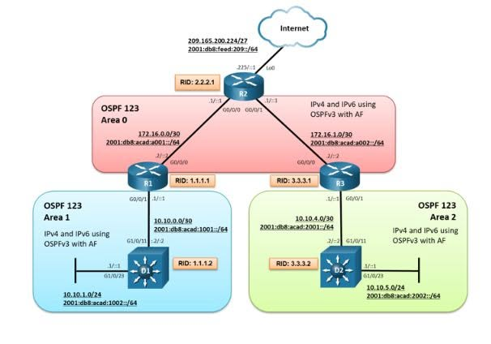
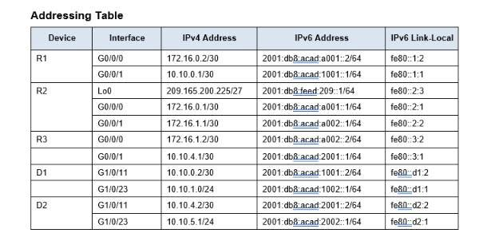

# IMPLEMENT MULTIAREA OSPFV3 – IPV4 & IPV6 ADDRESS FAMILY LAB

## OSPFV3 CHẠY ĐƯỢC IPV4 VÀ IPV6 TRÊN CÙNG MỘT PROCESS? THỬ NGAY LAB MULTIAREA OSPFV3!

Khi hệ thống mạng bắt đầu mở rộng, việc triển khai OSPF trên một Area duy nhất không còn là giải pháp tối ưu trong mọi trường hợp.

Một số câu hỏi quan trọng được đặt ra:

- Làm thế nào để thiết kế **OSPF Multi-Area**?
- Làm sao để định tuyến đồng thời **IPv4 và IPv6**?
- OSPFv3 Address Family khác gì so với OSPFv2 và Traditional OSPFv3?
- Khi xảy ra sự cố, làm sao kiểm tra **Neighbor, LSDB và Routing Table**?
- Làm thế nào để tối ưu OSPFv3 bằng **Passive Interface, Route Summarization và Default Route**?

Đây chính là những nội dung được thực hành trong bài lab **Implement Multiarea OSPFv3**.

Lab sử dụng 3 Cisco Router và 2 Layer 3 Switch, triển khai định tuyến qua 3 Area:

- **Area 0:** Backbone Area.
- **Area 1:** Mạng phía D1.
- **Area 2:** Mạng phía D2.

Đặc biệt, lab sử dụng **OSPFv3 Address Family (AF)** để hỗ trợ định tuyến IPv4 và IPv6 trong cùng một OSPFv3 process.

---

## 1. MỤC TIÊU BÀI LAB

Sau khi hoàn thành bài lab, có thể:

- Cấu hình IPv4, IPv6 Global Unicast và IPv6 Link-Local.
- Triển khai Traditional OSPFv3 dành cho IPv6.
- Cấu hình OSPFv3 IPv4 và IPv6 Address Family.
- Thiết lập OSPFv3 Multi-Area với Area 0, Area 1 và Area 2.
- Kiểm tra OSPFv3 Neighbor Adjacency.
- Phân tích Link-State Database (LSDB).
- Kiểm tra các tuyến IPv4/IPv6 được học qua OSPFv3.
- Cấu hình Passive Interface và Point-to-Point Network.
- Thực hành Route Summarization và Default Route Advertisement.
- Troubleshoot sự cố OSPFv3 theo quy trình chuẩn.

## 2. NETWORK TOPOLOGY



### Thành phần hệ thống

| Thiết bị | Router ID | Vai trò |
|---|---|---|
| R1 | 1.1.1.1 | ABR kết nối Area 0 và Area 1 |
| R2 | 2.2.2.1 | Backbone Router, mô phỏng kết nối Internet |
| R3 | 3.3.3.1 | ABR kết nối Area 0 và Area 2 |
| D1 | 1.1.1.2 | Layer 3 Switch trong Area 1 |
| D2 | 3.3.3.2 | Layer 3 Switch trong Area 2 |

### Thiết kế OSPF Area

| Area | Thiết bị | Network |
|---|---|---|
| Area 0 | R1 – R2 – R3 | 172.16.0.0/30, 172.16.1.0/30 |
| Area 1 | R1 – D1 | 10.10.0.0/30, 10.10.1.0/24 |
| Area 2 | R3 – D2 | 10.10.4.0/30, 10.10.5.0/24 |

**Nguyên tắc thiết kế:**

- Area 0 đóng vai trò Backbone.
- Area 1 kết nối về Area 0 thông qua R1.
- Area 2 kết nối về Area 0 thông qua R3.
- R1 và R3 thực hiện chức năng Area Border Router (ABR).
- R2 sử dụng Loopback0 để mô phỏng mạng phía Internet.

## 3. IP ADDRESSING TABLE



Một số dải mạng quan trọng:

| Network | IPv4 Prefix | IPv6 Prefix |
|---|---|---|
| R1 – R2 | 172.16.0.0/30 | 2001:db8:acad:a001::/64 |
| R2 – R3 | 172.16.1.0/30 | 2001:db8:acad:a002::/64 |
| R1 – D1 | 10.10.0.0/30 | 2001:db8:acad:1001::/64 |
| D1 LAN | 10.10.1.0/24 | 2001:db8:acad:1002::/64 |
| R3 – D2 | 10.10.4.0/30 | 2001:db8:acad:2001::/64 |
| D2 LAN | 10.10.5.0/24 | 2001:db8:acad:2002::/64 |
| R2 Loopback0 | 209.165.200.225/27 | 2001:db8:feed:209::1/64 |

> **Lưu ý:** Trong bảng địa chỉ gốc, D1 G1/0/23 ghi IPv4 `10.10.1.0/24`. Đây là địa chỉ mạng, không phải địa chỉ host hợp lệ cho interface. Khi triển khai có thể dùng `10.10.1.1/24`.

---

## 4. TRIỂN KHAI LAB

### BƯỚC 1 – CẤU HÌNH IPV4 VÀ IPV6

Trước tiên, tiến hành cấu hình địa chỉ IPv4, IPv6 Global Unicast và IPv6 Link-Local trên các interface theo Addressing Table.

Bật IPv6 Routing trên các thiết bị Layer 3:

```cisco
configure terminal
ipv6 unicast-routing
```

Kiểm tra trạng thái IPv6:

```cisco
show ipv6 interface brief
```

Kiểm tra IPv4:

```cisco
show ip interface brief
```

**Điểm cần hiểu:**

OSPFv3 sử dụng IPv6 Link-Local Address cho quá trình trao đổi thông tin với Neighbor trên liên kết.

Vì vậy, cần kiểm tra:

- Interface đã UP/UP hay chưa.
- IPv6 đã được kích hoạt trên interface hay chưa.
- IPv6 Link-Local Address có hợp lệ hay không.
- Các interface kết nối có thuộc đúng subnet hay không.

### BƯỚC 2 – CẤU HÌNH TRADITIONAL OSPFV3

Trên D1, triển khai Traditional OSPFv3 cho IPv6.

```cisco
configure terminal

ipv6 router ospf 123
 router-id 1.1.1.2
```

Kích hoạt OSPFv3 trên interface kết nối đến R1:

```cisco
interface GigabitEthernet1/0/11
 ipv6 ospf 123 area 1
```

Kiểm tra Neighbor:

```cisco
show ipv6 ospf neighbor
```

Kiểm tra OSPFv3 Interface:

```cisco
show ipv6 ospf interface brief
```

**Kết quả mong đợi:**

Neighbor giữa D1 và R1 hình thành thành công và đạt trạng thái FULL đối với IPv6.

> Khi sử dụng Traditional OSPFv3 và OSPFv3 AF trên hai đầu liên kết, cần kiểm tra tính tương thích của IOS, Area ID và Instance ID. Không phải mọi nền tảng đều hỗ trợ cách kết hợp này giống nhau.

### BƯỚC 3 – TRIỂN KHAI OSPFV3 ADDRESS FAMILY

Đây là phần quan trọng nhất của bài lab.

Khác với Traditional OSPFv3 chỉ hỗ trợ IPv6, OSPFv3 Address Family cho phép chạy cả IPv4 và IPv6 trong một OSPFv3 process.

Trên R1:

```cisco
configure terminal

router ospfv3 123
 router-id 1.1.1.1
 address-family ipv4 unicast
 exit-address-family
 address-family ipv6 unicast
 exit-address-family
```

Kích hoạt OSPFv3 IPv4 và IPv6 AF trên interface kết nối R2 thuộc Area 0:

```cisco
interface GigabitEthernet0/0/0
 ospfv3 123 ipv4 area 0
 ospfv3 123 ipv6 area 0
```

Đối với interface kết nối D1, sử dụng Area 1:

```cisco
interface GigabitEthernet0/0/1
 ospfv3 123 ipv4 area 1
 ospfv3 123 ipv6 area 1
```

Tương tự, triển khai trên R2, R3 và D2 theo đúng topology.

**Lưu ý quan trọng:**

- R1 – R2 – R3 sử dụng Area 0 trên các liên kết Backbone.
- R1 – D1 sử dụng Area 1.
- R3 – D2 sử dụng Area 2.
- Router ID phải duy nhất trong OSPF domain.
- IPv6 phải được kích hoạt trên interface để OSPFv3 vận hành, kể cả với IPv4 AF.
- Hai đầu liên kết phải sử dụng cấu hình AF và Instance ID tương thích.

---

### BƯỚC 4 – KIỂM TRA OSPFV3 NEIGHBOR

Sau khi cấu hình OSPFv3, cần kiểm tra các Neighbor đã hình thành Adjacency hay chưa.

**Traditional OSPFv3:**

```cisco
show ipv6 ospf neighbor
```

**OSPFv3 Address Family:**

```cisco
show ospfv3 neighbor
```

Kiểm tra chi tiết:

```cisco
show ospfv3 interface brief
```

Những thông tin cần quan sát:

| Thông tin | Ý nghĩa |
|---|---|
| Router ID | Xác định Neighbor Router |
| Area ID | Kiểm tra Area của liên kết |
| Interface | Xác định interface chạy OSPFv3 |
| Neighbor State | Theo dõi trạng thái Adjacency |
| IPv4 AF | Kiểm tra OSPFv3 IPv4 |
| IPv6 AF | Kiểm tra OSPFv3 IPv6 |

**Kết quả mong đợi:**

Các Neighbor trên liên kết Point-to-Point đạt trạng thái FULL.

**Tình huống troubleshooting:**

IPv6 Neighbor đã FULL nhưng IPv4 AF không hoạt động.

Khi đó cần tập trung kiểm tra:

- IPv4 Address Family đã được khai báo chưa.
- IPv4 AF đã được kích hoạt trên interface chưa.
- Area ID có chính xác không.
- Instance ID và cấu hình giữa hai đầu có tương thích không.

Không nên kết luận ngay rằng kết nối vật lý đang gặp sự cố.

### BƯỚC 5 – KIỂM TRA ROUTING TABLE

Sau khi Neighbor hình thành, tiếp tục kiểm tra các route được học từ OSPFv3.

**OSPFv2:**

```cisco
show ip route ospf
```

**OSPFv3 IPv4 Address Family:**

```cisco
show ip route ospfv3
```

**OSPFv3 IPv6:**

```cisco
show ipv6 route ospf
```

Đây là điểm rất dễ nhầm khi thực hành CCNP.

Nếu route IPv4 được học thông qua OSPFv3 AF, cần kiểm tra đúng bảng định tuyến tương ứng.

Không nên chỉ sử dụng:

```cisco
show ip route ospf
```

rồi kết luận OSPFv3 không hoạt động.

**Những nội dung cần xác minh:**

- Route đã xuất hiện trong Routing Table hay chưa.
- Next-Hop có chính xác không.
- Route được học trong Area hay từ Area khác.
- Administrative Distance và Metric.
- Khả năng truy cập giữa các mạng thuộc Area khác nhau.

### BƯỚC 6 – PHÂN TÍCH OSPF LINK-STATE DATABASE (LSDB)

Một Neighbor đạt trạng thái FULL không đồng nghĩa tất cả route cần thiết đều được cài đặt thành công.

Khi route không xuất hiện, cần kiểm tra OSPFv3 Database.

**Traditional OSPFv3:**

```cisco
show ipv6 ospf database
```

**OSPFv3 Address Family:**

```cisco
show ospfv3 database
```

Các loại LSA quan trọng:

| LSA | Chức năng |
|---|---|
| Router-LSA | Mô tả thông tin router trong Area |
| Network-LSA | Mô tả mạng transit multiaccess |
| Inter-Area-Prefix-LSA | Quảng bá prefix giữa các Area |
| AS-External-LSA | Quảng bá route external |
| Link-LSA | Chứa thông tin liên kết cục bộ |
| Intra-Area-Prefix-LSA | Quảng bá prefix trong Area |

**Quy trình phân tích:**

```text
Neighbor
   ↓
LSDB
   ↓
SPF Calculation
   ↓
Routing Table
   ↓
Forwarding
```

Nếu Neighbor FULL nhưng route không xuất hiện:

1. Kiểm tra LSA đã có trong LSDB chưa.
2. Xác minh prefix có được quảng bá đúng không.
3. Kiểm tra Area và loại LSA.
4. Kiểm tra SPF, Metric và đường đi tốt nhất.
5. Xác minh route có đủ điều kiện để được cài vào Routing Table không.

---

### BƯỚC 7 – TỐI ƯU OSPFV3

Sau khi hệ thống định tuyến ổn định, tiến hành tối ưu OSPFv3.

#### 7.1. Passive Interface

Mục tiêu là ngăn hình thành Neighbor trên những interface không cần trao đổi OSPF Hello nhưng vẫn quảng bá mạng kết nối.

Thường áp dụng cho:

- LAN Interface.
- User VLAN.
- Các interface không kết nối với OSPF Router khác.

#### 7.2. Route Summarization

Tổng hợp các prefix tại ABR khi có những mạng phù hợp để summary.

Lợi ích:

- Giảm số lượng route cần quảng bá giữa các Area.
- Giảm kích thước Routing Table.
- Hạn chế ảnh hưởng của thay đổi topology.
- Hỗ trợ thiết kế mạng dễ mở rộng.

Trong mô hình này, R1 và R3 là các thiết bị phù hợp để nghiên cứu cơ chế Inter-Area Summarization.

#### 7.3. Point-to-Point Network Type

Áp dụng trên các liên kết Router-to-Router phù hợp.

**Lợi ích:**

- Không cần bầu chọn DR/BDR.
- Đơn giản hóa quá trình Neighbor Adjacency.
- Phù hợp với các liên kết chỉ có hai OSPF Router.

#### 7.4. Default Route Advertisement

R2 đóng vai trò thiết bị kết nối về phía mạng mô phỏng Internet.

Mục tiêu là quảng bá Default Route xuống các Router trong hệ thống thông qua OSPFv3.

Luồng định tuyến:

```text
        Internet (Simulated)
                |
                R2
              /    \
            R1      R3
            |        |
            D1       D2
          Area 1   Area 2
```

Cần kiểm tra:

- R2 có Default Route hợp lệ hay không.
- Default Route đã được quảng bá cho đúng Address Family hay chưa.
- R1 và R3 đã học được Default Route hay chưa.
- Các thiết bị downstream có thể sử dụng Default Route hay không.

> Loopback0 của R2 trong topology mô phỏng một mạng bên ngoài. Nó không tự tạo ra một kết nối Internet thực hoặc một Default Route. Nếu chưa có Default Route trong bảng định tuyến, cần cấu hình phù hợp hoặc sử dụng tùy chọn `always` khi thực hành Default Route Origination.

---

## 5. TROUBLESHOOTING OSPFV3

### Quy trình kiểm tra khuyến nghị

```text
Physical Interface
        ↓
IPv4 / IPv6 Addressing
        ↓
IPv6 Link-Local Address
        ↓
OSPF Process & Router ID
        ↓
Address Family & Area
        ↓
OSPF Neighbor Adjacency
        ↓
OSPF Link-State Database
        ↓
SPF Calculation
        ↓
Routing Table
        ↓
End-to-End Connectivity
```

### Một số lỗi thường gặp

| Hiện tượng | Nguyên nhân cần kiểm tra |
|---|---|
| Neighbor không hình thành | Interface, Area, Hello/Dead Timer, Instance ID |
| Neighbor bị kẹt EXSTART/EXCHANGE | MTU hoặc quá trình trao đổi Database |
| IPv6 hoạt động nhưng IPv4 AF không hoạt động | Chưa cấu hình hoặc kích hoạt IPv4 AF |
| Neighbor FULL nhưng không có route | LSDB, prefix advertisement, SPF |
| Không thấy route khi dùng `show ip route ospf` | Có thể đang kiểm tra sai loại OSPF |
| Không học được Default Route | Default Route Origination hoặc route nguồn trên R2 |
| Area 1 không học được mạng Area 2 | ABR, Inter-Area LSA hoặc chính sách lọc/tổng hợp route |

### Bộ lệnh VERIFY quan trọng

```cisco
show ip interface brief
show ipv6 interface brief

show ipv6 ospf neighbor
show ipv6 ospf interface brief
show ipv6 ospf database

show ospfv3 neighbor
show ospfv3 interface brief
show ospfv3 database

show ip route ospfv3
show ipv6 route ospf

show running-config
```

> Cú pháp hỗ trợ có thể khác nhau giữa các phiên bản Cisco IOS và IOS XE.

---

## 6. PHÂN BIỆT OSPFV2, TRADITIONAL OSPFV3 VÀ OSPFV3 AF

| Đặc điểm | OSPFv2 | Traditional OSPFv3 | OSPFv3 AF |
|---|---|---|---|
| IPv4 Routing | ✅ | ❌ | ✅ |
| IPv6 Routing | ❌ | ✅ | ✅ |
| Sử dụng IPv6 Link-Local cho OSPF | ❌ | ✅ | ✅ |
| Hỗ trợ Multi-Area | ✅ | ✅ | ✅ |
| IPv4 và IPv6 trong cùng Process | ❌ | ❌ | ✅ |

**Điểm quan trọng:**

OSPFv3 Address Family hỗ trợ IPv4 và IPv6 trong cùng một process, nhưng **IPv4 AF và IPv6 AF vẫn duy trì các cơ chế định tuyến và LSDB riêng**.

Vì vậy, một Address Family hoạt động bình thường không đảm bảo Address Family còn lại cũng đã hoạt động đúng.

---

## 7. KẾT QUẢ MONG ĐỢI

Sau khi hoàn thành, hệ thống cần đáp ứng:

- [ ] Tất cả interface được cấu hình đúng IPv4/IPv6.
- [ ] IPv6 Link-Local Address hoạt động bình thường.
- [ ] OSPF Router ID được thiết lập chính xác.
- [ ] OSPFv3 Neighbor trên các liên kết cần thiết đạt FULL.
- [ ] IPv4 AF và IPv6 AF hoạt động đúng theo thiết kế.
- [ ] Các Router học được route giữa Area 0, Area 1 và Area 2.
- [ ] LSDB chứa các thông tin LSA cần thiết.
- [ ] Các mạng LAN có khả năng định tuyến liên Area.
- [ ] Passive Interface và Point-to-Point Network được áp dụng hợp lý.
- [ ] Default Route được quảng bá thành công khi cấu hình.
- [ ] Ping và Traceroute xác nhận được kết nối end-to-end.

---

## 8. KIẾN THỨC RÚT RA

Bài lab không chỉ tập trung vào việc cấu hình OSPFv3 mà còn giúp hiểu sâu hơn về cơ chế hoạt động của giao thức trong môi trường Enterprise Network.

Những kiến thức quan trọng:

**1. OSPF Multi-Area**

Hiểu cách Area 0, ABR và các Area khác phối hợp để trao đổi thông tin định tuyến.

**2. OSPFv3 Address Family**

Hiểu cách OSPFv3 hỗ trợ đồng thời IPv4 và IPv6.

**3. Neighbor Adjacency**

Biết cách xác định vì sao OSPF Neighbor không hình thành hoặc không đạt FULL.

**4. Link-State Database**

Hiểu vai trò của LSA và mối quan hệ giữa LSDB, SPF và Routing Table.

**5. Network Optimization**

Biết khi nào nên sử dụng Passive Interface, Route Summarization, Point-to-Point Network và Default Route Advertisement.

**6. Network Troubleshooting**

Xây dựng tư duy xử lý sự cố theo từng lớp thay vì chỉ dựa vào kết quả Ping.

---

## 9. KẾT LUẬN

Trong thực tế vận hành mạng, **OSPF Neighbor FULL mới chỉ là bước đầu**.

Một Network Engineer cần hiểu:

- Route được hình thành như thế nào?
- Prefix được quảng bá giữa các Area ra sao?
- Vì sao LSA đã xuất hiện nhưng route chưa được cài đặt?
- Tại sao IPv6 hoạt động nhưng IPv4 AF gặp sự cố?
- Khi mạng thay đổi, làm thế nào để giữ hệ thống định tuyến ổn định?

Thông qua bài lab **Implement Multiarea OSPFv3**, chúng ta có thể tiếp cận quá trình cấu hình, kiểm tra và troubleshooting giao thức OSPFv3 theo cách gần với môi trường thực tế hơn.

**Quy trình cần ghi nhớ:**

`Interface → Link-Local → Area/AF → Neighbor → LSDB → SPF → Routing Table → Connectivity`

> **Network Engineering không chỉ là cấu hình để mạng hoạt động, mà còn là hiểu vì sao mạng hoạt động và biết cách xử lý khi hệ thống gặp sự cố.**

---

## LAB ENVIRONMENT

- **Lab Platform:** Cisco CML / EVE-NG / GNS3
- **Devices:** 3 Cisco Routers + 2 Layer 3 Switches
- **Routing Protocol:** OSPFv3 Process 123
- **Architecture:** Multiarea OSPF
- **Address Families:** IPv4 Unicast, IPv6 Unicast
- **Technology:** OSPFv3, IPv6, LSDB, ABR, Route Summarization
- **Level:** CCNP Enterprise – ENCOR / ENARSI

---

## TAGS

`Cisco` `CCNP` `OSPFv3` `Multiarea-OSPF` `IPv4` `IPv6` `Address-Family` `Routing` `Network-Engineering` `Troubleshooting` `EVE-NG` `Cisco-CML`