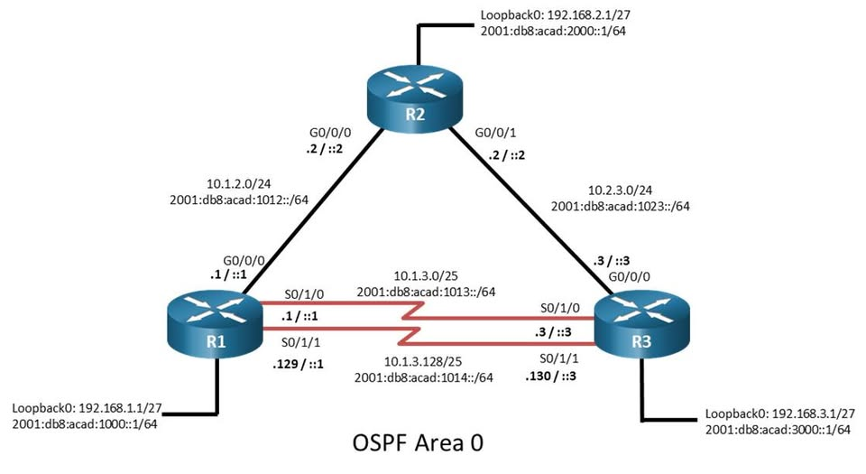

# CISCO NETWORK TROUBLESHOOTING LAB
## PING, TRACEROUTE HAY DEBUG – DÙNG GÌ KHI NETWORK CÓ LỖI?

Trong quá trình troubleshooting một hệ thống Cisco, câu hỏi không chỉ đơn giản là:

> **"Ping có được không?"**

Quan trọng hơn là:

- 🔹 Packet đang đi theo đường nào?
- 🔹 Packet bị dừng ở đâu?
- 🔹 Router nào đang trả về lỗi?
- 🔹 Vấn đề nằm ở Routing, MTU hay OSPF?
- 🔹 Làm thế nào để xác định chính xác nguyên nhân thay vì phỏng đoán?

Trong bài lab này, mình xây dựng mô hình **R1 – R2 – R3**, sử dụng IPv4/IPv6 và OSPF Area 0.

Sau khi hoàn tất cấu hình cơ bản, mình thực hiện kiểm tra các tình huống lỗi và sử dụng workflow:

**`PING → TRACEROUTE → SHOW → DEBUG → CONDITIONAL DEBUG`**

Mục tiêu là xác định nguyên nhân sự cố dựa trên bằng chứng thực tế từ router.

---

## 01 | NETWORK TOPOLOGY



### Thông tin hệ thống

| Router | Loopback IPv4 | Loopback IPv6 | OSPF Area |
|---|---|---|---|
| R1 | 192.168.1.1/27 | 2001:db8:acad:1000::1/64 | Area 0 |
| R2 | 192.168.2.1/27 | 2001:db8:acad:2000::1/64 | Area 0 |
| R3 | 192.168.3.1/27 | 2001:db8:acad:3000::1/64 | Area 0 |

### Các kết nối giữa router

| Connection | IPv4 Network | IPv6 Network |
|---|---|---|
| R1 ↔ R2 | 10.1.2.0/24 | 2001:db8:acad:1012::/64 |
| R2 ↔ R3 | 10.2.3.0/24 | 2001:db8:acad:1023::/64 |
| R1 ↔ R3 (Serial 1) | 10.1.3.0/25 | 2001:db8:acad:1013::/64 |
| R1 ↔ R3 (Serial 2) | 10.1.3.128/25 | 2001:db8:acad:1014::/64 |

**Mục tiêu lab:**

- Kiểm tra connectivity giữa các router.
- Phân tích đường đi của packet.
- Phát hiện sự cố liên quan đến MTU.
- Troubleshoot OSPF neighbor và adjacency.
- Sử dụng Debug để tìm bằng chứng xác định nguyên nhân lỗi.

---

## 02 | PING – KIỂM TRA CONNECTIVITY

### 2.1. Kiểm tra kết nối cơ bản

Đầu tiên, kiểm tra connectivity từ **Loopback0 của R1** đến **Loopback0 của R3**.

```cisco
R1# ping 192.168.3.1 source Loopback0
```

Kết quả mong đợi:

```text
!!!!!
Success rate is 100 percent (5/5)
```

Trong Cisco IOS:

| Ký hiệu | Ý nghĩa |
|---|---|
| `!` | Nhận được ICMP Echo Reply |
| `.` | Timeout |
| `U` | Destination Unreachable |
| `M` | Could not fragment |
| `?` | Unknown packet type |

Khi xuất hiện `!!!!!`, kết nối hoạt động và các ICMP Echo Reply đã quay trở lại thành công.

Tuy nhiên, **Ping thành công không đồng nghĩa toàn bộ network không có lỗi**.

### 2.2. Extended Ping

Khi troubleshooting, có thể thay đổi nhiều tham số:

- Source interface hoặc source IP
- Packet size
- Repeat count
- Timeout
- DF-bit (Don't Fragment)
- DSCP/TOS (tùy phiên bản IOS)

Ví dụ:

```cisco
R1# ping 192.168.3.1 source Loopback0 repeat 10
```

Kiểm tra với packet size lớn:

```cisco
R1# ping 192.168.3.1 source Loopback0 size 1750 df-bit
```

### 2.3. Troubleshooting Path MTU

Khi bật **DF-bit**, packet IPv4 không được phép phân mảnh.

Nếu packet lớn hơn MTU mà một liên kết trên đường đi hỗ trợ, packet có thể bị loại bỏ và router có thể gửi thông báo ICMP Fragmentation Needed.

Trong lab, mình kiểm tra nhiều kích thước packet, từ:

```text
1475 bytes → 1515 bytes
```

Khi packet bắt đầu thất bại ở một kích thước nhất định, đây là dấu hiệu cần kiểm tra **Path MTU**.

Có thể sử dụng Extended Ping để thực hiện sweep packet size.

**Ý nghĩa:**

> Ping không chỉ dùng để xác nhận connectivity mà còn hỗ trợ phân tích packet loss, timeout và các vấn đề liên quan đến MTU.

---

## 03 | TRACEROUTE – PACKET ĐANG ĐI QUA ĐÂU?

Khi Ping không cung cấp đủ thông tin, bước tiếp theo là kiểm tra đường đi của packet.

### 3.1. Kiểm tra route đến destination

```cisco
R1# traceroute 192.168.3.1
```

Trong tình huống lab được quan sát, packet đi qua:

```text
R1
 |
 v
R2 - 10.1.2.2
 |
 v
R3 - 10.2.3.3
```

Traceroute sử dụng TTL để khám phá từng hop trên đường đi.

Nó giúp trả lời câu hỏi:

> **"Packet thực sự đi qua router nào trước khi đến destination?"**

### 3.2. Troubleshooting Destination Unreachable

Thử traceroute đến một địa chỉ không reachable:

```cisco
R1# traceroute 172.16.3.1
```

Kết quả quan sát được trong lab có ký hiệu:

```text
!H
```

**`!H` – Host Unreachable**

Thông báo này cho biết một router hoặc host đã trả về ICMP Host Unreachable.

Trong tình huống lab, thông báo đến từ:

```text
10.1.2.2 (R2)
```

Phạm vi troubleshooting lúc này được thu hẹp đáng kể.

Thay vì kiểm tra toàn bộ network, có thể tập trung vào routing tại R2 và các route liên quan đến destination.

### 3.3. Extended Traceroute

Có thể chỉ định source address và giới hạn TTL để phân tích từng hop.

```cisco
R1# traceroute
```

Sau đó nhập các tham số theo lời nhắc của IOS, ví dụ:

```text
Target IP address: 192.168.3.1
Source address: 192.168.1.1
Minimum Time to Live: 2
Maximum Time to Live: 10
```

*Lưu ý: Các lời nhắc và cú pháp Extended Traceroute có thể khác nhau tùy nền tảng và phiên bản Cisco IOS.*

---

## 04 | SHOW COMMANDS – KIỂM TRA TRẠNG THÁI HỆ THỐNG

Trước khi sử dụng Debug, nên kiểm tra interface, routing table và trạng thái protocol.

### Kiểm tra Interface

```cisco
R1# show ip interface brief
```

### Kiểm tra Routing Table

```cisco
R1# show ip route
```

### Kiểm tra route được học từ OSPF

```cisco
R1# show ip route ospf
```

### Kiểm tra OSPF Neighbor

```cisco
R1# show ip ospf neighbor
```

### Kiểm tra OSPF Interface

```cisco
R1# show ip ospf interface
```

### Kiểm tra IPv6 Routing

```cisco
R1# show ipv6 route
```

Những lệnh này cho phép xác định:

- Interface có đang Up/Up không?
- Route đến destination có tồn tại không?
- Next-hop đang trỏ về đâu?
- OSPF neighbor đang ở trạng thái nào?
- Các interface có cùng tham số OSPF phù hợp không?

**Nguyên tắc:**

> Sử dụng Show Commands để xác định trạng thái hệ thống trước khi dùng Debug phân tích nguyên nhân.

---

## 05 | DEBUG ICMP – XÁC ĐỊNH ROUTER TRẢ VỀ LỖI

Đây là lúc Debug phát huy giá trị.

### 5.1. Bật ICMP Debug

```cisco
R1# debug ip icmp
```

Tạo một ICMP packet đến destination không reachable:

```cisco
R1# ping 172.16.3.1 source Loopback0 repeat 1
```

Trong lab, output cho thấy R1 nhận thông báo:

```text
Host Unreachable from 10.1.2.2
```

Điều này cho thấy thông báo lỗi được gửi từ R2.

### 5.2. Phân tích kết quả

```text
R1
 |
 | ICMP Echo Request
 v
R2 (10.1.2.2)
 |
 | Destination Unreachable
 v
R1 receives ICMP error
```

Từ đây, cần kiểm tra:

```cisco
R2# show ip route
R2# show ip interface brief
R2# show ip ospf neighbor
```

Thay vì đoán lỗi nằm ở R1 hay R3, mình có bằng chứng để tập trung phân tích R2 và các tuyến đường liên quan.

### 5.3. Lưu ý khi sử dụng Debug

Debug có thể tạo ra lượng output rất lớn trên router đang xử lý nhiều traffic.

Ví dụ:

```cisco
R1# debug ip packet
```

Lệnh này có thể gây tăng CPU hoặc ảnh hưởng đến hoạt động hệ thống nếu sử dụng không kiểm soát.

Sau khi hoàn tất troubleshooting:

```cisco
R1# undebug all
```

Kiểm tra các chế độ Debug còn hoạt động:

```cisco
R1# show debugging
```

**Best Practice:**

> Chỉ bật Debug khi cần, sử dụng trong thời gian ngắn và luôn tắt sau khi thu thập đủ thông tin.

---

## 06 | CONDITIONAL DEBUG – CHỈ QUAN SÁT TRAFFIC CẦN THIẾT

Khi có quá nhiều traffic, không nên Debug toàn bộ hệ thống.

Có thể sử dụng ACL để lọc các packet cần quan sát.

### 6.1. Tạo Access Control List

Ví dụ giới hạn traffic có source IP là Loopback0 của R1:

```cisco
R1(config)# access-list 1 permit host 192.168.1.1
```

### 6.2. Debug với ACL

```cisco
R1# debug ip packet 1
```

Debug chỉ áp dụng bộ lọc theo ACL 1 đối với các packet mà cơ chế Debug này quan sát được.

**Lưu ý:** `debug ip packet` chủ yếu quan sát các packet được xử lý bởi CPU. Traffic chuyển tiếp bằng CEF/hardware forwarding có thể không xuất hiện trong output. Khả năng lọc và các tùy chọn Debug phụ thuộc vào IOS và nền tảng thiết bị.

### 6.3. Tắt Debug

```cisco
R1# undebug all
```

**Tư duy troubleshooting:**

> Đừng Debug tất cả. Hãy Debug đúng traffic đang gặp vấn đề.

---

## 07 | OSPF TROUBLESHOOTING – NEIGHBOR KHÔNG LÊN FULL

Đây là một trong những phần quan trọng nhất của bài lab.

Khi OSPF không hình thành adjacency như mong đợi, cần kiểm tra lần lượt từ trạng thái neighbor đến các tham số protocol.

### 7.1. Kiểm tra trạng thái OSPF Neighbor

```cisco
R1# show ip ospf neighbor
```

Trong một tình huống lỗi, neighbor chỉ dừng ở:

```text
INIT
```

**OSPF INIT** cho biết router đã nhận Hello từ neighbor, nhưng chưa thấy Router ID của chính mình trong danh sách neighbor của Hello nhận được.

Đây là dấu hiệu cần kiểm tra quá trình trao đổi Hello.

### 7.2. Debug OSPF Hello

```cisco
R1# debug ip ospf hello
```

Output trong tình huống lỗi timer:

```text
Mismatched hello parameters

Dead R 48 C 40
Hello R 12 C 10
```

Trong đó:

| Parameter | Remote | Current |
|---|---|---|
| Hello Interval | 12 seconds | 10 seconds |
| Dead Interval | 48 seconds | 40 seconds |

**Nguyên nhân:** Hello/Dead timer không khớp giữa hai router.

Timer mismatch khiến Hello bị từ chối và ngăn OSPF hình thành neighborship đúng cách. Đây là một lỗi có thể được phát hiện khi điều tra OSPF, nhưng không phải mọi trường hợp INIT đều do timer mismatch gây ra.

Kiểm tra thông số trên interface:

```cisco
R1# show ip ospf interface
```

Ví dụ cấu hình đồng nhất timer:

```cisco
R1(config)# interface GigabitEthernet0/0/0
R1(config-if)# ip ospf hello-interval 10
R1(config-if)# ip ospf dead-interval 40
```

**Lưu ý:** Cần kiểm tra và thống nhất timer trên đúng cặp interface kết nối OSPF; tên interface trên chỉ là ví dụ.

### 7.3. Kiểm tra OSPF Network Type

Một tình huống khác liên quan đến sự khác biệt về OSPF Network Type.

Ví dụ:

```text
R1: Broadcast
R2: Point-to-Multipoint
```

Các kiểu network khác nhau có thể dẫn đến sự khác biệt về hành vi neighbor discovery, yêu cầu subnet mask và quá trình hình thành adjacency.

Kiểm tra:

```cisco
R1# show ip ospf interface
```

```cisco
R2# show ip ospf interface
```

Cần đối chiếu network type, subnet mask và các tham số liên quan thay vì thay đổi cấu hình một cách ngẫu nhiên.

---

## 08 | OSPF MTU MISMATCH – LỖI TRONG DBD EXCHANGE

Sau khi xử lý các vấn đề về Hello và Network Type, tiếp tục theo dõi quá trình hình thành adjacency.

### 8.1. Debug OSPF Adjacency

```cisco
R1# debug ip ospf adj
```

Ví dụ output:

```text
Nbr 3.3.3.4 has smaller interface MTU
```

Thông báo cho thấy MTU của neighbor nhỏ hơn MTU interface phía local trong quá trình trao đổi Database Description (DBD) packet.

MTU mismatch có thể khiến OSPF adjacency bị kẹt tại:

```text
EXSTART
```

hoặc:

```text
EXCHANGE
```

### 8.2. Kiểm tra MTU

```cisco
R1# show interfaces
```

```cisco
R3# show interfaces
```

Đối chiếu MTU trên hai interface kết nối trực tiếp.

Nếu có sự khác biệt, cần xác định giá trị MTU phù hợp với thiết kế và cấu hình đồng nhất khi cần thiết.

Không nên sử dụng `ip ospf mtu-ignore` như giải pháp đầu tiên vì nó bỏ qua việc kiểm tra MTU của OSPF mà không giải quyết nguyên nhân gốc.

---

## 09 | VERIFY – KIỂM TRA SAU KHI KHẮC PHỤC

Sau khi xử lý các lỗi, thực hiện kiểm tra lại trạng thái hệ thống.

### Kiểm tra OSPF Neighbor

```cisco
R1# show ip ospf neighbor
```

Các trạng thái được ghi nhận sau khi khắc phục:

```text
FULL/BDR
FULL/-
FULL/-
```

Trong đó:

- `FULL/BDR`: Adjacency FULL, neighbor giữ vai trò Backup Designated Router trên segment tương ứng.
- `FULL/-`: Adjacency FULL trên loại network không sử dụng DR/BDR.

### Kiểm tra Routing Table

```cisco
R1# show ip route ospf
```

### Kiểm tra Connectivity

```cisco
R1# ping 192.168.3.1 source Loopback0
```

### Kiểm tra đường đi của Packet

```cisco
R1# traceroute 192.168.3.1
```

### Kiểm tra và tắt Debug

```cisco
R1# undebug all
R1# show debugging
```

**Điều kiện hoàn thành lab:**

- Các adjacency OSPF cần thiết đạt trạng thái FULL.
- Các route mong đợi xuất hiện trong Routing Table.
- Ping giữa các Loopback thành công.
- Traceroute hiển thị đường đi phù hợp với Routing Table.
- Các lỗi về timer, network type và MTU đã được xử lý.
- Không còn Debug không cần thiết hoạt động.

---

## 10 | NETWORK TROUBLESHOOTING WORKFLOW

Sau bài lab, mình rút ra một workflow đơn giản nhưng hiệu quả:

**`PING → TRACEROUTE → SHOW → DEBUG → CONDITIONAL DEBUG → VERIFY`**

| Công cụ | Câu hỏi cần giải quyết |
|---|---|
| **Ping** | Connectivity có hoạt động không? |
| **Traceroute** | Packet đang đi qua những hop nào? |
| **Show** | Interface, Routing và Protocol đang ở trạng thái nào? |
| **Debug** | Router thực sự đang xử lý packet/protocol như thế nào? |
| **Conditional Debug** | Làm sao chỉ quan sát traffic liên quan đến lỗi? |
| **Verify** | Sau khi thay đổi cấu hình, hệ thống đã hoạt động đúng chưa? |

### Workflow riêng cho OSPF

```text
OSPF NEIGHBOR NOT FULL
          |
          v
show ip ospf neighbor
          |
          v
Check Interface / OSPF Parameters
          |
          v
debug ip ospf hello
          |
          v
Check Hello / Dead Timers
          |
          v
Check Network Type / Subnet
          |
          v
debug ip ospf adj
          |
          v
Check DBD Exchange / MTU
          |
          v
Fix Configuration
          |
          v
show ip ospf neighbor
          |
          v
       FULL
          |
          v
Verify Routing & Connectivity
```

---

## 11 | LESSONS LEARNED

Qua bài lab, mình rút ra những điểm quan trọng:

**1. Ping thành công chưa chắc network đã hoạt động tối ưu.**

Cần kiểm tra thêm path, packet size và những vấn đề liên quan đến MTU.

**2. Traceroute giúp thu hẹp phạm vi troubleshooting.**

Khi biết packet đi qua những router nào và router nào trả về lỗi, việc khoanh vùng nguyên nhân sẽ hiệu quả hơn.

**3. Show Commands là bước kiểm tra trạng thái quan trọng.**

Không nên Debug ngay khi chưa kiểm tra interface, routing table và protocol state.

**4. Debug cung cấp bằng chứng thay vì phỏng đoán.**

Những thông báo như:

```text
Mismatched hello parameters
```

hoặc:

```text
Nbr has smaller interface MTU
```

giúp xác định nguyên nhân cần kiểm tra.

**5. Debug phải được sử dụng có kiểm soát.**

Chỉ quan sát những thông tin cần thiết, tránh tạo overhead không cần thiết lên thiết bị.

**6. Sau khi sửa lỗi, luôn phải Verification.**

Một cấu hình được thay đổi không đồng nghĩa sự cố đã được khắc phục hoàn toàn.

---

## 12 | CONCLUSION

Trong quá trình học **CCNP Enterprise**, mục tiêu không chỉ là biết cấu hình routing protocol.

Quan trọng hơn là hiểu được:

- OSPF hình thành neighbor như thế nào.
- Tại sao OSPF adjacency không đạt trạng thái FULL.
- Packet đi qua network theo đường nào.
- Router phản hồi thế nào khi không thể chuyển tiếp packet.
- Sử dụng Show và Debug để xác định root cause.
- Xác minh hệ thống sau khi khắc phục sự cố.

> **"Troubleshooting không phải là thử sửa từng cấu hình cho đến khi network hoạt động. Troubleshooting là thu thập bằng chứng, xác định nguyên nhân và kiểm chứng giải pháp."**

**CCNP Enterprise – Không chỉ biết cấu hình OSPF, mà còn phải biết OSPF lỗi ở đâu và chứng minh được tại sao.**

---