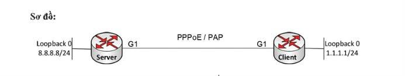

# CISCO NETWORK LAB | TỪ PPPoE DISCOVERY ĐẾN NAT – CLIENT NHẬN IP NHƯNG TRAFFIC ĐI ĐÂU?

> **PPPoE Session đã UP. Dialer0 đã nhận IP. Nhưng ping vẫn có thể FAIL!**

Đây chính là điểm thú vị khi làm lab **PPPoE trên Cisco Router**.

Không chỉ cấu hình để Client quay PPPoE thành công, mà còn phải hiểu toàn bộ luồng hoạt động:

**Physical Interface → PPPoE Discovery → Dialer Interface → PAP Authentication → IP Negotiation → Routing → NAT/PAT**

Trong bài lab này, mình xây dựng mô hình gồm **2 Cisco Router**:

- **R1:** PPPoE Server
- **R2:** PPPoE Client

**Mục tiêu cuối cùng:**

R2 thiết lập PPPoE thành công, nhận địa chỉ IP từ Server và thực hiện NAT/PAT cho traffic từ mạng phía trong để truy cập đến **Loopback 8.8.8.8 trên R1**.

---

## 1. MÔ HÌNH LAB



### Thông tin thiết bị

| Thiết bị | Interface | Địa chỉ IP | Chức năng |
|---|---|---|---|
| R1 - Server | Loopback0 | 8.8.8.8/24 | Mạng đích |
| R1 - Server | G1 | PPPoE Server | Kết nối R2 |
| R2 - Client | Loopback0 | 1.1.1.1/24 | NAT Inside |
| R2 - Client | G1 | PPPoE Client | Kết nối R1 |
| R2 - Client | Dialer0 | Negotiated | NAT Outside |

**Giao thức sử dụng:**

- PPPoE (Point-to-Point Protocol over Ethernet)
- PAP (Password Authentication Protocol)
- IPCP (IP Control Protocol)
- NAT/PAT (Network Address Translation / Port Address Translation)

### Nguyên lý hoạt động

Sau khi PPPoE được thiết lập, R2 không sử dụng địa chỉ IP trực tiếp trên interface vật lý G1 để truyền IP qua phiên PPP.

**Dialer0 mới là interface Layer 3 của phiên PPPoE.**

Luồng xử lý:

```text
R2 (PPPoE Client)
       |
       v
GigabitEthernet1
       |
       v
PPPoE Discovery
       |
       v
PPPoE Session
       |
       v
PPP / PAP Authentication
       |
       v
IPCP Negotiation
       |
       v
Dialer0 receives IP
       |
       v
Routing + NAT/PAT
       |
       v
R1 (PPPoE Server)
       |
       v
Loopback0: 8.8.8.8
```

---

## 2. CẤU HÌNH PPPoE CLIENT – R2

### Bước 1: Tạo Dialer Interface

Trên R2:

```cisco
configure terminal

interface Dialer0
 encapsulation ppp
 ip address negotiated
 ppp pap sent-username user01 password vnpro01
 dialer pool 1
```

### Giải thích cấu hình

| Lệnh | Chức năng |
|---|---|
| `encapsulation ppp` | Sử dụng giao thức PPP trên Dialer |
| `ip address negotiated` | Nhận IP thông qua quá trình thương lượng PPP/IPCP |
| `ppp pap sent-username` | Gửi username/password xác thực PAP |
| `dialer pool 1` | Liên kết Dialer0 với Dialer Pool 1 |

### Bước 2: Cấu hình Interface vật lý

```cisco
interface GigabitEthernet1
 no shutdown
 pppoe enable
 pppoe-client dial-pool-number 1
```

Đây là điểm rất dễ nhầm khi mới học PPPoE.

**GigabitEthernet1 không phải interface Layer 3 chính của phiên PPPoE.**

Interface này chịu trách nhiệm mang phiên PPPoE và được liên kết với Dialer0 thông qua:

```cisco
pppoe-client dial-pool-number 1
```

**Điểm cần nhớ:**

- G1: Kết nối vật lý và truyền PPPoE frames.
- Dialer0: Xử lý PPP, xác thực và nhận IP.
- Dialer Pool: Liên kết physical interface với Dialer interface.

---

## 3. CẤU HÌNH PPPoE SERVER + PAP – R1

### Bước 1: Tạo PPPoE Profile

```cisco
configure terminal

bba-group pppoe VNPRO
 virtual-template 1
```

BBA Group xác định Virtual Template được sử dụng khi PPPoE Client kết nối đến Server.

### Bước 2: Tạo IP Pool

```cisco
ip local pool PPPOEPOOL 192.168.1.2 192.168.1.254
```

Pool này được sử dụng để cấp địa chỉ IP cho các PPPoE Client.

**Dải IP cấp phát:**

```text
192.168.1.2 - 192.168.1.254
```

### Bước 3: Tạo tài khoản xác thực PAP

```cisco
username user01 password vnpro01
```

Thông tin xác thực:

| Tham số | Giá trị |
|---|---|
| Username | `user01` |
| Password | `vnpro01` |
| Authentication | PAP |

> **Security Note:** PAP truyền thông tin xác thực ở dạng không mã hóa trong PPP. Chỉ sử dụng cấu hình này trong môi trường lab. Với hệ thống thực tế, nên ưu tiên phương thức xác thực an toàn hơn khi được hỗ trợ.

### Bước 4: Cấu hình Virtual Template

```cisco
interface Virtual-Template1
 ip address 192.168.1.1 255.255.255.0
 peer default ip address pool PPPOEPOOL
 ppp authentication pap
```

**Giải thích:**

- `ip address`: Cấu hình IP phía Server cho phiên PPP.
- `peer default ip address pool`: Cấp IP cho Client từ local pool.
- `ppp authentication pap`: Yêu cầu Client xác thực bằng PAP.

### Bước 5: Kích hoạt PPPoE trên G1

```cisco
interface GigabitEthernet1
 no shutdown
 pppoe enable group VNPRO
```

### Quá trình thiết lập PPPoE

Khi R2 kết nối đến R1, các giai đoạn diễn ra:

```text
PPPoE Discovery
      |
      v
PADI -> PADO -> PADR -> PADS
      |
      v
PPPoE Session Established
      |
      v
PPP LCP Negotiation
      |
      v
PAP Authentication
      |
      v
IPCP Negotiation
      |
      v
Client Receives IP Address
```

Nếu username/password chính xác và quá trình thương lượng thành công, R1 sẽ cấp cho Dialer0 của R2 một địa chỉ IP thuộc pool `192.168.1.2 - 192.168.1.254`.

---

## 4. KIỂM TRA PPPoE TRƯỚC KHI CẤU HÌNH NAT

> **Nguyên tắc troubleshooting: PPPoE chưa UP thì chưa kiểm tra NAT.**

### Bước 1: Kiểm tra Interface

Trên R2:

```cisco
show ip interface brief
```

Kiểm tra:

- Dialer0 đã nhận IP hay chưa?
- Interface có ở trạng thái UP hay không?
- IP có thuộc dải được Server cấp phát hay không?

### Bước 2: Kiểm tra PPPoE Session

```cisco
show pppoe session
```

Trạng thái mong đợi:

```text
UP
```

### Bước 3: Kiểm tra Dialer Interface

```cisco
show interfaces Dialer0
```

Lệnh này giúp kiểm tra trạng thái PPP và các thông tin liên quan đến Dialer.

### Nếu PPPoE chưa UP

Cần kiểm tra lần lượt:

1. Username/password PAP có chính xác không?
2. Dialer Pool có được cấu hình đúng không?
3. `pppoe-client dial-pool-number` có trùng với Dialer Pool không?
4. Virtual Template đã được cấu hình chưa?
5. PPPoE Profile có được gắn vào interface Server không?
6. Interface vật lý G1 trên hai Router đã UP chưa?

**Không nên kết luận NAT lỗi khi PPPoE Session chưa hoạt động.**

---

## 5. CẤU HÌNH ROUTING + NAT/PAT TRÊN R2

Sau khi PPPoE hoạt động và Dialer0 nhận IP thành công, bước tiếp theo là cấu hình Routing và NAT.

### Bước 1: Cấu hình Default Route

```cisco
ip route 0.0.0.0 0.0.0.0 Dialer0
```

Default Route giúp R2 chuyển traffic đến các mạng không có route cụ thể trong bảng định tuyến thông qua Dialer0.

### Bước 2: Cấu hình NAT Outside

```cisco
interface Dialer0
 ip nat outside
```

Dialer0 đóng vai trò interface hướng ra PPPoE Server.

### Bước 3: Cấu hình NAT Inside

```cisco
interface Loopback0
 ip address 1.1.1.1 255.255.255.0
 ip nat inside
```

Loopback0 đại diện cho mạng phía trong của R2 trong mô hình lab.

### Bước 4: Tạo ACL xác định traffic cần NAT

```cisco
access-list 1 permit 1.1.1.0 0.0.0.255
```

ACL 1 xác định mạng nguồn được phép thực hiện NAT.

### Bước 5: Cấu hình PAT Overload

```cisco
ip nat inside source list 1 interface Dialer0 overload
```

Lệnh này cho phép các địa chỉ IP thuộc mạng Inside được dịch sang địa chỉ IP của Dialer0 khi traffic đi ra ngoài.

### Luồng xử lý NAT/PAT

```text
Inside Network
1.1.1.0/24
     |
     v
NAT Inside
     |
     v
ACL 1 Match
     |
     v
NAT/PAT Translation
     |
     v
Dialer0 (NAT Outside)
     |
     v
PPPoE Session
     |
     v
R1 PPPoE Server
     |
     v
Destination: 8.8.8.8
```

### Điểm quan trọng

**NAT không thay thế Routing.**

R2 vẫn cần Default Route để xác định đường đi của traffic.

Đồng thời phải phân biệt đúng:

```text
Inside -> NAT/PAT -> Outside
```

Nếu cấu hình sai chiều NAT hoặc thiếu route, traffic có thể không đến được đích dù PPPoE đã UP.

---

## 6. KIỂM TRA TOÀN BỘ FLOW

### Bước 1: Kiểm tra kết nối đến R1

Trên R2:

```cisco
ping 8.8.8.8 source Loopback0
```

Nếu nhận được:

```text
!!!!!
Success rate is 100 percent
```

Điều đó chứng tỏ ICMP Echo Request và Echo Reply đã truyền thành công giữa hai đầu.

**Lưu ý:** Traffic phát sinh trực tiếp từ chính Router có thể được xử lý NAT khác với traffic được forward qua Router, tùy nền tảng và phiên bản IOS. Vì vậy, ping từ Loopback0 không phải lúc nào cũng là phép thử đủ để xác nhận PAT.

### Bước 2: Kiểm tra NAT Translation

```cisco
show ip nat translations
```

Kiểm tra xem có địa chỉ Inside Local được chuyển đổi sang Inside Global hay không.

Có thể xem thêm:

```cisco
show ip nat statistics
```

Để xác nhận PAT rõ ràng hơn, nên tạo traffic từ một host hoặc mạng phía sau R2 đi qua NAT Inside và Dialer0.

### Bước 3: Kiểm tra Routing Table

```cisco
show ip route
```

Xác nhận Default Route qua Dialer0 đã tồn tại.

### Bước 4: Kiểm tra PPPoE Session

```cisco
show pppoe session
```

### Bước 5: Kiểm tra Dialer0

```cisco
show ip interface brief
```

**Kết quả mong đợi:**

- PPPoE Session: UP.
- PAP Authentication: Thành công.
- Dialer0: Nhận IP từ Server.
- Default Route: Đi qua Dialer0.
- NAT/PAT: Có translation khi traffic phù hợp đi qua Router.
- Ping: Thành công khi đường đi và đường về hợp lệ.

---

## 7. KINH NGHIỆM TROUBLESHOOTING

Điểm dễ sai nhất trong bài lab này không nằm ở một câu lệnh riêng lẻ, mà nằm ở mối quan hệ giữa các thành phần:

**Physical Interface → PPPoE Session → Virtual Template → PAP → IPCP → Dialer0 → Routing → NAT**

Vì vậy, mình thường troubleshoot theo từng tầng.

### Troubleshooting Workflow

```text
[1] Physical Interface UP
             |
             v
[2] PPPoE Session UP
             |
             v
[3] PAP Authentication Success
             |
             v
[4] Dialer0 Receives IP
             |
             v
[5] Default Route Exists
             |
             v
[6] NAT Translation Appears
             |
             v
[7] Ping 8.8.8.8 Successful
```

### Các lệnh kiểm tra nhanh

| Thành phần | Lệnh kiểm tra |
|---|---|
| Physical Interface | `show ip interface brief` |
| PPPoE Session | `show pppoe session` |
| Dialer Interface | `show interfaces Dialer0` |
| PPP Authentication | `debug ppp authentication` |
| Routing | `show ip route` |
| NAT Translation | `show ip nat translations` |
| NAT Statistics | `show ip nat statistics` |
| Connectivity | `ping 8.8.8.8` |

> Chỉ bật lệnh `debug` trong môi trường lab hoặc khi đã đánh giá ảnh hưởng đến thiết bị.

---

## 8. KẾT LUẬN

Qua bài lab PPPoE Server/Client kết hợp NAT/PAT trên Cisco Router, mình rút ra một số điểm quan trọng:

**1. PPPoE UP chưa đồng nghĩa với traffic thông suốt.**

Session thành công chỉ xác nhận một phần của quá trình kết nối.

**2. Dialer0 là thành phần Layer 3 quan trọng của PPPoE Client.**

Physical Interface chịu trách nhiệm truyền PPPoE frames, trong khi Dialer0 xử lý kết nối PPP và địa chỉ IP.

**3. Authentication, IP Negotiation, Routing và NAT là những bước riêng biệt.**

Mỗi thành phần phải được kiểm tra độc lập trước khi xác định nguyên nhân lỗi.

**4. NAT không thể thay thế Routing.**

Muốn traffic hoạt động, Router cần có đường đi hợp lệ, cấu hình NAT chính xác và đường trả lời phù hợp.

**5. Troubleshooting hiệu quả phải dựa trên từng tầng.**

Đừng cấu hình tất cả cùng lúc rồi ngồi đoán lỗi.

Hãy xác nhận từng tầng, xác định traffic đang dừng ở đâu rồi mới tiếp tục.

---

## 9. TECHNOLOGIES & SKILLS

**Technologies:**

- Cisco IOS
- PPPoE Server / Client
- PAP Authentication
- PPP / IPCP
- Virtual Template
- Dialer Interface
- Static Routing
- NAT / PAT Overload

**Skills Practiced:**

- PPPoE Deployment
- WAN Connectivity
- PPP Authentication
- IP Address Negotiation
- NAT/PAT Configuration
- Network Troubleshooting
- Traffic Flow Analysis

---
