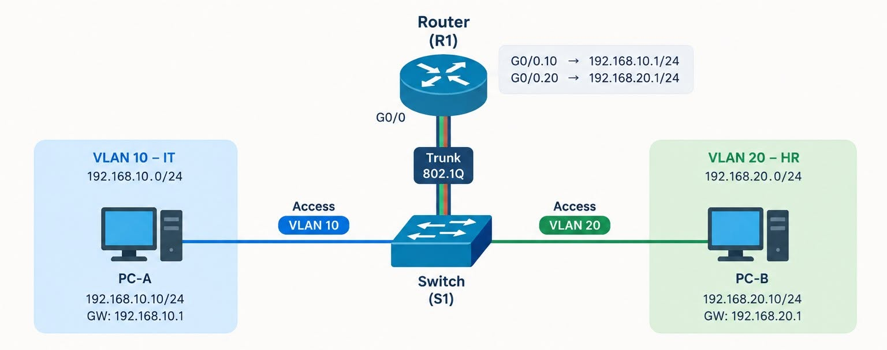

# CISCO ROUTER-ON-A-STICK LAB

## Một Router có thể định tuyến giữa nhiều VLAN như thế nào?

> **PC đã có IP, Switch đã chia VLAN, vậy tại sao VLAN 10 vẫn không thể ping VLAN 20?**

Đây là một bài lab quen thuộc khi học **CCNA**, nhưng điều quan trọng không chỉ nằm ở việc ghi nhớ các dòng lệnh cấu hình.

Câu hỏi cần hiểu là: **Khi PC ở VLAN 10 muốn giao tiếp với PC ở VLAN 20, packet thực sự đi qua những đâu?**

Đó chính là bài toán **Router-on-a-Stick (Inter-VLAN Routing)**.

---

## 1. Sơ đồ mạng (Topology)



### Bảng địa chỉ IP

| Thiết bị | Interface / VLAN | Địa chỉ IP | Default Gateway |
|---|---|---|---|
| **PC-A (IT)** | VLAN 10 | `192.168.10.10/24` | `192.168.10.1` |
| **PC-B (HR)** | VLAN 20 | `192.168.20.10/24` | `192.168.20.1` |
| **R1** | `G0/0.10` – VLAN 10 | `192.168.10.1/24` | — |
| **R1** | `G0/0.20` – VLAN 20 | `192.168.20.1/24` | — |

**Kết nối:**

- **PC-A ↔ S1:** Access Port thuộc **VLAN 10**.
- **PC-B ↔ S1:** Access Port thuộc **VLAN 20**.
- **S1 ↔ R1 (`G0/0`):** Kết nối **Trunk 802.1Q** mang VLAN 10 và VLAN 20.

---

## 2. Vì sao Switch không tự routing giữa các VLAN?

Giả sử hệ thống có hai VLAN:

| VLAN | Phòng ban | Network |
|---|---|---|
| **10** | IT | `192.168.10.0/24` |
| **20** | HR | `192.168.20.0/24` |

Hai PC có thể cùng kết nối vào một Switch nhưng vẫn thuộc **hai broadcast domain** và **hai IP subnet khác nhau**.

- **Switch Layer 2** chuyển Ethernet Frame dựa trên **MAC Address** trong phạm vi VLAN.
- Switch Layer 2 **không thực hiện Layer 3 routing** giữa các subnet.
- Khi PC-A gửi traffic đến `192.168.20.10`, nó nhận thấy địa chỉ đích nằm ngoài subnet `192.168.10.0/24`.
- Do đó, PC-A phải gửi packet qua **Default Gateway `192.168.10.1`**.

**Đây là nơi Router tham gia vào quá trình truyền dữ liệu.**

---

## 3. Router-on-a-Stick hoạt động như thế nào?

Thay vì sử dụng một cổng vật lý riêng cho từng VLAN, Router sử dụng **một interface vật lý** và tạo nhiều **Sub-interface (interface logic)**.

Ví dụ:

```text
R1
└── G0/0 (Physical Interface)
    ├── G0/0.10 → VLAN 10 → 192.168.10.1/24
    └── G0/0.20 → VLAN 20 → 192.168.20.1/24
```

Mỗi Sub-interface được ánh xạ với một VLAN thông qua **IEEE 802.1Q VLAN ID**:

```cisco
interface GigabitEthernet0/0.10
 encapsulation dot1Q 10
 ip address 192.168.10.1 255.255.255.0

interface GigabitEthernet0/0.20
 encapsulation dot1Q 20
 ip address 192.168.20.1 255.255.255.0
```

> **Lưu ý:** Sub-interface là interface logic, không phải cổng vật lý mới. Interface vật lý `G0/0` cần được bật (`no shutdown`); cú pháp interface có thể khác tùy dòng thiết bị.

Nhờ đó, **một cổng vật lý** có thể đồng thời làm **Default Gateway cho nhiều VLAN**.

---

## 4. Vì sao liên kết Switch – Router phải dùng Trunk?

Một kết nối vật lý phải mang traffic của nhiều VLAN, vì vậy cổng Switch nối với Router cần hoạt động ở chế độ **Trunk**.

Trên đường trunk, Switch sử dụng **802.1Q tagging** để gắn thông tin VLAN vào Ethernet Frame:

```text
VLAN 10 → 802.1Q Tag 10 → Trunk → R1 G0/0.10
VLAN 20 → 802.1Q Tag 20 → Trunk → R1 G0/0.20
```

Router dựa vào VLAN ID để phân phối Frame đến đúng Sub-interface:

```cisco
G0/0.10 → encapsulation dot1Q 10
G0/0.20 → encapsulation dot1Q 20
```

Sau đó, Router xử lý packet ở **Layer 3** và định tuyến giữa các mạng IP.

> **Phân biệt:** Các cổng nối PC là **Access Port** (thông thường Frame từ PC không có VLAN tag); cổng nối Router là **Trunk Port** (mang traffic của nhiều VLAN, dùng tag 802.1Q trong sơ đồ này).

---

## 5. Packet Flow: VLAN 10 ping VLAN 20

**Tình huống:** PC-A `192.168.10.10/24` ping PC-B `192.168.20.10/24`.

### Bước 1 — PC-A kiểm tra địa chỉ đích

PC-A nhận thấy `192.168.20.10` **không thuộc subnet** `192.168.10.0/24`, nên quyết định chuyển packet đến **Default Gateway `192.168.10.1`**.

Nếu chưa biết MAC Address của Gateway, PC-A sử dụng **ARP** để tìm địa chỉ MAC tương ứng.

### Bước 2 — PC-A gửi Frame vào Access Port

- PC-A kết nối với một **Access Port thuộc VLAN 10**.
- Frame đi vào Switch **S1**.
- Switch xử lý Frame trong phạm vi **VLAN 10** và chuyển đến cổng nối Router.

### Bước 3 — Switch đưa Frame lên Trunk

- Frame được gửi ra **Trunk Port** kết nối với Router.
- Switch gắn **802.1Q VLAN Tag 10** cho Frame.
- Router nhận Frame và xác định traffic thuộc **VLAN 10**.

### Bước 4 — Router xử lý tại `G0/0.10`

Router tiếp nhận traffic tại:

```text
G0/0.10 → 192.168.10.1/24
```

Sau khi bỏ lớp đóng gói Ethernet đầu vào, Router kiểm tra địa chỉ IP đích:

```text
Destination IP: 192.168.20.10
```

Router tra **Routing Table** để xác định đường đi đến mạng đích.

### Bước 5 — Router định tuyến sang VLAN 20

Routing Table cho biết:

```text
192.168.20.0/24 → Directly Connected → G0/0.20
```

Router thực hiện **Layer 3 routing** và chuẩn bị gửi packet qua **Sub-interface `G0/0.20`**.

**Đây chính là bước mà Switch Layer 2 không thể tự thực hiện.**

### Bước 6 — Frame đến PC-B qua VLAN 20

- Nếu chưa biết MAC Address của PC-B, Router sử dụng **ARP** để tìm MAC.
- Router đóng gói packet trong **Ethernet Frame mới** cho VLAN 20.
- Frame được gửi qua **Trunk**, mang **802.1Q VLAN Tag 20**.
- Switch nhận Frame, xử lý trong **VLAN 20** và gửi qua Access Port đến **PC-B**.

### Tổng hợp Packet Flow

```text
PC-A (192.168.10.10)
   │
   ▼
Access Port — VLAN 10
   │
   ▼
Switch S1
   │
   ▼
Trunk 802.1Q — Tag 10
   │
   ▼
R1: G0/0.10 (192.168.10.1)
   │
   ▼
Layer 3 Routing
   │
   ▼
R1: G0/0.20 (192.168.20.1)
   │
   ▼
Trunk 802.1Q — Tag 20
   │
   ▼
Switch S1
   │
   ▼
Access Port — VLAN 20
   │
   ▼
PC-B (192.168.20.10)
```

**Kết luận:** Router-on-a-Stick kết hợp **VLAN Switching + 802.1Q Tagging + Layer 3 Routing** để cho phép các VLAN giao tiếp với nhau thông qua một kết nối vật lý.

---

## 6. Troubleshooting — PC có IP nhưng vẫn không ping được?

Khi lab gặp lỗi, đừng chỉ kiểm tra IP. Hãy kiểm tra theo chính **Packet Flow**.

| Lỗi thường gặp | Nguyên nhân / Cách kiểm tra |
|---|---|
| **Sai Default Gateway** | VLAN 10 dùng `192.168.10.1`; VLAN 20 dùng `192.168.20.1`. |
| **Access Port sai VLAN** | PC-A phải thuộc VLAN 10; PC-B phải thuộc VLAN 20. |
| **Trunk chưa cấu hình đúng** | Cổng Switch nối Router phải là trunk, cho phép VLAN 10 và 20. |
| **VLAN ID không khớp** | Ví dụ Router cấu hình `encapsulation dot1Q 30` trong khi Switch gửi VLAN 20. |
| **Sai Sub-interface / IP** | VLAN ID và địa chỉ IP phải đúng subnet; kiểm tra interface vật lý có đang `up` hay không. |
| **VLAN chưa tồn tại hoặc không hoạt động** | Kiểm tra VLAN trên Switch và trạng thái cổng. |

### Lệnh kiểm tra trên Switch

```cisco
show vlan brief
show interfaces trunk
show interfaces status
```

### Lệnh kiểm tra trên Router

```cisco
show ip interface brief
show running-config interface GigabitEthernet0/0.10
show running-config interface GigabitEthernet0/0.20
show ip route
show arp
```

> **Ghi chú:** Một số phiên bản Cisco IOS không hỗ trợ cú pháp `show running-config interface ...`; khi đó dùng `show running-config` và tìm phần cấu hình interface tương ứng.

### Chuỗi kiểm tra đề xuất

```text
IP Address
    ↓
Default Gateway
    ↓
VLAN Membership
    ↓
Access Port
    ↓
Trunk / Allowed VLANs
    ↓
802.1Q VLAN ID
    ↓
Router Sub-interface
    ↓
Routing Table
    ↓
ARP / Destination Host
```

---

## 7. Những điểm dễ nhầm khi học CCNA

**Router-on-a-Stick không có nghĩa Router chỉ xử lý một VLAN.**

“**One Stick**” chỉ việc nhiều VLAN cùng sử dụng **một kết nối vật lý** giữa Switch và Router.

| Chức năng | Thành phần thực hiện |
|---|---|
| **Phân chia mạng logic** | VLAN |
| **Gắn nhãn lưu lượng trên trunk** | IEEE 802.1Q |
| **Phân biệt từng VLAN ở Router** | Sub-interface + `encapsulation dot1Q` |
| **Giao tiếp giữa các subnet** | Layer 3 Routing |
| **Ánh xạ IP sang MAC trên LAN** | ARP |

Các kiến thức CCNA được kết nối trong lab:

**VLAN → Access Port → Trunk → 802.1Q → Sub-interface → Default Gateway → ARP → Routing**

---

## 8. Bài học rút ra

Đừng chỉ học **“cấu hình lệnh gì?”**. Hãy tự trả lời:

1. PC đang ở VLAN nào?
2. Destination thuộc cùng subnet hay khác subnet?
3. Default Gateway nằm ở đâu?
4. Traffic đi qua Access Port hay Trunk Port?
5. Router nhận biết VLAN bằng cách nào?
6. Routing Table chuyển packet đến interface nào?

Khi hiểu được **6 bước Packet Flow**, bạn không chỉ biết cấu hình **Router-on-a-Stick**, mà còn có thể xác định **packet đang bị gián đoạn ở đâu** khi lab không hoạt động.

---
