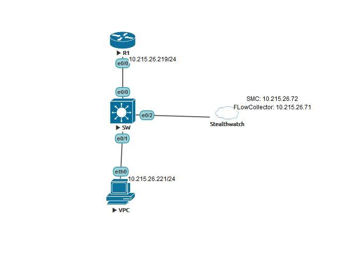

# CISCO STEALTHWATCH LAB | GIÁM SÁT TRAFFIC VỚI NETFLOW & CISCO STEALTHWATCH

##  Giới thiệu

Trong vận hành hệ thống mạng, việc **"ping được" chưa có nghĩa là chúng ta đã hiểu được traffic đang chạy như thế nào**.

Một câu hỏi thực tế hơn dành cho Network/Security Engineer là:

-  Thiết bị nào đang tạo traffic?
-  Source IP và Destination IP là gì?
-  Giao thức nào đang được sử dụng?
-  Lưu lượng đó đang đi qua đâu?
-  Stealthwatch có nhìn thấy được traffic hay không?

Trong bài lab này, chúng ta sẽ thực hành mô hình **Cisco Stealthwatch Basic**, sử dụng **NetFlow** để thu thập thông tin traffic từ các thiết bị mạng và gửi về **Stealthwatch FlowCollector** để giám sát và phân tích.

---

##  1. MÔ HÌNH LAB

###  Sơ đồ mạng



###  Bảng địa chỉ IP

| Thiết bị | Địa chỉ IP | Vai trò |
|---|---|---|
| R1 | 10.215.26.219/24 | Router, NetFlow Exporter |
| SW (Switch 2) | - | Switch, cấu hình NetFlow |
| vPC | 10.215.26.221/24 | Thiết bị tạo traffic |
| FlowCollector | 10.215.26.71 | Thu thập và xử lý NetFlow |
| SMC | 10.215.26.72 | Quản lý và giám sát traffic |
| Gateway | 10.215.26.219 | Default Gateway |

**Môi trường triển khai:**

- Cisco Router
- Cisco Switch hỗ trợ NetFlow
- Cisco Stealthwatch Management Console (SMC)
- Cisco Stealthwatch FlowCollector
- VMware/vSphere
- Virtual PC (vPC)

**Mục tiêu lab:**

- Cấu hình NetFlow trên Router và Switch.
- Export thông tin flow về Stealthwatch FlowCollector.
- Kết nối và quản lý FlowCollector thông qua SMC.
- Tạo ICMP traffic từ vPC đến R1.
- Kiểm tra và phân tích traffic trên Stealthwatch.

---

##  2. CÁC BƯỚC THỰC HIỆN

### 2.1. Kết nối SMC với FlowCollector

Đầu tiên, triển khai và kiểm tra kết nối giữa:

- **Stealthwatch Management Console (SMC):** `10.215.26.72`
- **Stealthwatch FlowCollector:** `10.215.26.71`

Từ giao diện SMC, sử dụng **Desktop Client** để quản trị hệ thống và thực hiện các thao tác giám sát traffic.

**Mục tiêu:**

- Đảm bảo SMC kết nối được với FlowCollector.
- Kiểm tra trạng thái hoạt động của FlowCollector.
- Chuẩn bị hệ thống để tiếp nhận NetFlow từ thiết bị mạng.

### 2.2. Cấu hình NetFlow trên R1

Trên Router R1, tiến hành cấu hình **Flexible NetFlow** theo thứ tự:

```text
Flow Record
    ↓
Flow Exporter
    ↓
Flow Monitor
    ↓
Apply Flow Monitor to Interface
    ↓
Collect Ingress / Egress Traffic
```

**Các thành phần chính:**

| Thành phần | Chức năng |
|---|---|
| Flow Record | Xác định các trường thông tin cần thu thập |
| Flow Exporter | Gửi dữ liệu NetFlow đến FlowCollector |
| Flow Monitor | Liên kết Flow Record và Flow Exporter |
| Interface | Thu thập traffic trên cổng mạng |

**Thông số Flow Exporter:**

```text
Destination IP : 10.215.26.71
Protocol       : UDP
Destination Port: 2055
```

Flow Exporter sẽ gửi dữ liệu NetFlow từ R1 về **Stealthwatch FlowCollector** thông qua UDP port **2055**.

### 2.3. Cấu hình NetFlow trên Switch 2

Tương tự Router R1, Switch 2 cũng được cấu hình NetFlow để theo dõi traffic đi qua thiết bị.

Quy trình thực hiện:

1. Tạo Flow Record.
2. Cấu hình Flow Exporter.
3. Tạo Flow Monitor.
4. Gán Flow Monitor vào interface phù hợp.
5. Cấu hình thu thập traffic ingress/egress theo khả năng thiết bị.

**Mục tiêu:**

Thu thập thông tin traffic từ Switch và export dữ liệu về **FlowCollector 10.215.26.71**.

> **Lưu ý:** Khả năng hỗ trợ Flexible NetFlow và hướng ingress/egress phụ thuộc vào dòng Switch, phiên bản IOS và loại interface.

---

##  3. TẠO TRAFFIC VÀ KIỂM TRA NETFLOW

### 3.1. Tạo ICMP traffic

Từ vPC có địa chỉ IP:

```text
10.215.26.221/24
```

Thực hiện ping đến Router R1:

```bash
ping 10.215.26.219
```

**Mục đích:**

- Kiểm tra kết nối giữa vPC và R1.
- Tạo ICMP traffic trong hệ thống mạng.
- Kiểm chứng việc thu thập flow trên thiết bị mạng.

### 3.2. Kiểm tra NetFlow trên R1

Với Traditional NetFlow:

```cisco
show ip cache flow
```

Với Flexible NetFlow:

```cisco
show flow monitor <MONITOR_NAME> cache
```

Kiểm tra trạng thái Flow Exporter:

```cisco
show flow exporter <EXPORTER_NAME> statistics
```

**Kết quả quan sát trong lab:**

- R1 ghi nhận traffic ICMP từ vPC.
- Source IP: `10.215.26.221`
- Destination IP: `10.215.26.219`
- Protocol: `ICMP`

Điều này cho thấy Router đã nhận diện được traffic được tạo ra trong mạng.

---

##  4. QUAN SÁT TRAFFIC TRÊN STEALTHWATCH

Đây là phần quan trọng nhất của bài lab.

Sau khi các thiết bị mạng export dữ liệu NetFlow về FlowCollector, Stealthwatch có thể tổng hợp và hiển thị các luồng traffic.

Trên giao diện **Stealthwatch Flow Table**, chúng ta có thể theo dõi:

| Thông tin | Ý nghĩa |
|---|---|
| Source IP | Địa chỉ IP nguồn |
| Destination IP | Địa chỉ IP đích |
| Protocol | Giao thức sử dụng |
| Traffic/Application | Loại traffic hoặc ứng dụng được nhận diện |
| Bytes | Dung lượng traffic |
| Packets | Số lượng packet |
| Flow Information | Thông tin liên quan đến flow |

###  Kết quả giám sát

Trong bài lab, Stealthwatch đã ghi nhận được **ICMP traffic từ vPC đến R1**.

```text
Source IP      : 10.215.26.221
Destination IP : 10.215.26.219
Protocol       : ICMP
FlowCollector  : 10.215.26.71
SMC            : 10.215.26.72
```

Thông qua Flow Table, Network/Security Engineer có thể:

- Xác định thiết bị nào đang tạo traffic.
- Phân tích hướng truyền dữ liệu.
- Theo dõi mức sử dụng băng thông.
- Nhận diện các luồng traffic bất thường.
- Hỗ trợ quá trình Network Troubleshooting và Security Monitoring.

---

##  5. ĐIỂM QUAN TRỌNG CỦA BÀI LAB

NetFlow không đơn thuần là việc **"bật một vài dòng lệnh"** trên Router hoặc Switch.

Để hệ thống giám sát hoạt động chính xác, cần hiểu được toàn bộ quy trình:

```text
Network Device
      |
      v
NetFlow Record
      |
      v
Flow Monitor
      |
      v
Flow Exporter
      |
      | UDP/2055
      v
Stealthwatch FlowCollector
      |
      v
Stealthwatch Management Console
      |
      v
Flow Table / Traffic Analysis
```

###  Những kiến thức rút ra

**1. NetFlow giúp quan sát traffic**

Không chỉ xác định thiết bị có kết nối được hay không, NetFlow còn cung cấp thông tin về các luồng traffic.

**2. Flow Exporter đóng vai trò quan trọng**

Nếu Flow Exporter cấu hình sai destination IP hoặc UDP port, dữ liệu có thể không đến được FlowCollector.

**3. FlowCollector là thành phần thu thập dữ liệu**

FlowCollector nhận và xử lý các bản ghi NetFlow từ thiết bị mạng.

**4. SMC cung cấp khả năng giám sát tập trung**

Thông qua SMC, quản trị viên có thể theo dõi và phân tích traffic từ nhiều thiết bị.

**5. NetFlow hỗ trợ Network Security Monitoring**

Dữ liệu NetFlow có thể được sử dụng để phát hiện những dấu hiệu bất thường như:

- Lưu lượng tăng đột biến.
- Kết nối đến các địa chỉ IP đáng ngờ.
- Những thiết bị tạo lượng traffic bất thường.
- Các mô hình giao tiếp có dấu hiệu port scanning.

---

##  6. KẾT LUẬN

Thông qua bài lab **Cisco Stealthwatch & NetFlow**, chúng ta đã thực hành:

-  Xây dựng mô hình giám sát traffic.
-  Kết nối SMC và FlowCollector.
-  Cấu hình NetFlow trên Router và Switch.
-  Export dữ liệu NetFlow về FlowCollector.
-  Tạo ICMP traffic để kiểm thử.
-  Kiểm tra flow trên thiết bị mạng.
-  Quan sát ICMP traffic trên Stealthwatch.

**Bài học quan trọng nhất:**

> Ping chỉ giúp kiểm tra khả năng kết nối. NetFlow và Stealthwatch giúp chúng ta hiểu rõ hơn traffic đang diễn ra như thế nào trong hệ thống mạng.

Đây là nền tảng quan trọng trong **Network Monitoring, Network Troubleshooting, Traffic Analysis và Security Operations (SOC)**.

---

##  Technologies Used

`Cisco` `NetFlow` `Flexible NetFlow` `Cisco Stealthwatch` `FlowCollector` `SMC` `Network Monitoring` `Traffic Analysis` `Network Security` `VMware`
