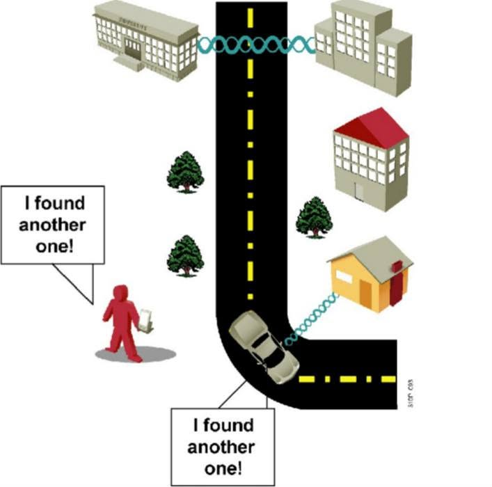
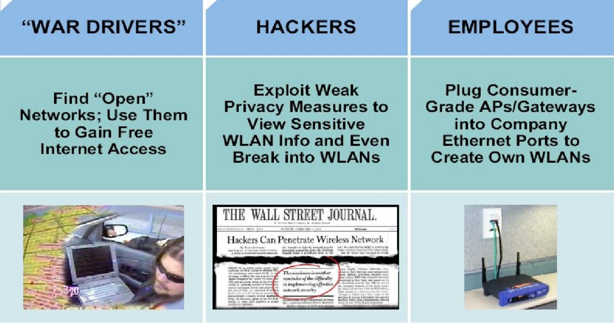
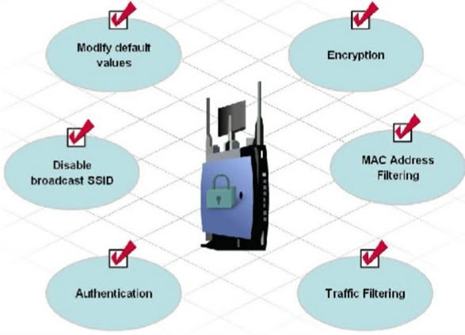

# WIRELESS SECURITY LAB – WPA2-PSK & MAC ADDRESS FILTERING

## WIRELESS SECURITY: BẢO VỆ MẠNG WI-FI NHƯ THẾ NÀO?

Trong hệ thống mạng doanh nghiệp, **Wi-Fi là một trong những điểm dễ bị tiếp cận nhất** vì người dùng không cần kết nối trực tiếp vào hệ thống mạng vật lý.

Nếu Access Point sử dụng cấu hình mặc định hoặc không có cơ chế xác thực phù hợp, người lạ trong vùng phủ sóng hoàn toàn có thể phát hiện và thử truy cập vào mạng.

Một số nguy cơ bảo mật WLAN thường gặp:

- **War Driving:** Tìm kiếm và thu thập thông tin về các mạng Wi-Fi trong khu vực.
- **Unauthorized Access:** Truy cập mạng không dây khi không được cấp quyền.
- **Weak Authentication:** Lợi dụng mật khẩu yếu hoặc cơ chế xác thực không an toàn.
- **Rogue Access Point:** Tự ý kết nối Access Point vào mạng nội bộ.
- **MAC Spoofing:** Giả mạo địa chỉ MAC để vượt qua cơ chế kiểm soát dựa trên MAC.

Trong bài lab này, mình thực hành triển khai bảo mật cơ bản cho một hệ thống WLAN, tập trung vào hai cơ chế chính:

- **WPA2-PSK + AES:** Xác thực và mã hóa kết nối Wi-Fi.
- **MAC Address Filtering:** Kiểm soát danh sách thiết bị được phép kết nối.

Mục tiêu không chỉ là giúp Wireless Client kết nối được Wi-Fi, mà còn kiểm chứng cách Access Point xử lý các thiết bị hợp lệ và không hợp lệ.

---

## 1. MÔ HÌNH THỰC HÀNH

### Thành phần hệ thống

| Thiết bị | Số lượng | Chức năng |
|---|---|---|
| Router | 01 | Default Gateway, DHCP Server |
| Switch | 01 | Kết nối hạ tầng LAN |
| Access Point | 01 | Cung cấp WLAN |
| Wireless Client | 02 | Kiểm thử xác thực và truy cập |

### Thông số mạng

| Thông số | Giá trị |
|---|---|
| Network | `192.168.10.0/24` |
| Default Gateway | `192.168.10.1` |
| Access Point IP | `192.168.10.2` |
| Subnet Mask | `255.255.255.0` |
| SSID | `VNPRO-WIFI` |
| Security Mode | `WPA2-Personal` |
| Encryption | `AES (CCMP)` |
| Pre-Shared Key | `VnPro@2026` |

**Mục tiêu thực hành:**

1. Cấu hình Access Point và thay đổi thông số mặc định.
2. Kích hoạt WPA2-PSK với AES.
3. Kiểm tra xác thực bằng mật khẩu đúng và sai.
4. Triển khai MAC Address Filtering.
5. Kiểm chứng kết nối của các Wireless Client.

---

## 2. CẤU HÌNH ACCESS POINT

Đầu tiên, mình truy cập giao diện quản trị của Access Point và thay đổi các thông tin cấu hình mặc định.

### Cấu hình IP Management

- IP Address: `192.168.10.2`
- Subnet Mask: `255.255.255.0`
- Default Gateway: `192.168.10.1`
- SSID: `VNPRO-WIFI`

Sau khi lưu cấu hình, mình kiểm tra lại khả năng truy cập giao diện quản trị AP bằng địa chỉ IP mới.

**Lưu ý:** Trong môi trường thực tế, cần thay đổi tài khoản và mật khẩu quản trị mặc định, đồng thời hạn chế các thiết bị được phép truy cập giao diện quản trị AP.

---

## 3. CẤU HÌNH WPA2-PSK & AES

Tiếp theo, mình chuyển WLAN từ chế độ **Open Authentication** sang sử dụng cơ chế xác thực bằng Pre-Shared Key.

### Wireless Security Configuration

| Parameter | Configuration |
|---|---|
| SSID | `VNPRO-WIFI` |
| Security | `WPA2-Personal` |
| Encryption | `AES` |
| Authentication | `Pre-Shared Key` |
| PSK | `VnPro@2026` |

Sau khi Apply cấu hình, mình tiến hành kết nối Wireless Client vào SSID `VNPRO-WIFI`.

### Kiểm tra kết nối

Client thực hiện:

1. Tìm SSID `VNPRO-WIFI`.
2. Chọn kết nối.
3. Nhập WPA2 Pre-Shared Key.
4. Hoàn tất xác thực.
5. Nhận địa chỉ IP từ DHCP Server.

Tiếp theo, kiểm tra kết nối tới Default Gateway bằng lệnh:

`ping 192.168.10.1`

**Kết quả:**

✅ Client nhập đúng PSK có thể xác thực thành công.

✅ Client nhận địa chỉ IP hợp lệ.

✅ Ping thành công tới Default Gateway, xác nhận kết nối IP giữa Client và Gateway hoạt động.

---

## 4. KIỂM TRA CƠ CHẾ XÁC THỰC

Sau khi triển khai WPA2-PSK, mình thực hiện kiểm thử bằng hai trường hợp.

### Test 1 – Incorrect Password

Sử dụng Wireless Client và nhập sai mật khẩu Wi-Fi.

**Kết quả:**

❌ Client không thể hoàn tất quá trình xác thực WPA2.

❌ Client không được phép truy cập WLAN.

### Test 2 – Correct Password

Tiến hành kết nối lại với PSK hợp lệ.

**Kết quả:**

✅ Client xác thực thành công.

✅ Thiết bị có thể tham gia WLAN.

✅ Client có thể nhận IP và truy cập các tài nguyên mạng được cho phép.

Qua hai bài kiểm tra này, mình xác nhận cơ chế WPA2-PSK hoạt động theo cấu hình.

---

## 5. CẤU HÌNH MAC ADDRESS FILTERING

Ngoài WPA2-PSK, mình tiếp tục triển khai **MAC Address Filtering** để bổ sung cơ chế kiểm soát thiết bị kết nối.

### Bước 1 – Xác định MAC Address

Trên Wireless Client hợp lệ, kiểm tra địa chỉ MAC của card Wi-Fi.

Ví dụ:

`AA:BB:CC:11:22:33`

### Bước 2 – Cấu hình Allow List

Truy cập mục MAC Address Filtering trên Access Point.

- Enable MAC Filtering.
- Chọn chế độ **Allow / Permit**.
- Thêm địa chỉ MAC của thiết bị hợp lệ.

**Allowed MAC Address:**

`AA:BB:CC:11:22:33`

### Bước 3 – Kiểm thử Client hợp lệ

**Client 1:**

- Password: Correct
- MAC Address: In Allow List
- Expected Result: **Connected**

✅ Client kết nối thành công.

### Bước 4 – Kiểm thử Client không hợp lệ

**Client 2:**

- Password: Correct
- MAC Address: Not In Allow List
- Expected Result: **Rejected**

❌ Client bị từ chối kết nối mặc dù sử dụng đúng mật khẩu.

Điều này cho thấy Access Point đang áp dụng thêm chính sách kiểm soát dựa trên địa chỉ MAC.

**Lưu ý bảo mật:** MAC Address Filtering không phải cơ chế xác thực mạnh vì địa chỉ MAC có thể bị giả mạo. Tính năng này chỉ nên được xem là lớp kiểm soát bổ sung.

---

## 6. TỔNG HỢP KẾT QUẢ KIỂM THỬ

| Test Case | WPA2 Password | MAC Allow List | Kết quả mong đợi |
|---|---|---|---|
| Client 1 | Correct | Allowed | ✅ Connected |
| Client 2 | Incorrect | Allowed | ❌ Rejected |
| Client 3 | Correct | Not Allowed | ❌ Rejected |
| Client 4 | Incorrect | Not Allowed | ❌ Rejected |

Qua quá trình kiểm thử, có thể thấy WLAN sử dụng hai cơ chế kiểm soát:

**WPA2-PSK Authentication → MAC Address Filtering → Network Access**

Thiết bị cần đáp ứng các điều kiện đã cấu hình mới có thể kết nối thành công.

---

## 7. CÁC MỐI ĐE DỌA ĐỐI VỚI WLAN

Trong môi trường thực tế, bảo mật mạng Wi-Fi không chỉ dừng lại ở việc thiết lập mật khẩu.

Một số tình huống cần quan tâm:

**War Driving**

Kẻ tấn công có thể phát hiện các mạng Wi-Fi từ bên ngoài tòa nhà hoặc khu vực doanh nghiệp.

**Weak Wireless Security**

Mật khẩu yếu và các giao thức bảo mật cũ có thể tạo điều kiện cho việc truy cập trái phép.

**Rogue Access Point**

Nhân viên có thể tự ý kết nối router hoặc Access Point cá nhân vào mạng LAN, tạo ra một WLAN không được quản lý.

**MAC Spoofing**

Kẻ tấn công có thể giả mạo MAC Address của thiết bị hợp lệ. Vì vậy, không nên sử dụng MAC Filtering làm lớp bảo mật chính.

---

## 8. CÁC BIỆN PHÁP TĂNG CƯỜNG WIRELESS SECURITY

Đối với hệ thống WLAN doanh nghiệp, có thể triển khai thêm các biện pháp:

- **Change Default Configuration:** Thay đổi tài khoản, mật khẩu quản trị và cấu hình mặc định.
- **Strong Encryption:** Ưu tiên WPA3 khi được hỗ trợ, hoặc WPA2-AES cho thiết bị tương thích.
- **Strong Authentication:** Triển khai 802.1X kết hợp RADIUS trong môi trường Enterprise.
- **Network Segmentation:** Phân chia mạng Guest, Employee và Management bằng VLAN.
- **Traffic Filtering:** Áp dụng Firewall/ACL để giới hạn truy cập giữa các phân đoạn mạng.
- **Wireless Monitoring:** Giám sát thiết bị lạ, Rogue AP và các sự kiện xác thực bất thường.
- **SSID Management:** Quản lý SSID phù hợp; không xem việc ẩn SSID là một biện pháp bảo mật đáng tin cậy.

---

## 9. KẾT QUẢ THỰC HÀNH

Sau khi hoàn thành bài lab, mình đã triển khai và kiểm tra các cơ chế bảo mật WLAN cơ bản:

✅ Cấu hình IP Management và SSID cho Access Point.

✅ Triển khai WPA2-Personal sử dụng AES.

✅ Kiểm tra xác thực với PSK đúng và sai.

✅ Cấu hình MAC Address Filtering theo Allow List.

✅ Kiểm tra khả năng kết nối của Client hợp lệ và không hợp lệ.

✅ Kiểm tra kết nối từ Wireless Client tới Default Gateway.

### Kiến thức rút ra

**WPA2-PSK + AES** giúp xác thực thiết bị sử dụng khóa chia sẻ và mã hóa lưu lượng trên kết nối không dây.

**MAC Address Filtering** cung cấp thêm khả năng kiểm soát thiết bị, nhưng không thể thay thế cơ chế xác thực mạnh.

Đối với môi trường doanh nghiệp có nhiều người dùng, việc sử dụng chung một PSK sẽ gây khó khăn trong quản lý và thu hồi quyền truy cập.

Vì vậy, giải pháp phù hợp hơn là triển khai:

**Wireless Client → Access Point/WLC → 802.1X → RADIUS Server → Authentication & Authorization → Network Access**

Các công nghệ như **WPA2/WPA3-Enterprise, 802.1X và RADIUS** cho phép quản lý xác thực tập trung, áp dụng chính sách truy cập theo người dùng và tăng cường khả năng giám sát bảo mật.

**Kết luận:** Bảo mật WLAN không chỉ là đặt mật khẩu Wi-Fi. Một hệ thống Wireless an toàn cần kết hợp xác thực, mã hóa, kiểm soát truy cập, phân đoạn mạng và giám sát liên tục.