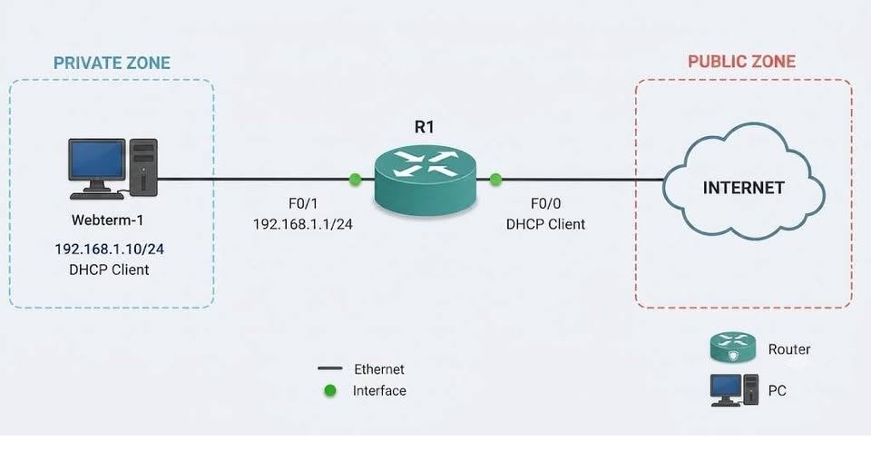

# CISCO ZONE-BASED FIREWALL – NAT, DHCP, TRAFFIC POLICING & SESSION CONTROL LAB

##  ZONE-BASED FIREWALL – KHI ROUTER KHÔNG CHỈ ROUTING MÀ CÒN ĐÓNG VAI TRÒ FIREWALL

Trong hệ thống mạng thực tế, việc cho phép máy tính bên trong truy cập Internet không chỉ đơn giản là cấu hình **NAT**.

Khi Router đảm nhiệm thêm vai trò **Firewall**, chúng ta cần xác định rõ:

- Traffic nào được phép đi qua?
- Traffic nào phải bị chặn?
- Làm thế nào để kiểm soát băng thông?
- Làm thế nào để giới hạn số lượng session?
- Làm thế nào để kiểm tra Firewall Policy có hoạt động đúng?

Trong bài lab này, mình xây dựng hệ thống sử dụng **Cisco Router** để thực hiện đồng thời:

- **DHCP Server** – Cấp phát địa chỉ IP tự động.
- **NAT/PAT** – Cho phép các thiết bị LAN truy cập Internet.
- **Zone-Based Firewall (ZBF)** – Kiểm soát traffic giữa các Security Zone.
- **Traffic Policing** – Giới hạn tốc độ của traffic.
- **Session Control** – Giới hạn số lượng kết nối.

**Mục tiêu cuối cùng:** PC truy cập được Internet, nhưng mọi traffic giữa PRIVATE và PUBLIC Zone phải tuân theo các Security Policy được cấu hình.

---

##  1. NETWORK TOPOLOGY



### Network Information

| Device | Interface | IP Address | Description |
|---|---|---|---|
| R1 | F0/0 | DHCP Client | Internet / PUBLIC |
| R1 | F0/1 | 192.168.1.1/24 | LAN / PRIVATE |
| Webterm-1 | Ethernet | DHCP Client | Internal PC |
| Internet | WAN | External Network | Public Network |

### Security Zones

| Zone | Interface | Function |
|---|---|---|
| PRIVATE | FastEthernet0/1 | Internal LAN |
| PUBLIC | FastEthernet0/0 | External Network |

**Network:** `192.168.1.0/24`

**Default Gateway:** `192.168.1.1`

**DNS Server:** `8.8.8.8`

### Traffic Flow

```text
PC (DHCP Client)
       |
       | PRIVATE ZONE
       |
FastEthernet0/1
       |
       v
  Cisco Router R1
  +---------------------+
  | DHCP Server         |
  | NAT / PAT           |
  | Zone-Based Firewall |
  | Traffic Policing    |
  | Session Control     |
  +---------------------+
       |
FastEthernet0/0
       |
       | PUBLIC ZONE
       |
       v
    INTERNET
```

---

##  2. CONFIGURE INTERFACES & NAT/PAT

Đầu tiên, cấu hình hai interface trên Router R1.

### Step 1 – Configure WAN Interface

Interface `FastEthernet0/0` kết nối ra Internet và nhận IP động thông qua DHCP.

```cisco
R1(config)# interface FastEthernet0/0
R1(config-if)# ip address dhcp
R1(config-if)# ip nat outside
R1(config-if)# no shutdown
```

### Step 2 – Configure LAN Interface

Interface `FastEthernet0/1` kết nối với mạng LAN.

```cisco
R1(config)# interface FastEthernet0/1
R1(config-if)# ip address 192.168.1.1 255.255.255.0
R1(config-if)# ip nat inside
R1(config-if)# no shutdown
```

### Step 3 – Configure NAT ACL

Tạo Access Control List để xác định mạng LAN được phép sử dụng NAT.

```cisco
R1(config)# access-list 1 permit 192.168.1.0 0.0.0.255
```

### Step 4 – Configure PAT

```cisco
R1(config)# ip nat inside source list 1 interface FastEthernet0/0 overload
```

**Giải thích:**

- `ip nat inside`: Xác định interface phía mạng nội bộ.
- `ip nat outside`: Xác định interface phía mạng bên ngoài.
- `access-list 1`: Xác định mạng LAN cần NAT.
- `overload`: Cho phép nhiều thiết bị sử dụng chung địa chỉ IP phía WAN thông qua PAT.

**Kết quả mong đợi:** Các thiết bị trong mạng LAN có thể sử dụng địa chỉ IP WAN của Router để truy cập Internet, khi có định tuyến và Firewall Policy phù hợp.

---

##  3. CONFIGURE DHCP SERVER

Thay vì cấu hình IP thủ công cho từng thiết bị, Router R1 sẽ đóng vai trò **DHCP Server**.

### Step 1 – Exclude IP Addresses

Dành riêng dải địa chỉ từ `192.168.1.1` đến `192.168.1.40` cho các thiết bị cần IP cố định.

```cisco
R1(config)# ip dhcp excluded-address 192.168.1.1 192.168.1.40
```

### Step 2 – Create DHCP Pool

```cisco
R1(config)# ip dhcp pool PRIVATE-LAN
R1(dhcp-config)# network 192.168.1.0 255.255.255.0
R1(dhcp-config)# default-router 192.168.1.1
R1(dhcp-config)# dns-server 8.8.8.8
```

### DHCP Configuration Summary

| Parameter | Value |
|---|---|
| Network | 192.168.1.0/24 |
| Default Gateway | 192.168.1.1 |
| DNS Server | 8.8.8.8 |
| Excluded Range | 192.168.1.1 – 192.168.1.40 |
| Available Pool | 192.168.1.41 – 192.168.1.254 |

### Verification

```cisco
R1# show ip dhcp binding
R1# show ip dhcp pool
```

**Kết quả mong đợi:** PC nhận được địa chỉ IP, Subnet Mask, Default Gateway và DNS Server tự động.

---

##  4. CONFIGURE SECURITY ZONES

Đây là bước bắt đầu triển khai **Zone-Based Firewall** trên Cisco Router.

### Step 1 – Create Security Zones

Tạo hai Security Zone:

- **PRIVATE:** Mạng LAN nội bộ.
- **PUBLIC:** Mạng Internet.

```cisco
R1(config)# zone security PRIVATE
R1(config)# zone security PUBLIC
```

### Step 2 – Assign Interfaces to Zones

Gán interface LAN vào PRIVATE Zone.

```cisco
R1(config)# interface FastEthernet0/1
R1(config-if)# zone-member security PRIVATE
```

Gán interface WAN vào PUBLIC Zone.

```cisco
R1(config)# interface FastEthernet0/0
R1(config-if)# zone-member security PUBLIC
```

### Understanding Default Zone Behavior

Một điểm rất quan trọng của Cisco Zone-Based Firewall:

**Traffic giữa các Security Zone khác nhau mặc định bị chặn nếu chưa có Zone-Pair Policy cho phép.**

Sau khi đưa các interface vào Security Zone, thử kiểm tra từ PC:

```bash
ping 8.8.8.8
```

**Kết quả mong đợi:** Traffic ICMP từ PRIVATE đến PUBLIC bị chặn vì chưa có Firewall Policy cho phép.

Đây chính là nguyên tắc:

**Default Deny → Explicit Allow**

---

##  5. ALLOW ICMP TRAFFIC – PRIVATE TO PUBLIC

Mục tiêu của bước này là cho phép PC trong PRIVATE Zone ping ra Internet.

### Step 1 – Create ICMP Class-Map

```cisco
R1(config)# class-map type inspect match-all ICMP
R1(config-cmap)# match protocol icmp
```

Class-map này dùng để nhận diện traffic ICMP.

### Step 2 – Create Firewall Policy

```cisco
R1(config)# policy-map type inspect PRI-PUB
R1(config-pmap)# class type inspect ICMP
R1(config-pmap-c)# inspect
```

**Action `inspect`** cho phép Firewall theo dõi trạng thái kết nối và xử lý return traffic tương ứng.

### Step 3 – Create Zone-Pair

```cisco
R1(config)# zone-pair security PRIVATE-TO-PUBLIC source PRIVATE destination PUBLIC
R1(config-sec-zone-pair)# service-policy type inspect PRI-PUB
```

### Step 4 – Verify ICMP Connectivity

Từ PC:

```bash
ping 8.8.8.8
```

**Kết quả mong đợi:**

- ICMP được phép đi từ PRIVATE sang PUBLIC.
- Firewall theo dõi traffic thông qua Inspect Policy.
- ICMP reply được phép quay về.

Bước này thể hiện rõ cơ chế kiểm soát traffic theo hướng của Zone-Based Firewall.

---

##  6. ALLOW INTERNET ACCESS – TCP & UDP

Sau khi ICMP được cho phép, PC có thể ping nhưng chưa chắc truy cập được website.

**Nguyên nhân:** Policy hiện tại mới cho phép ICMP, chưa cho phép các kết nối TCP/UDP cần thiết.

### Step 1 – Create WEB-ACCESS Class-Map

```cisco
R1(config)# class-map type inspect match-any WEB-ACCESS
R1(config-cmap)# match protocol tcp
R1(config-cmap)# match protocol udp
```

**Giải thích:**

- `match-any`: Chỉ cần một điều kiện khớp.
- `match protocol tcp`: Nhận diện TCP.
- `match protocol udp`: Nhận diện UDP.

### Step 2 – Update Firewall Policy

```cisco
R1(config)# policy-map type inspect PRI-PUB
R1(config-pmap)# class type inspect WEB-ACCESS
R1(config-pmap-c)# inspect
```

Vì Policy `PRI-PUB` đã được gán vào Zone-Pair nên không cần áp dụng lại.

### Expected Result

Sau bước này:

- PC có thể tạo kết nối TCP ra Internet.
- PC có thể tạo kết nối UDP ra Internet.
- Return traffic của các session được inspect có thể quay về.
- Các kết nối Internet cần thiết có thể hoạt động.

**Lưu ý:** Class-map này cho phép TCP/UDP khá rộng, phù hợp để minh họa trong lab. Trong môi trường production nên giới hạn protocol, port và destination theo nhu cầu thực tế.

---

##  7. HTTP/HTTPS TRAFFIC POLICING – 8000 BPS

Sau khi cho phép truy cập Internet, bước tiếp theo là kiểm soát băng thông.

**Mục tiêu:** Giới hạn traffic HTTP/HTTPS được policy nhận diện ở mức `8000 bps`.

### Step 1 – Create RESTRICT_TRAFFIC Class-Map

Class-map được thiết kế để nhận diện:

- HTTP
- HTTPS

```cisco
R1(config)# class-map type inspect match-any RESTRICT_TRAFFIC
R1(config-cmap)# match protocol http
R1(config-cmap)# match protocol https
```

### Step 2 – Configure Traffic Policing

Trong policy tương ứng, cấu hình giới hạn:

```cisco
police rate 8000 burst 1000
```

Các giá trị:

| Parameter | Value | Description |
|---|---|---|
| Rate | 8000 bps | Tốc độ giới hạn |
| Burst | 1000 bytes | Mức burst cấu hình |
| Traffic | HTTP/HTTPS | Traffic cần kiểm soát |

*Lưu ý: Cú pháp policing và vị trí hỗ trợ lệnh phụ thuộc vào phiên bản Cisco IOS/IOS XE và nền tảng Router.*

### Step 3 – Test Traffic

Thực hiện kiểm tra bằng cách:

1. Mở trình duyệt trên PC.
2. Truy cập website sử dụng HTTP/HTTPS.
3. Theo dõi tốc độ tải nội dung.
4. So sánh trước và sau khi áp dụng policing.
5. Kiểm tra thống kê traffic trên Router.

**Kết quả mong đợi:** Traffic khớp với policy bị giới hạn tốc độ.

**Lưu ý kỹ thuật:** Một số dịch vụ như YouTube có thể sử dụng QUIC trên UDP/443, vì vậy không phải toàn bộ video traffic đều được giới hạn nếu class-map chỉ nhận diện HTTP/HTTPS theo TCP.

---

##  8. HTTP SESSION LIMIT – MAXIMUM 5 SESSIONS

Bước cuối cùng tập trung vào kiểm soát số lượng session.

**Mục tiêu:** Giới hạn số lượng session phù hợp với phạm vi policy được cấu hình.

### Step 1 – Create Parameter-Map

```cisco
R1(config)# parameter-map type inspect RESTRICT_SESSION
```

### Step 2 – Configure Session Limit

```cisco
R1(config-profile)# sessions maximum 5
```

### Step 3 – Apply Parameter-Map

Trong policy của WEB-ACCESS:

```cisco
R1(config)# policy-map type inspect PRI-PUB
R1(config-pmap)# class type inspect WEB-ACCESS
R1(config-pmap-c)# inspect RESTRICT_SESSION
```

### Step 4 – Verify Session Control

Tiến hành:

1. Mở trình duyệt trên PC.
2. Tạo nhiều kết nối đến các HTTP Server.
3. Quan sát số lượng Firewall Session.
4. Kiểm tra khi số lượng kết nối vượt giới hạn.

**Kết quả mong đợi:** Router áp dụng giới hạn session theo Parameter-Map.

**Lưu ý:** Nếu parameter-map được áp dụng cho WEB-ACCESS bao gồm cả TCP và UDP, giới hạn sẽ không tự động chỉ dành riêng cho HTTP. Muốn giới hạn HTTP cụ thể cần thiết kế class và policy phù hợp.

---

##  9. VERIFICATION & TROUBLESHOOTING

Sau khi hoàn thành cấu hình, cần kiểm tra từng thành phần thay vì chỉ dựa vào kết quả ping.

### Verify Interfaces

```cisco
show ip interface brief
```

Kiểm tra IP Address và trạng thái các interface.

### Verify DHCP

```cisco
show ip dhcp binding
show ip dhcp pool
```

Kiểm tra các địa chỉ IP đã cấp phát.

### Verify NAT/PAT

```cisco
show ip nat translations
show ip nat statistics
```

Kiểm tra NAT Translation và thống kê NAT.

### Verify Security Zones

```cisco
show zone security
show zone-pair security
```

Kiểm tra các Security Zone và Zone-Pair.

### Verify Firewall Policy

```cisco
show policy-map type inspect zone-pair
show policy-map type inspect zone-pair sessions
```

Kiểm tra Policy, Inspect Statistics và các session đang được theo dõi.

### Troubleshooting Workflow

```text
PC Connectivity
      |
      v
DHCP Configuration
      |
      v
Interface Status
      |
      v
Default Route
      |
      v
NAT / PAT
      |
      v
Security Zone
      |
      v
Zone-Pair
      |
      v
Class-Map
      |
      v
Policy-Map
      |
      v
Inspect / Police
      |
      v
Session Verification
```

---

##  10. LAB RESULTS

Sau khi thực hiện và kiểm tra từng giai đoạn, bài lab hướng đến những kết quả sau:

- [x] Cấu hình LAN và WAN Interfaces.
- [x] Triển khai DHCP Server trên Router.
- [x] Cấu hình NAT/PAT cho mạng nội bộ.
- [x] Tạo PRIVATE và PUBLIC Security Zones.
- [x] Thiết lập Zone-Pair PRIVATE → PUBLIC.
- [x] Cấu hình Stateful Inspection cho ICMP.
- [x] Cho phép TCP/UDP thông qua WEB-ACCESS Policy.
- [x] Thiết lập Traffic Policing ở mức 8000 bps.
- [x] Cấu hình giới hạn tối đa 5 sessions theo policy.
- [x] Sử dụng các lệnh `show` để kiểm tra Firewall.

### Lab Summary

| Feature | Configuration | Objective |
|---|---|---|
| DHCP | DHCP Pool | Automatic IP Assignment |
| NAT/PAT | Overload | Internet Connectivity |
| ZBF | PRIVATE / PUBLIC | Network Segmentation |
| ICMP Inspect | Stateful Inspection | Allow ICMP |
| TCP/UDP Inspect | WEB-ACCESS | Internet Access |
| Traffic Policing | 8000 bps | Bandwidth Control |
| Session Control | Maximum 5 | Connection Limitation |

---

##  11. KEY TAKEAWAYS

Điểm quan trọng nhất của bài lab không phải là ghi nhớ từng dòng lệnh Cisco IOS, mà là hiểu **cách Router xử lý và kiểm soát traffic thông qua Zone-Based Firewall**.

### Zone-Based Firewall Processing Logic

```text
Security Zone
      |
      v
Zone-Pair
      |
      v
Class-Map
      |
      v
Policy-Map
      |
      v
Inspect / Police / Drop
      |
      v
Session Tracking
      |
      v
Verification
```

### Những kiến thức rút ra

**1. NAT không thay thế Firewall**

NAT/PAT xử lý chuyển đổi địa chỉ, còn Firewall Policy xác định traffic nào được phép đi qua.

**2. Zone-Based Firewall hoạt động theo hướng traffic**

Traffic từ PRIVATE sang PUBLIC và chiều ngược lại có thể chịu các chính sách khác nhau.

**3. Stateful Inspection giúp xử lý return traffic**

Khi một kết nối hợp lệ được inspect, Router có thể cho phép traffic phản hồi dựa trên trạng thái session.

**4. Traffic Policing giúp kiểm soát mức sử dụng băng thông**

Không chỉ cho phép hay từ chối, Router còn có thể giới hạn tốc độ của các loại traffic được hỗ trợ.

**5. Session Control giúp quản lý tài nguyên**

Giới hạn số lượng session có thể giúp kiểm soát tài nguyên Firewall trong các trường hợp phù hợp.

---

##  CONCLUSION

**Một Router có thể làm nhiều hơn việc định tuyến gói tin.**

Khi kết hợp:

**DHCP + NAT/PAT + Zone-Based Firewall + Stateful Inspection + Traffic Policing + Session Control**

chúng ta có thể xây dựng một hệ thống mạng không chỉ đảm bảo khả năng kết nối mà còn có khả năng kiểm soát traffic theo Security Policy.

> Không chỉ cấu hình để PC ping được Internet, mà còn phải hiểu traffic nào được phép đi qua, đi theo hướng nào và được sử dụng tài nguyên ở mức nào.

Đây cũng chính là tư duy quan trọng khi tiếp cận các bài lab **CCNP Enterprise**, **Network Security** và **Traffic Control**.

---

##  TECHNOLOGIES USED

`Cisco IOS` `CCNP Enterprise` `Zone-Based Firewall` `ZBF` `DHCP` `NAT` `PAT` `ACL` `Stateful Inspection` `Traffic Policing` `Session Control` `Network Security`