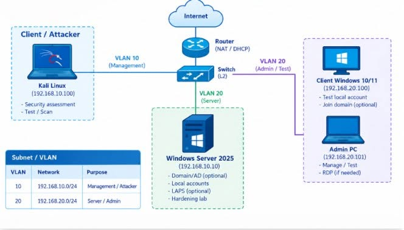

#  WINDOWS SERVER 2025 HARDENING | ACCOUNTS & PRIVILEGED ACCESS
 
> **Workflow:** `Inventory → Least Privilege → Account Hardening → Password/Lockout → UAC/Remote Admin → LAPS → Verification`

## Giới thiệu

Trong một Windows Server, không phải mọi rủi ro đều bắt đầu từ Firewall, malware hay lỗ hổng phần mềm. Đôi khi, điểm yếu lại nằm ở một câu hỏi rất cơ bản:

> **Ai đang có quyền Administrator trên server?**

Một tài khoản quản trị dùng chung, Guest vẫn được bật, nhiều server sử dụng cùng local admin password hoặc user hằng ngày cũng có quyền Administrator đều có thể trở thành điểm khởi đầu cho **credential abuse**, **brute-force** và **lateral movement**.

Trong bài lab này, chúng ta thực hành hardening lớp **Accounts & Privileged Access** trên **Windows Server 2025** theo nguyên tắc:

- **Least Privilege:** cấp đúng quyền, đúng người, đúng nhu cầu.
- **Separation of Duties:** tách tài khoản dùng hằng ngày và tài khoản quản trị.
- **Credential Hygiene:** giảm việc tái sử dụng mật khẩu quản trị.
- **Verification:** luôn kiểm chứng cấu hình sau hardening.

## LAB TOPOLOGY



### Môi trường thực hành

| Thành phần | Vai trò |
| --- | --- |
| Windows Server 2025 | Server mục tiêu để hardening |
| Windows Client 10/11 | Kiểm tra quyền tài khoản và truy cập từ xa |
| Admin PC | Kiểm tra truy cập quản trị hợp lệ |
| Kali Linux | Security assessment và test/scan trong lab |
| Switch / Router | Phân chia VLAN, kết nối các hệ thống |

### Checklist trước khi bắt đầu

- [ ] Tạo **Snapshot/Checkpoint** cho Windows Server.
- [ ] Chuẩn bị ít nhất một **tài khoản quản trị dự phòng** và xác nhận đăng nhập được.
- [ ] Mở **PowerShell với quyền Administrator**.
- [ ] Ghi nhận trạng thái tài khoản/chính sách hiện tại để so sánh trước và sau.
- [ ] Đảm bảo các thao tác chỉ thực hiện trong môi trường lab được phép.

---

## 01 | INVENTORY — KIỂM TRA TRƯỚC KHI HARDENING

Trước khi thay đổi policy, cần xác định server có những tài khoản nào và ai đang sở hữu quyền Administrator.

### Kiểm tra danh tính và quyền hiện tại

```powershell
whoami
whoami /groups
whoami /priv
```

### Liệt kê local users và thành viên Administrators

```powershell
Get-LocalUser |
    Select-Object Name, Enabled, LastLogon, PasswordRequired, PasswordExpires

Get-LocalGroupMember -Group "Administrators"
```

### Xác định built-in Administrator (RID 500)

```powershell
Get-LocalUser |
    Where-Object { $_.SID.Value -match '-500$' } |
    Select-Object Name, SID, Enabled
```

**Các câu hỏi cần trả lời:**

- [ ] Guest có đang được bật không?
- [ ] Những user nào thuộc nhóm `Administrators`?
- [ ] Có tài khoản quản trị dùng chung không?
- [ ] Có service account đang giữ quyền Administrator không cần thiết không?

**Nguyên tắc:** *Inventory trước — hardening sau.*

---

## 02 | LEAST PRIVILEGE — TÁCH STANDARD VÀ PRIVILEGED ACCOUNT

Tài khoản sử dụng hằng ngày không nên đồng thời là tài khoản quản trị.

### Tạo standard user

```powershell
$PwdUser = Read-Host "Password for lab-user" -AsSecureString

New-LocalUser -Name "lab-user" `
    -Password $PwdUser `
    -FullName "Lab Standard User"
```

### Tạo tài khoản quản trị riêng

```powershell
$PwdAdmin = Read-Host "Password for sec-admin" -AsSecureString

New-LocalUser -Name "sec-admin" `
    -Password $PwdAdmin `
    -FullName "Security Admin"

Add-LocalGroupMember `
    -Group "Administrators" `
    -Member "sec-admin"
```

### Xác minh

```powershell
Get-LocalGroupMember -Group "Administrators"
```

| Tài khoản | Quyền mong muốn | Mục đích |
| --- | --- | --- |
| `lab-user` | Standard User | Sử dụng thông thường |
| `sec-admin` | Privileged Account | Quản trị khi cần thiết |

> **Lưu ý:** Lệnh `New-LocalUser` áp dụng cho local account trên member server/workgroup, không dùng để tạo local user trên Domain Controller.

---

## 03 | ACCOUNT HARDENING — XỬ LÝ ACCOUNT MẶC ĐỊNH

### Kiểm tra và vô hiệu hóa Guest

```powershell
Get-LocalUser -Name "Guest"

Disable-LocalUser -Name "Guest"

Get-LocalUser -Name "Guest" |
    Select-Object Name, Enabled
```

**Kết quả mong muốn:** `Enabled = False`.

### Kiểm tra built-in Administrator

Không nên vội vô hiệu hóa hoặc đổi tên built-in Administrator trước khi xác nhận tài khoản quản trị thay thế hoạt động bình thường.

Nếu cần đổi tên tài khoản có **RID 500**:

```powershell
$BuiltInAdmin = Get-LocalUser |
    Where-Object { $_.SID.Value -match '-500$' }

Rename-LocalUser `
    -Name $BuiltInAdmin.Name `
    -NewName "srv-breakglass"
```

> **Quan trọng:** Đổi tên Administrator **không phải** biện pháp bảo mật chính. Ưu tiên credential riêng biệt, least privilege và kiểm soát remote access. Việc đổi tên tài khoản mặc định cần được cân nhắc theo chính sách vận hành của tổ chức.

---

## 04 | PASSWORD POLICY & ACCOUNT LOCKOUT

### Password Policy

Truy cập:

```text
secpol.msc → Account Policies → Password Policy
```

**Cấu hình đề xuất cho mục đích lab:**

| Policy | Giá trị |
| --- | --- |
| Minimum password length | `14` ký tự |
| Password must meet complexity requirements | `Enabled` |
| Enforce password history | `24` mật khẩu |
| Minimum password age | `1 day` |
| Maximum password age | `60 days` |
| Store passwords using reversible encryption | `Disabled` |

### Account Lockout Policy

```text
secpol.msc → Account Policies → Account Lockout Policy
```

| Policy | Giá trị |
| --- | --- |
| Account lockout threshold | `3` lần đăng nhập sai |
| Account lockout duration | `15 minutes` |
| Reset account lockout counter after | `15 minutes` |

### Áp dụng và kiểm tra

```powershell
gpupdate /force
net accounts
```

Có thể kiểm chứng chính sách lockout bằng **test account**.

> Không kiểm thử lockout trên tài khoản quản trị duy nhất hoặc service account. Nếu server đã join domain, cần kiểm tra **GPO/domain policy** vì local policy có thể không phải chính sách cuối cùng có hiệu lực. Giá trị trong bảng là cấu hình minh họa cho lab, không mặc định là baseline tối ưu cho mọi tổ chức.

---

## 05 | UAC & REMOTE ADMINISTRATION

### Kiểm tra UAC

```powershell
Get-ItemProperty `
    "HKLM:\SOFTWARE\Microsoft\Windows\CurrentVersion\Policies\System" |
    Select-Object EnableLUA, ConsentPromptBehaviorAdmin, PromptOnSecureDesktop
```

**Mục tiêu:** UAC được bật và Secure Desktop prompt được cấu hình phù hợp.

### Kiểm tra User Rights Assignment

Truy cập:

```text
secpol.msc → Local Policies → User Rights Assignment
```

Review các quyền quan trọng:

- `Access this computer from the network`
- `Allow log on through Remote Desktop Services`
- `Deny access to this computer from the network`
- `Deny log on through Remote Desktop Services`

**Câu hỏi quan trọng:** *Ai thực sự cần quyền remote administration?*

> Hardening không có nghĩa là chặn tất cả truy cập, mà là **cấp đúng quyền cho đúng đối tượng**. Kiểm tra kỹ chính sách `Deny` trước khi áp dụng để tránh tự khóa quyền quản trị từ xa.

---

## 06 | WINDOWS LAPS — GIẢM RỦI RO CREDENTIAL REUSE

Trong môi trường có nhiều Windows Server, sử dụng cùng một mật khẩu local Administrator tạo ra rủi ro lớn: một credential bị lộ có thể tạo điều kiện cho **lateral movement** sang các server khác.

**Windows LAPS** giúp quản lý và tự động xoay vòng (rotate) mật khẩu local administrator khi được cấu hình với nơi lưu trữ và policy phù hợp.

### Kiểm tra module LAPS

```powershell
Get-Command -Module LAPS
```

### Thu thập chẩn đoán LAPS

```powershell
Get-LapsDiagnostics -OutputFolder C:\Temp\LAPS-Diagnostics
```

**Mục tiêu triển khai:**

`Mỗi server → Credential riêng → Password được quản lý → Rotation tự động`

> **Lưu ý:** Có module LAPS hoặc chạy diagnostics thành công **không đồng nghĩa LAPS đã được triển khai**. Cần cấu hình policy, nơi sao lưu mật khẩu (AD/Entra ID, tùy môi trường), quyền truy xuất và kiểm tra trạng thái backup/rotation thực tế.

---

## 07 | VERIFICATION — HARDENING XONG PHẢI CHỨNG MINH

Sau khi thực hiện các thay đổi, cần kiểm tra lại trạng thái tài khoản và chính sách bảo mật.

### Kiểm tra account và quyền quản trị

```powershell
Get-LocalUser |
    Select-Object Name, Enabled, LastLogon, PasswordRequired, PasswordExpires

Get-LocalGroupMember -Group "Administrators"
```

### Kiểm tra password và lockout policy

```powershell
net accounts
```

### Kiểm tra UAC

```powershell
Get-ItemProperty `
    "HKLM:\SOFTWARE\Microsoft\Windows\CurrentVersion\Policies\System" |
    Select-Object EnableLUA, PromptOnSecureDesktop
```

### Before / After Comparison

| Hạng mục | Before (ghi nhận ban đầu) | After (kết quả mong muốn) |
| --- | --- | --- |
| Guest | Kiểm tra trạng thái | `Disabled` |
| `lab-user` | Chưa tạo / chưa phân quyền | `Standard User` |
| `sec-admin` | Chưa tạo / chưa phân quyền | `Privileged Account` |
| Password Policy | Kiểm tra chính sách hiện tại | Đã harden, được xác minh |
| Account Lockout | Kiểm tra chính sách hiện tại | Đã cấu hình, test bằng tài khoản thử |
| UAC | Kiểm tra giá trị hiện tại | Đã bật và xác minh |
| Remote Administration | Review quyền đăng nhập | Chỉ cho phép đối tượng cần thiết |
| Local Admin Password | Kiểm tra việc dùng chung mật khẩu | LAPS / rotation được xác minh nếu triển khai |

### Checklist hoàn thành

- [ ] Đã lưu kết quả **Inventory** trước khi cấu hình.
- [ ] Đã kiểm tra thành viên nhóm **Administrators**.
- [ ] Đã tách **Standard User** và **Privileged Account**.
- [ ] Đã xác nhận **Guest** bị vô hiệu hóa.
- [ ] Đã kiểm tra **Password/Lockout Policy**.
- [ ] Đã xác minh **UAC** và quyền truy cập quản trị từ xa.
- [ ] Đã đánh giá/triển khai **Windows LAPS** theo điều kiện môi trường.
- [ ] Đã lưu bằng chứng **Before/After**.

---

## KẾT LUẬN

Mục tiêu của **Windows Server Hardening** không phải là cấu hình được bao nhiêu security policy, mà là sau hardening, hệ thống có thực sự:

- **Giảm quyền dư thừa** (*excessive privileges*).
- **Giảm tái sử dụng thông tin đăng nhập** (*credential reuse*).
- **Hạn chế credential abuse và lateral movement**.
- **Đảm bảo khả năng quản trị an toàn** và có thể kiểm chứng.

> **Trước khi lab:** luôn tạo **Snapshot/Checkpoint** và chuẩn bị ít nhất một **tài khoản quản trị dự phòng** để tránh mất quyền truy cập server.

---