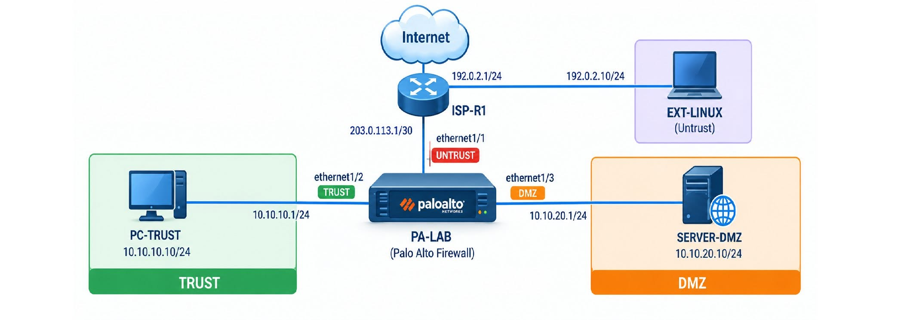

# Security Policy, Inter-Zone & NAT — Kiểm soát Traffic từ TRUST đến UNTRUST

> **Mục tiêu:** Xây dựng và kiểm chứng chính sách bảo mật giữa các zone **TRUST – DMZ – UNTRUST**, xác định rule được match, cơ chế NAT và sự thay đổi địa chỉ IP trong từng session.

## 1. Tổng quan

Firewall không chỉ đơn giản là **Allow** hoặc **Deny** traffic. Lab này tập trung đối chiếu **Security Policy**, **NAT Policy**, **Session** và **Traffic Log** để hiểu chính xác Palo Alto xử lý traffic như thế nào.

## 2. Network Topology



| Thiết bị | Zone | Địa chỉ IP | Vai trò |
|---|---|---|---|
| PC-TRUST | TRUST | `10.10.10.10/24` | Máy nội bộ |
| SERVER-DMZ | DMZ | `10.10.20.10/24` | Web server |
| EXT-LINUX | UNTRUST | `192.0.2.10/24` | Máy kiểm thử phía ngoài |
| PA-LAB `ethernet1/1` | UNTRUST | `203.0.113.2/30` | WAN firewall |
| PA-LAB `ethernet1/2` | TRUST | `10.10.10.1/24` | Gateway mạng nội bộ |
| PA-LAB `ethernet1/3` | DMZ | `10.10.20.1/24` | Gateway DMZ |
| ISP-R1 | WAN | `203.0.113.1/30` | Router phía WAN |
| ISP-R1 | External | `192.0.2.1/24` | Gateway EXT-LINUX |

## 3. Security Policy — Kiểm soát traffic giữa các zone

### 3.1. Cho phép HTTPS từ TRUST đến DMZ

Luồng cần cho phép:

```text
10.10.10.10 → 10.10.20.10:443/TCP
```

| Thuộc tính | Giá trị |
|---|---|
| Source Zone | `TRUST` |
| Destination Zone | `DMZ` |
| Application | `ssl` |
| Service | `application-default` |
| Action | `Allow` |
| Logging | `Log at Session End` |

Kiểm thử:

```bash
curl -k https://10.10.20.10/
```

**Kết quả kỳ vọng:** Server trả về `DMZ-WEB`; Traffic Log ghi nhận source `10.10.10.10`, destination `10.10.20.10`, zone `TRUST → DMZ` và rule Allow tương ứng. **Luồng này không thực hiện NAT.**

### 3.2. Chặn các dịch vụ không được phép

Tạo rule `BLOCK-TRUST-DMZ-ADMIN` để deny TCP/22 (SSH) và TCP/3389 (RDP). HTTP TCP/80 cũng phải bị chặn bởi chính sách deny phù hợp. Bật `Log at Session End` cho các rule kiểm thử.

```bash
curl http://10.10.20.10/
nc -vz 10.10.20.10 22
nc -vz 10.10.20.10 3389
```

> **Lưu ý:** Timeout hoặc lỗi kết nối chưa đủ chứng minh firewall đã deny. Cần kiểm tra **source, destination, port, Security Rule và action** trong Traffic Log. Kiểm tra thêm chiều `DMZ → TRUST` và `UNTRUST → TRUST` để xác nhận traffic không được phép bị chặn.

## 4. Source NAT — TRUST đi ra WAN

Triển khai **Dynamic IP and Port (DIPP)** để chuyển source IP khi máy nội bộ truy cập dịch vụ phía ngoài:

```text
Trước NAT: 10.10.10.10 → 192.0.2.10:443
Sau SNAT: 203.0.113.2 → 192.0.2.10:443
```

**NAT Rule:** `SNAT-TRUST-WAN`

| Thuộc tính | Giá trị |
|---|---|
| Source Zone | `TRUST` |
| Destination Zone | `UNTRUST` |
| Source Address | `NET-TRUST` |
| Destination Address | `EXT-LINUX` |
| Translation | `Dynamic IP and Port` |
| Translated Address | `Interface Address: 203.0.113.2` |

Từ PC-TRUST, truy cập HTTPS đến Web Server ngoài mạng. Trên EXT-LINUX, xem access log:

```bash
sudo tail -f /var/log/nginx/access.log
```

**Kết quả kỳ vọng:** Nginx nhìn thấy source `203.0.113.2` thay vì `10.10.10.10`. Traffic Log của Palo Alto thể hiện:

```text
Source IP     : 10.10.10.10
NAT Source IP : 203.0.113.2
Destination   : 192.0.2.10
```

Đây là bằng chứng xác nhận SNAT thực sự hoạt động, thay vì chỉ dựa vào việc truy cập web thành công.

## 5. NAT không đồng nghĩa với Allow

Kiểm tra SSH từ PC-TRUST:

```bash
nc -vz 192.0.2.10 22
```

Dù traffic có thể thỏa điều kiện NAT, Security Policy vẫn có thể deny SSH.

> **Nguyên tắc:** NAT Policy quyết định **translation**; Security Policy quyết định traffic có **được phép đi qua** hay không.

## 6. Destination NAT — Publish HTTPS của DMZ

Publish Web Server DMZ qua IP WAN của firewall:

```text
EXT-LINUX (192.0.2.10)
        │ HTTPS / TCP 443
        ▼
PA-WAN (203.0.113.2:443)
        │ DNAT
        ▼
SERVER-DMZ (10.10.20.10:443)
```

**NAT Rule:** `DNAT-DMZ-HTTPS`

| Thuộc tính | Giá trị |
|---|---|
| Source Zone | `UNTRUST` |
| Destination Address | `203.0.113.2` (PA-WAN) |
| Service | `TCP/443` |
| Translation Type | `Destination Translation` |
| Translated Address | `10.10.20.10` |
| Translated Port | `443` |

**Security Rule:** `ALLOW-UNTRUST-PUBLISHED-HTTPS`

| Thuộc tính | Giá trị |
|---|---|
| Source Zone | `UNTRUST` |
| Destination Zone | `DMZ` |
| Destination Address | `203.0.113.2` (IP trước NAT) |
| Service | `TCP/443` |
| Action | `Allow` |

> **Điểm dễ nhầm:** Trong Security Policy của Palo Alto, **Destination Zone** dựa trên zone đích sau khi xác định đường đi đến server được DNAT (`DMZ`), nhưng **Destination Address** vẫn là IP đích trước NAT (`203.0.113.2`).

## 7. Kiểm chứng DNAT bằng Traffic Log

Trên EXT-LINUX:

```bash
curl -k --http1.1 https://203.0.113.2/
```

**Kết quả kỳ vọng:**

```text
DMZ-WEB
```

Đối chiếu Traffic Log:

| Trường | Giá trị kỳ vọng |
|---|---|
| Source | `192.0.2.10` |
| Destination | `203.0.113.2` |
| NAT Destination IP | `10.10.20.10` |
| Destination Port | `443/TCP` |
| Zone | `UNTRUST → DMZ` |
| Rule | `ALLOW-UNTRUST-PUBLISHED-HTTPS` |

Trên SERVER-DMZ, kiểm tra Nginx access log hoặc `tcpdump` để xác nhận request đến server.

```text
EXT-LINUX → PA-WAN → DNAT → SERVER-DMZ
EXT-LINUX ← Reverse Translation ← SERVER-DMZ
```

## 8. Policy Match & Troubleshooting

Kiểm tra NAT Policy từ CLI Palo Alto:

```text
test nat-policy-match from TRUST to UNTRUST source 10.10.10.10 destination 192.0.2.10 protocol 6 destination-port 443
```

**Rule kỳ vọng:** `SNAT-TRUST-WAN`.

Tiếp tục kiểm tra Security Policy match và đối chiếu session/log. Thử tạo lỗi có kiểm soát như **disable SNAT** hoặc cấu hình sai **Destination Address** của rule DNAT, sau đó kiểm tra lại.

**Quy trình troubleshooting:**

1. Kiểm tra interface, zone và routing.
2. Kiểm tra NAT Policy match.
3. Kiểm tra Security Policy match.
4. Kiểm tra session và địa chỉ trước/sau NAT.
5. Đối chiếu Traffic Log.
6. Xác minh request tại server bằng access log hoặc packet capture.

Không nên dùng `allow-any` để che giấu nguyên nhân lỗi.

## 9. Kết quả và bài học rút ra

Lab giúp làm rõ cách Palo Alto kiểm soát các session xuyên zone, kết hợp **Security Policy**, **NAT**, **Session** và **Traffic Log**.

Các câu hỏi cần trả lời khi traffic thất bại:

- Route đến đích đã tồn tại và đúng chưa?
- NAT Rule có match không?
- Security Policy nào được match?
- Source/Destination trước và sau NAT là gì?
- Traffic Log ghi nhận action nào?
- Server có thực sự nhận request không?

**Kết luận:** Một kết nối thành công không tự động chứng minh policy và NAT được cấu hình đúng. Cần đối chiếu rule, session, bản dịch địa chỉ và log ở cả firewall lẫn server để xác định chính xác nguyên nhân.

---