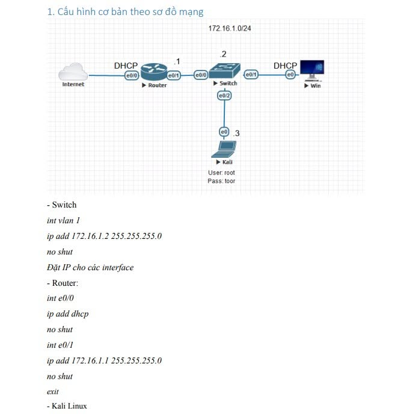

# LAB THỰC HÀNH: TẤN CÔNG MẠNG LAN VỚI NMAP – YERSINIA – ETTERCAP

> **Mục tiêu:** Tìm hiểu các kỹ thuật trinh sát và tấn công mạng LAN trong môi trường lab được cấp phép; từ đó đánh giá rủi ro và triển khai các biện pháp phòng thủ theo nguyên tắc **Defense in Depth**.

Một trong những cách hiệu quả nhất để hiểu về bảo mật mạng là thực hành các kỹ thuật tấn công trong **môi trường lab an toàn** trước khi học cách phát hiện và phòng thủ. Bài lab sử dụng ba công cụ quen thuộc trong lĩnh vực **Pentest & Network Security**: **Nmap**, **Yersinia** và **Ettercap**.

## 1. Sơ đồ và mô hình mạng



Các thiết bị trong mô hình gồm:

| Thiết bị | Vai trò | Địa chỉ IP / Cấu hình |
|---|---|---|
| **Router** | Gateway, kết nối Internet | LAN: `172.16.1.1/24`; WAN: DHCP |
| **Switch** | Kết nối các thiết bị LAN | VLAN 1: `172.16.1.2/24` |
| **Kali Linux** | Máy kiểm thử bảo mật | `172.16.1.3/24` |
| **Windows** | Máy trạm mục tiêu | Nhận IP qua DHCP |

> **Lưu ý:** Sơ đồ sử dụng mạng `172.16.1.0/24`. Chỉ thực hiện kiểm thử trên các thiết bị và hệ thống thuộc phạm vi lab được cho phép.

## 2. Giai đoạn 1 – Trinh sát mạng với Nmap

Trước khi phân tích các nguy cơ bảo mật, cần xác định những host đang hoạt động, các cổng mở và dịch vụ được cung cấp trên mạng. Sau khi dựng hạ tầng cơ bản (router/switch, NAT và DHCP), có thể dùng **Nmap** để khảo sát.

### 2.1. TCP Connect Scan

```bash
nmap -sT <IP>
```

- Sử dụng cơ chế bắt tay TCP để kiểm tra trạng thái các cổng.
- So sánh kết quả **trước và sau khi bật SSH/Telnet** trên thiết bị để quan sát sự thay đổi của bề mặt tấn công (*attack surface*).

### 2.2. OS Fingerprinting

```bash
sudo nmap -O <IP>
```

- Ước đoán hệ điều hành dựa trên đặc điểm phản hồi của TCP/IP stack.
- Kết quả chỉ mang tính suy đoán và phụ thuộc vào môi trường mạng.

### 2.3. Quét toàn bộ cổng TCP

```bash
nmap -p- <IP>
```

- Quét các cổng TCP từ `1` đến `65535`.
- Hữu ích khi rà soát các dịch vụ đang lắng nghe trên máy Windows hoặc thiết bị mạng.

### 2.4. Ping Sweep – Phát hiện host

```bash
nmap -sn 172.16.1.0/24
```

- Phát hiện host đang hoạt động trong subnet.
- Không thực hiện quét cổng.

> **Bài học phòng thủ:** Giảm thiểu dịch vụ không cần thiết, giới hạn truy cập bằng firewall/ACL và sử dụng IDS/IPS hoặc hệ thống giám sát để phát hiện hành vi quét bất thường.

## 3. Giai đoạn 2 – Khai thác giao thức Layer 2 với Yersinia

Các giao thức Layer 2 đóng vai trò quan trọng trong mạng LAN nhưng nhiều giao thức không có cơ chế xác thực nguồn gửi đủ mạnh. **Yersinia** được sử dụng trong lab để tìm hiểu ba nhóm rủi ro tiêu biểu.

### 3.1. DHCP Starvation Attack

**Cơ chế:**

Yersinia có thể tạo số lượng lớn bản tin **DHCP DISCOVER** với các địa chỉ MAC giả. Khi DHCP server cấp phát nhiều lease cho các yêu cầu này, pool địa chỉ có nguy cơ cạn kiệt, khiến máy trạm hợp lệ không nhận được IP — một dạng **Denial of Service (DoS)**.

**Quan sát trong lab:**

```text
show ip dhcp binding
```

Kiểm tra danh sách các DHCP lease để phát hiện số lượng địa chỉ được cấp phát bất thường.

**Biện pháp phòng thủ:**

- **DHCP Snooping:** Phân loại cổng trusted/untrusted và giới hạn tốc độ gói DHCP trên các cổng truy cập.
- **Port Security:** Giới hạn số lượng địa chỉ MAC được học trên một cổng (tùy điều kiện triển khai).
- Theo dõi DHCP pool và nhật ký cấp phát địa chỉ.

### 3.2. Root Bridge Attack (STP Manipulation)

**Cơ chế:**

Kẻ tấn công có thể gửi các bản tin **BPDU** giả với **Bridge ID** có mức ưu tiên cao hơn (giá trị thấp hơn) Root Bridge hiện tại, nhằm ảnh hưởng đến quá trình bầu chọn Root Bridge của **Spanning Tree Protocol (STP)**.

Nếu việc thao túng thành công, topology STP có thể thay đổi, gây ra đường truyền không tối ưu, gián đoạn kết nối hoặc tạo điều kiện để traffic đi qua thiết bị do kẻ tấn công kiểm soát trong một số cấu hình.

**Biện pháp phòng thủ:**

- **Root Guard:** Ngăn các cổng không mong muốn trở thành đường đi hướng về Root Bridge mới.
- **BPDU Guard:** Vô hiệu hóa cổng access/PortFast nếu nhận BPDU trái với thiết kế.
- Quy hoạch vị trí Root Bridge và cấu hình ưu tiên STP phù hợp.

### 3.3. CDP Flooding Attack

**Cơ chế:**

**Cisco Discovery Protocol (CDP)** được sử dụng để trao đổi thông tin giữa các thiết bị Cisco lân cận. Vì CDP không cung cấp cơ chế xác thực và mã hóa như một giao thức bảo mật, các bản tin CDP giả mạo hoặc được gửi với lưu lượng lớn có thể gây tiêu tốn tài nguyên, tùy thiết bị và phiên bản phần mềm.

**Biện pháp phòng thủ:**

- Tắt CDP trên các cổng kết nối tới endpoint khi không cần thiết:

  ```text
  no cdp enable
  ```

- Chỉ bật CDP ở những cổng hạ tầng thực sự cần trao đổi thông tin lân cận.
- Giám sát tài nguyên thiết bị và các biến động bất thường trong bảng CDP neighbor.

> **Bài học phòng thủ Layer 2:** Không mặc định tin cậy các bản tin đến từ **access port**. Áp dụng phối hợp **DHCP Snooping, Port Security, Root Guard, BPDU Guard** và các tính năng bảo vệ phù hợp với từng giao thức.

## 4. Giai đoạn 3 – Man-in-the-Middle với Ettercap

Giai đoạn này minh họa nguy cơ khi một máy trong cùng mạng LAN có thể can thiệp quá trình phân giải địa chỉ IP–MAC bằng kỹ thuật **ARP Poisoning**.

### 4.1. Cơ chế ARP Poisoning

Trong mô hình lab, hai bên liên quan là:

1. **Windows:** Máy trạm nạn nhân.
2. **Default Gateway:** Router mà Windows sử dụng để truy cập mạng ngoài.

**Ettercap** có thể phát đi các bản tin **ARP Reply giả**, nhằm làm cho:

- Windows tin rằng **IP của gateway** tương ứng với **MAC của Kali**.
- Gateway tin rằng **IP của Windows** tương ứng với **MAC của Kali**.

Khi cả hai phía bị ảnh hưởng và Kali chuyển tiếp gói tin phù hợp, traffic giữa nạn nhân và gateway có thể đi qua Kali, tạo điều kiện cho một tình huống **Man-in-the-Middle (MITM)**.

**Dấu hiệu kiểm chứng:** Đối chiếu bảng ARP của các thiết bị; các ánh xạ IP–MAC bất thường có thể là dấu hiệu bị đầu độc ARP.

### 4.2. Sniffing và nguy cơ lộ thông tin xác thực

Nếu nạn nhân đăng nhập vào một trang web qua **HTTP không mã hóa**, các trường dữ liệu gửi bằng HTTP POST có thể bị quan sát dưới dạng **plaintext** trong Wireshark, chẳng hạn ở phần **HTML Form URL Encoded**.

Một số giao thức cũ hoặc cấu hình truyền thông không mã hóa như **FTP** và **Telnet** cũng có nguy cơ làm lộ thông tin xác thực khi bị nghe lén. Mức độ quan sát được phụ thuộc vào giao thức và cách hệ thống triển khai.

### 4.3. Biện pháp phòng thủ

- **Dynamic ARP Inspection (DAI):** Kiểm tra tính hợp lệ của bản tin ARP; thường kết hợp dữ liệu binding từ DHCP Snooping.
- **DHCP Snooping:** Hỗ trợ xây dựng cơ sở kiểm tra địa chỉ IP–MAC tại switch.
- **HTTPS/TLS:** Mã hóa dữ liệu truyền trên mạng, giúp bảo vệ nội dung ngay cả khi đường truyền bị quan sát.
- **Giám sát ARP:** Phát hiện sự thay đổi địa chỉ MAC bất thường của gateway hoặc host quan trọng.

> **Bài học phòng thủ:** Mã hóa bằng **HTTPS/TLS** giúp bảo vệ tính bí mật của nội dung truyền tải. Ở Layer 2, **DAI kết hợp DHCP Snooping** có thể ngăn chặn nhiều tình huống ARP Spoofing nếu được cấu hình đúng.

## 5. Kết luận

Bài lab cho thấy việc bảo vệ mạng LAN đòi hỏi cách tiếp cận **Defense in Depth** thay vì chỉ dựa vào một công cụ hay một lớp bảo mật.

| Lớp bảo vệ | Biện pháp tiêu biểu | Mục tiêu |
|---|---|---|
| **Layer 2** | Port Security, DHCP Snooping, DAI, Root Guard, BPDU Guard | Hạn chế giả mạo và thao túng giao thức trong LAN |
| **Mạng và dịch vụ** | ACL, Firewall, tắt dịch vụ không cần thiết | Giảm bề mặt tấn công |
| **Ứng dụng** | HTTPS/TLS, hạn chế giao thức plaintext | Bảo vệ dữ liệu và thông tin đăng nhập |
| **Giám sát** | Traffic log, ARP table, CDP neighbor, DHCP binding, IDS/IPS | Phát hiện sớm hành vi bất thường |

**Thông điệp chính:** Hiểu cách các cuộc tấn công xảy ra giúp triển khai cơ chế phòng thủ phù hợp hơn, từ việc bảo vệ cổng switch, kiểm soát giao thức Layer 2 đến mã hóa lưu lượng ứng dụng.

---

**Công cụ sử dụng:** `Nmap` · `Yersinia` · `Ettercap` · `Wireshark`  
**Phạm vi thực hành:** Môi trường mạng LAN giả lập/ảo hóa được phép kiểm thử.
