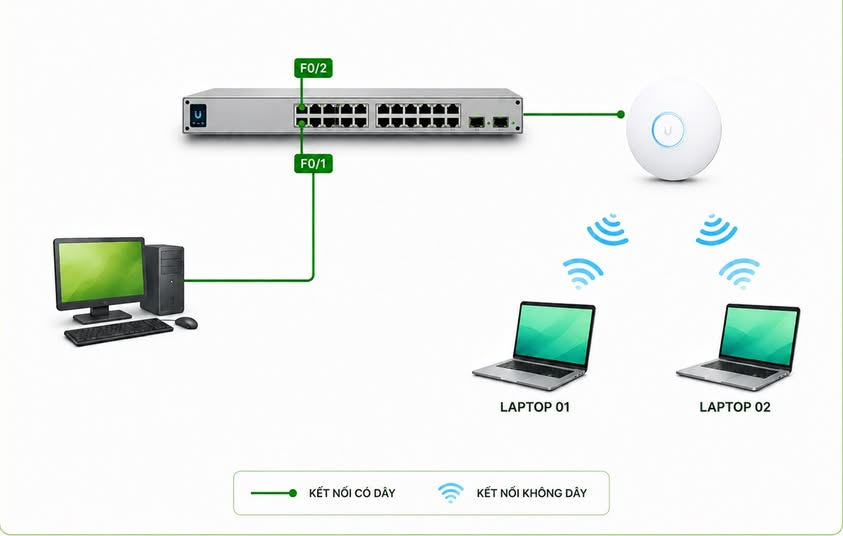

# UNIFI WIRELESS LAB – AP ADOPTION, SSID & CAPTIVE PORTAL AUTHENTICATION

## TỪ ADOPT AP ĐẾN CAPTIVE PORTAL – CLIENT KẾT NỐI WIFI NHƯNG CHƯA CHẮC ĐÃ CÓ INTERNET

Trong một hệ thống Wireless, **Client kết nối được Wi-Fi chưa có nghĩa là Client đã được phép truy cập Internet.**

Trong bài lab này, chúng ta sẽ triển khai **UniFi Network Controller** theo quy trình thực tế:

**Controller → Adopt AP → Create SSID → Client nhận IP → Captive Portal → Authentication → Internet Access**

Mục tiêu không chỉ là cấu hình UniFi Controller, mà quan trọng hơn là hiểu Client phải đi qua những bước nào trước khi được phép truy cập mạng, đồng thời biết cách kiểm tra và troubleshoot từng thành phần khi có sự cố.

---

## 1. MÔ HÌNH TRIỂN KHAI

### Các thành phần trong hệ thống

- **UniFi Network Controller:** Cài đặt trên PC, thực hiện quản lý AP, SSID và cấu hình Captive Portal.
- **UniFi Switch:** Kết nối các thiết bị trong hệ thống mạng.
- **UniFi Access Point:** Phát sóng Wi-Fi và phục vụ Wireless Client.
- **Laptop 01:** Wireless Client dùng để kiểm tra kết nối.
- **Laptop 02:** Wireless Client dùng để kiểm tra xác thực Captive Portal.

### Kết nối vật lý

| Thiết bị | Kết nối | Chức năng |
|---|---|---|
| PC Controller | Switch F0/1 | Quản lý UniFi Network |
| UniFi AP | Switch F0/2 | Cung cấp Wireless Network |
| Laptop 01 | Wireless | Kiểm tra SSID và Authentication |
| Laptop 02 | Wireless | Kiểm tra Captive Portal |
| Router/Gateway | Uplink mạng (nếu có) | Routing, DHCP và Internet Access |

**Lưu ý:** Mô hình trong hình minh họa chưa thể hiện Router/Gateway. Để kiểm tra Internet end-to-end, hệ thống cần có Gateway, DHCP, DNS và kết nối ra mạng ngoài được cấu hình phù hợp.

---

## 2. CÀI ĐẶT UNIFI NETWORK CONTROLLER

Cài đặt **UniFi Network Controller (UniFi Network Application)** trên PC theo môi trường lab.

Sau khi cài đặt, mở Controller bằng trình duyệt và thực hiện các thiết lập ban đầu.

### Initial Setup

- Country / Region
- Timezone
- Administrator Account
- Network Management

### Tài khoản sử dụng trong lab

| Thông tin | Giá trị |
|---|---|
| Controller Username | `vnpro` |
| Controller Password | `vnpro@123#` |

**Security Note:** Thông tin trên chỉ sử dụng trong môi trường lab. Khi triển khai thực tế cần sử dụng tài khoản riêng và mật khẩu đủ mạnh.

### Kiểm tra kết nối

Sau khi Controller hoạt động:

1. Kiểm tra PC đã có địa chỉ IP.
2. Kiểm tra kết nối từ PC đến mạng quản lý AP.
3. Kiểm tra AP đã được cấp IP.
4. Đảm bảo Controller có thể giao tiếp với AP.

Khi các điều kiện trên đã đáp ứng, chuyển sang bước **AP Adoption**.

---

## 3. ADOPT UNIFI ACCESS POINT

Trong UniFi Controller, truy cập mục:

**Devices → Access Point**

Nếu Controller phát hiện AP, thiết bị có thể xuất hiện với trạng thái:

**Pending Adoption**

Điều này có nghĩa Controller đã phát hiện Access Point nhưng AP chưa được Controller quản lý.

### Thực hiện Adoption

1. Chọn AP đang ở trạng thái `Pending Adoption`.
2. Nhấn `Adopt`.
3. Chờ Controller thực hiện quá trình Adoption và Provisioning.
4. Kiểm tra trạng thái thiết bị.

Kết quả mong đợi:

**Pending Adoption → Adopting → Provisioning → Connected**

Khi AP chuyển sang trạng thái **Connected**, quá trình Adoption đã hoàn tất.

### Network Engineer cần hiểu gì?

Không nên chỉ nhớ:

**Pending → Adopt → Connected**

Mà cần hiểu quá trình điều khiển và giao tiếp:

**UniFi Controller ↔ Network ↔ Access Point**

Nếu AP không Adopt được, cần kiểm tra:

- AP đã nhận IP Address chưa?
- Controller có giao tiếp được với AP không?
- Switch Port có hoạt động không?
- Management VLAN có được cấu hình đúng không?
- Firewall có chặn các kết nối cần thiết không?
- AP có đang được quản lý bởi Controller khác không?

**Kết luận:** Adoption không đơn giản là thao tác nhấn nút, mà phụ thuộc vào khả năng giao tiếp giữa Controller, Network Infrastructure và Access Point.

---

## 4. TẠO SSID VÀ KIỂM TRA WIRELESS CLIENT

Sau khi AP chuyển sang trạng thái **Connected**, tiến hành tạo Wireless Network.

### Wireless Configuration

| Parameter | Value |
|---|---|
| SSID | `vnpro_wifi` |
| Access Point | UniFi AP |
| Security | Theo yêu cầu lab |
| Wi-Fi Password | Theo cấu hình lab |
| Client Type | Wireless Laptop |

### Các bước cấu hình

1. Truy cập phần cấu hình Wi-Fi trong UniFi Controller.
2. Tạo Wireless Network mới.
3. Nhập SSID: `vnpro_wifi`.
4. Chọn phương thức bảo mật phù hợp.
5. Cấu hình Wi-Fi Password nếu sử dụng WPA/WPA2/WPA3.
6. Chọn `Save / Apply Changes`.

Controller sẽ provision cấu hình xuống AP.

### Kiểm tra từ Client

Trên Laptop:

1. Mở danh sách mạng Wi-Fi.
2. Tìm SSID `vnpro_wifi`.
3. Kết nối với SSID.
4. Nhập Wi-Fi Password nếu được yêu cầu.

Khi kết nối thành công, Client đã hoàn thành bước kết nối Wireless.

Tuy nhiên, đây mới chỉ là một phần của quá trình:

**Wireless Association ≠ Internet Access**

Client kết nối được với AP không đồng nghĩa Client đã có IP hợp lệ hoặc được phép truy cập Internet.

Đây là điểm quan trọng trong quá trình **Wireless Troubleshooting**.

---

## 5. CAPTIVE PORTAL – KIỂM SOÁT QUYỀN TRUY CẬP

Tiếp theo, triển khai **Guest Network / Captive Portal** cho Wireless Network.

Captive Portal là cơ chế yêu cầu Client thực hiện xác thực hoặc chấp nhận điều kiện truy cập trước khi được cấp quyền sử dụng mạng theo policy.

### Authentication Flow

**Client → Connect SSID → Wireless Association → DHCP/IP Address → Captive Portal → Authentication → Access Granted → Internet**

### Phân biệt hai cơ chế Authentication

**Wi-Fi Authentication**

- Xác thực ở giai đoạn kết nối Wireless.
- Có thể sử dụng WPA2/WPA3 Password.
- Cho phép Client tham gia mạng Wi-Fi khi đáp ứng yêu cầu bảo mật.

**Captive Portal Authentication**

- Diễn ra sau khi Client đã kết nối Wi-Fi và có kết nối mạng phù hợp.
- Có thể yêu cầu nhập Voucher, Password hoặc phương thức xác thực khác.
- Xác định Client có được cấp quyền truy cập theo policy hay không.

**Điểm cần nhớ:**

**Wi-Fi Password ≠ Captive Portal Access Code**

### Cấu hình Captive Portal

Trong UniFi Controller:

1. Truy cập phần cấu hình Guest/Hotspot.
2. Bật Hotspot/Captive Portal cho SSID tương ứng.
3. Chọn phương thức Authentication theo yêu cầu lab.
4. Cấu hình Access Policy.
5. Lưu và áp dụng cấu hình.

Tên menu có thể khác nhau tùy theo phiên bản UniFi Network đang sử dụng.

Sau khi áp dụng, Controller sẽ cập nhật cấu hình liên quan xuống các thiết bị UniFi.

---

## 6. TẠO MÃ TRUY CẬP CAPTIVE PORTAL

Trong mô hình Guest Network, có thể sử dụng **Voucher/Access Code** để xác thực Client trước khi cho phép truy cập Internet.

### Nguyên tắc hoạt động

Mã truy cập Captive Portal không phải là Wi-Fi Password.

Client cần thực hiện theo đúng thứ tự:

1. Kết nối vào SSID.
2. Nhận địa chỉ IP từ DHCP Server.
3. Truy cập Captive Portal.
4. Nhập mã truy cập.
5. Hệ thống xác thực mã.
6. Client được cấp quyền truy cập theo policy.

### Ví dụ mã truy cập trong lab

- Voucher 01
- Voucher 02
- Voucher 03
- Voucher 04

Các Voucher cần được tạo trong hệ thống UniFi và có thể được cấu hình giới hạn thời gian hoặc số lượt sử dụng tùy khả năng của phiên bản triển khai.

### Captive Portal Flow

**Client → vnpro_wifi → DHCP → Browser → Captive Portal → Enter Voucher → Authentication → Access Granted → Internet**

### Troubleshooting Point

Khi Client đã kết nối Wi-Fi nhưng chưa truy cập Internet, cần kiểm tra:

- Client đã được cấp IP chưa?
- Default Gateway có đúng không?
- Captive Portal có xuất hiện không?
- Voucher có hợp lệ không?
- Voucher đã hết hạn hoặc hết lượt sử dụng chưa?
- Client đã được Authorized chưa?
- Access Policy có cho phép Internet không?

**Kết luận:** Wireless Connected không đồng nghĩa với Captive Portal Authorized.

---

## 7. TEST CLIENT END-TO-END

Đây là bước quan trọng nhất để xác minh toàn bộ hệ thống hoạt động.

### Step 1 – Kết nối Wireless

Trên Laptop, kết nối vào SSID:

`vnpro_wifi`

Xác nhận Wireless Connection đã thành công.

### Step 2 – Kiểm tra IP Address

Trên Windows, mở CMD:

`ipconfig /all`

Kiểm tra các thông số:

- IP Address
- Subnet Mask
- Default Gateway
- DNS Server
- DHCP Server

Client cần được cấp địa chỉ IP phù hợp với mạng Guest/Wireless.

Nếu Client không nhận được IP, cần kiểm tra DHCP, VLAN, Switch Port và kết nối Layer 2 trước khi xử lý Captive Portal.

### Step 3 – Kiểm tra Default Gateway

Thực hiện:

`ping <default-gateway>`

Ví dụ, nếu Gateway là `192.168.1.1`:

`ping 192.168.1.1`

Nếu không ping được Gateway, cần kiểm tra thêm VLAN, IP Address, ARP, Routing và chính sách ICMP.

Một số thiết bị có thể chặn ICMP, vì vậy ping thất bại chưa đủ để kết luận mất kết nối mạng.

### Step 4 – Kiểm tra Captive Portal

Mở trình duyệt trên Client.

Nếu Captive Portal hoạt động đúng, Client thường sẽ được dẫn đến trang xác thực khi phát sinh lưu lượng truy cập web phù hợp.

Nếu không xuất hiện trang xác thực tự động, có thể thử truy cập một website HTTP như:

`http://neverssl.com`

Tránh kết luận Captive Portal lỗi chỉ vì một website HTTPS không tự chuyển hướng.

### Step 5 – Xác thực Captive Portal

Tại trang Portal:

1. Nhập mã Voucher đã tạo.
2. Gửi yêu cầu Authentication.
3. Chờ hệ thống xác thực.
4. Kiểm tra trạng thái được cấp quyền truy cập.

Kết quả mong đợi:

**Authentication Successful → Access Granted**

### Step 6 – Kiểm tra Internet

Sau khi xác thực thành công, thực hiện:

`ping 8.8.8.8`

Kiểm tra DNS:

`nslookup example.com`

Cuối cùng, mở trình duyệt và truy cập một website.

Phân biệt các tình huống:

- **Ping Gateway thành công, không ra Internet:** Kiểm tra Routing, NAT, Firewall, Captive Portal Policy và kết nối WAN.
- **Ping 8.8.8.8 thành công, không truy cập website:** Kiểm tra DNS, HTTP/HTTPS và chính sách truy cập.
- **Không xuất hiện Captive Portal:** Kiểm tra Hotspot Configuration, Redirect và khả năng kết nối đến Portal.
- **Authentication thành công nhưng không có Internet:** Kiểm tra Authorization Policy, Gateway, NAT và WAN.

### Expected Result

**Wireless Connected → IP Assigned → Gateway Reachable → Portal Authenticated → Internet Accessible**

Khi các bước kiểm tra thành công, có thể kết luận quá trình end-to-end đã hoạt động theo yêu cầu lab.

---

## 8. KIỂM TRA CLIENT TRÊN UNIFI CONTROLLER

Quay lại UniFi Controller và truy cập:

**Clients**

Tìm Client vừa kết nối.

### Thông tin cần kiểm tra

| Parameter | Description |
|---|---|
| Client | Thiết bị đang kết nối |
| MAC Address | Địa chỉ MAC của Client |
| IP Address | Địa chỉ IP được cấp |
| Connected AP | Access Point đang phục vụ Client |
| SSID | Wireless Network Client đang sử dụng |
| Connection Status | Trạng thái kết nối |
| Authorization Status | Trạng thái xác thực, nếu phiên bản hỗ trợ hiển thị |

### Đối chiếu hai phía

**Client Side**

- Có thấy SSID không?
- Có kết nối Wi-Fi không?
- Có IP Address không?
- Có Default Gateway không?
- Captive Portal có xuất hiện không?
- Có Internet Access không?

**Controller Side**

- Controller có nhìn thấy Client không?
- Client đang kết nối AP nào?
- Client thuộc SSID nào?
- Có nhận đúng địa chỉ IP không?
- Client đã được cấp quyền truy cập chưa?

Việc đối chiếu thông tin giữa Client và Controller giúp xác định nhanh lỗi nằm ở Wireless, IP Connectivity hay Authentication.

---

## 9. TROUBLESHOOTING THEO NETWORK FLOW

### Case 01 – AP không xuất hiện trên Controller

Kiểm tra đường kết nối:

**PC Controller → Switch → UniFi AP**

Các bước thực hiện:

- Kiểm tra nguồn điện hoặc PoE của AP.
- Kiểm tra kết nối vật lý.
- Kiểm tra Switch Port.
- Kiểm tra IP Address của AP.
- Kiểm tra VLAN quản lý.
- Kiểm tra khả năng giao tiếp giữa Controller và AP.
- Kiểm tra Firewall và Discovery.

### Case 02 – AP Pending Adoption quá lâu

Không nên chỉ thực hiện Adopt lại liên tục.

Kiểm tra:

**Controller ↔ Network ↔ Access Point**

Cần đảm bảo:

- Controller hoạt động ổn định.
- AP có thể liên lạc với Controller.
- Management VLAN đúng.
- Không có Firewall Rule chặn kết nối cần thiết.
- AP không bị ràng buộc với Controller khác.

### Case 03 – Client thấy SSID nhưng không kết nối được

Kiểm tra:

- Wireless Security Mode.
- Wi-Fi Password.
- SSID Configuration.
- AP Radio Settings.
- Tương thích giữa Client và chuẩn bảo mật đang sử dụng.

### Case 04 – Client kết nối Wi-Fi nhưng không nhận IP

Kiểm tra:

- DHCP Server.
- DHCP Scope/Pool.
- VLAN của SSID.
- Switch Port Configuration.
- Trunk/Tagged VLAN nếu được sử dụng.
- DHCP Relay nếu Server nằm khác subnet.

### Case 05 – Client có IP nhưng không xuất hiện Captive Portal

Kiểm tra:

- Hotspot/Captive Portal đã được bật chưa?
- SSID đã được gán đúng Hotspot Policy chưa?
- Client có truy cập được Portal không?
- DNS Resolution có hoạt động không?
- Redirect có bị ảnh hưởng bởi HTTPS không?
- Firewall có chặn Portal không?

### Case 06 – Client xác thực thành công nhưng không có Internet

Kiểm tra theo thứ tự:

**Client → IP → Gateway → Captive Portal Authentication → Access Policy → Routing → NAT → WAN**

Đặc biệt kiểm tra:

- Default Gateway.
- Authorization Status.
- Firewall Rule.
- NAT Configuration.
- DNS.
- Internet Uplink.

### Troubleshooting Summary

| Hiện tượng | Thành phần cần kiểm tra |
|---|---|
| AP không xuất hiện | Physical, IP, VLAN, Discovery |
| Adoption thất bại | Controller, Connectivity, Firewall |
| Không thấy SSID | AP, Radio, SSID Configuration |
| Không kết nối Wi-Fi | Wireless Security, Password |
| Không nhận IP | DHCP, VLAN, Switching |
| Không hiện Portal | Hotspot, DNS, Redirect, Firewall |
| Voucher không hợp lệ | Authentication, Voucher Settings |
| Không có Internet | Gateway, Access Policy, NAT, WAN |

**Nguyên tắc:** Troubleshoot theo từng Layer và từng giai đoạn thay vì kết luận ngay rằng AP hoặc Controller bị lỗi.

---

## 10. LAB VERIFICATION CHECKLIST

### Controller & Access Point

- [ ] UniFi Network Controller hoạt động.
- [ ] Controller giao tiếp được với AP.
- [ ] AP nhận được IP Address.
- [ ] AP được Adopt thành công.
- [ ] AP chuyển sang trạng thái Connected.

### Wireless Network

- [ ] Tạo thành công SSID `vnpro_wifi`.
- [ ] Cấu hình Wireless Security.
- [ ] Laptop phát hiện SSID.
- [ ] Laptop kết nối SSID thành công.

### Captive Portal

- [ ] Kích hoạt Guest/Hotspot/Captive Portal.
- [ ] Cấu hình Authentication Method.
- [ ] Tạo Voucher/Access Code.
- [ ] Client nhận IP và Default Gateway.
- [ ] Captive Portal xuất hiện.
- [ ] Voucher xác thực thành công.
- [ ] Client được cấp quyền truy cập.

### End-to-End Testing

- [ ] Client xuất hiện trên Controller.
- [ ] Controller hiển thị đúng SSID và AP.
- [ ] Kiểm tra Gateway thành công.
- [ ] Kiểm tra Internet IP Connectivity.
- [ ] Kiểm tra DNS Resolution.
- [ ] Client truy cập website thành công.

---

## 11. GÓC NHÌN NETWORK ENGINEER

Điểm quan trọng của bài lab không nằm ở việc ghi nhớ từng menu trong UniFi Controller, mà là hiểu được **End-to-End Wireless Client Flow**.

Kết nối Wi-Fi chỉ là bước đầu tiên.

Để truy cập Internet, Client còn cần đi qua nhiều thành phần:

**Wireless Association → IP Addressing → Default Gateway → Captive Portal → Authentication → Access Policy → Internet**

Một lỗi tại bất kỳ thành phần nào cũng có thể khiến Client kết nối được Wi-Fi nhưng không sử dụng được Internet.

Từ mô hình này, chúng ta có thể mở rộng sang các chủ đề thực tế hơn:

- **Guest VLAN:** Tách biệt mạng khách với mạng nội bộ.
- **DHCP:** Quản lý việc cấp IP cho Wireless Client.
- **Captive Portal:** Kiểm soát truy cập bằng Authentication.
- **Access Control:** Áp dụng Security Policy cho từng nhóm Client.
- **Multiple AP:** Mở rộng vùng phủ sóng Wireless.
- **Centralized Wireless Management:** Quản lý nhiều Access Point tập trung.

### KẾT LUẬN

Một hệ thống Wireless hoạt động tốt không chỉ cần phát được SSID mà còn phải đảm bảo toàn bộ quá trình từ kết nối, cấp IP, xác thực đến cấp quyền truy cập hoạt động chính xác.

**Wireless Connected ≠ Internet Accessible**

Đây cũng chính là tư duy cần có khi triển khai và troubleshooting hệ thống Wireless trong môi trường doanh nghiệp.