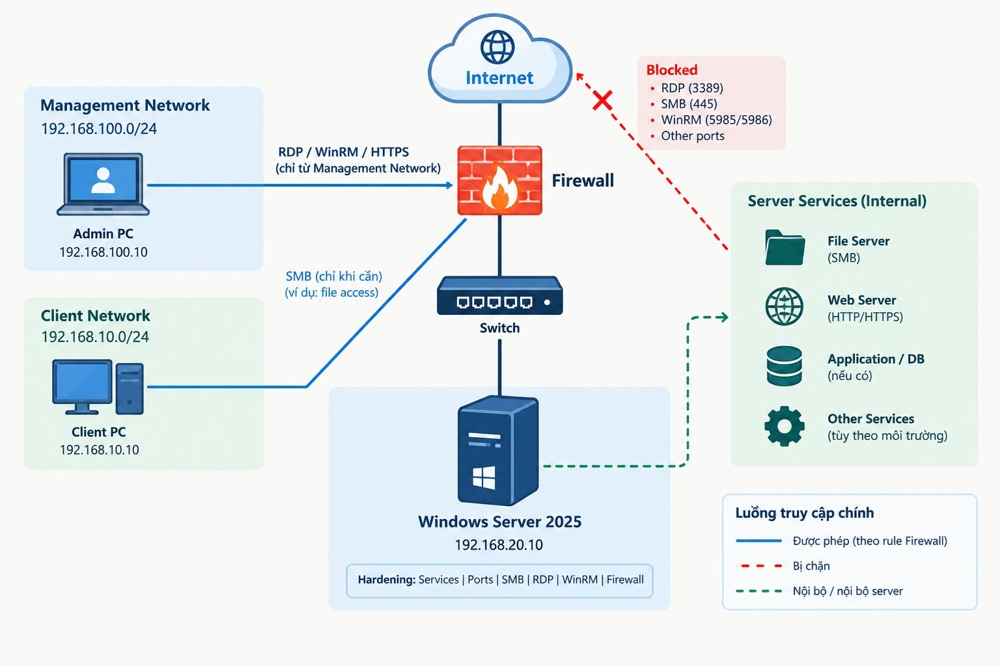

# WINDOWS SERVER 2025 – KIỂM TRA & GIẢM ATTACK SURFACE

> **Chủ đề:** Windows Server Hardening – Service Inventory, Listening Ports, SMB, RDP, WinRM và Windows Defender Firewall.
>
> **Mục tiêu:** Chỉ giữ **đúng dịch vụ cần thiết – đúng port cần thiết – đúng nguồn được phép truy cập**.

## 1. Tổng quan bài lab

Một Windows Server đang hoạt động bình thường **chưa có nghĩa là server đã được bảo vệ tốt**.

Trong thực tế, *Attack Surface* (bề mặt tấn công) có thể đến từ:

- Các service không cần thiết vẫn đang chạy.
- Những port đang ở trạng thái listening.
- SMB, RDP hoặc WinRM được mở quá rộng.
- Windows Defender Firewall chưa giới hạn đúng nguồn truy cập.

Trong lab này, Windows Server 2025 được hardening theo workflow:

**Services → Ports → SMB → RDP → WinRM → Windows Defender Firewall → Verification**

Mục tiêu **không phải “tắt càng nhiều càng tốt”**, mà là giữ các dịch vụ phục vụ nghiệp vụ và kiểm soát chặt chẽ quyền truy cập.

## 2. Sơ đồ mạng (Topology)



| Thành phần | Địa chỉ / Mạng | Vai trò |
|---|---|---|
| **Management Network** | `192.168.100.0/24` | Mạng quản trị |
| **Admin PC** | `192.168.100.10` | Quản trị server qua RDP, WinRM, HTTPS khi cần |
| **Client Network** | `192.168.10.0/24` | Mạng người dùng |
| **Client PC** | `192.168.10.10` | Truy cập dịch vụ được cấp quyền, ví dụ SMB |
| **Windows Server 2025** | `192.168.20.10` | Máy chủ cần hardening |
| **Firewall** | — | Kiểm soát lưu lượng và nguồn truy cập |

**Nguyên tắc thiết kế:** Không expose trực tiếp các cổng quản trị như RDP (`3389`), SMB (`445`) hoặc WinRM (`5985`/`5986`) ra Internet. Chỉ cho phép các luồng nội bộ thực sự cần thiết.

---

## 01 | SERVICE INVENTORY

Trước khi thay đổi bất kỳ cấu hình nào, cần xác định **server đang chạy những service nào**.

Các service cần đưa vào danh sách đánh giá gồm:

- **Print Spooler** – dịch vụ in ấn.
- **Remote Registry** – quản trị Registry từ xa.
- **TermService** – dịch vụ Remote Desktop.
- **WinRM** – quản trị từ xa qua Windows Remote Management.

> [!IMPORTANT]
> Không disable service chỉ dựa trên tên. Windows Server có thể đang chạy IIS, File Server, SQL Server, Hyper-V, Backup Agent hoặc Monitoring Agent. Việc tắt nhầm service có thể ảnh hưởng trực tiếp đến nghiệp vụ.

Phân loại từng service và ghi nhận trạng thái ban đầu:

| Phân loại | Ý nghĩa |
|---|---|
| `Required` | Dịch vụ cần thiết, phải giữ hoạt động |
| `Not Required` | Không cần thiết, xem xét vô hiệu hóa |
| `Review` | Cần xác minh thêm trước khi thay đổi |

**Đầu ra:** Bảng kiểm kê service và trạng thái **Before** để đối chiếu sau hardening.

## 02 | LISTENING PORTS – SERVER ĐANG MỞ NHỮNG GÌ?

Kiểm tra các cổng TCP/UDP đang listening và đối chiếu theo luồng:

**Port → PID → Process → Service**

| Port | Giao thức / Dịch vụ | Mục đích phổ biến |
|---|---|---|
| `135/TCP` | RPC | Giao tiếp RPC |
| `445/TCP` | SMB | Chia sẻ file / tài nguyên |
| `3389/TCP` | RDP | Remote Desktop |
| `5985/TCP` | WinRM HTTP | Quản trị từ xa |
| `5986/TCP` | WinRM HTTPS | Quản trị từ xa qua TLS |
| `80/TCP` | HTTP | Web Service (nếu có) |
| `443/TCP` | HTTPS | Web Service (nếu có) |

Với mỗi port, cần trả lời ba câu hỏi:

1. Port này phục vụ dịch vụ gì?
2. Dịch vụ đó có thực sự cần thiết không?
3. Những nguồn nào được phép truy cập?

**Đầu ra:** Danh sách listening ports và đánh giá mức độ cần thiết trước khi hardening.

## 03 | SMB HARDENING

SMB là một trong những thành phần cần kiểm tra kỹ vì thường liên quan đến chia sẻ dữ liệu nội bộ.

Các hạng mục kiểm tra:

- Trạng thái **SMBv1** và khả năng vô hiệu hóa nếu không còn yêu cầu tương thích với hệ thống cũ.
- Trạng thái **SMBv2/SMBv3**.
- Các **SMB Shares** đang được chia sẻ.
- Các **SMB Sessions** hiện có.
- Các **Open Files** thông qua SMB.
- Quy tắc truy cập **TCP/445** trên Firewall.

**Cấu hình mục tiêu:**

| Hạng mục | Trạng thái mong muốn |
|---|---|
| SMBv1 | `Disabled` |
| SMBv2/SMBv3 | `Enabled` khi nghiệp vụ yêu cầu |
| TCP/445 | Chỉ cho phép từ các nguồn được cấp quyền |

Như vậy, SMB Hardening không chỉ dừng ở việc kiểm soát **protocol** mà còn kiểm soát **nguồn truy cập** đến dịch vụ.

## 04 | RDP – KHÔNG CHỈ MỞ PORT 3389

Nếu sử dụng Remote Desktop, cần kiểm tra:

- Trạng thái **TermService**.
- **Network Level Authentication (NLA)**.
- Nhóm user được phép đăng nhập qua RDP.
- Firewall Rule cho **TCP/3389**.

Bật NLA để yêu cầu xác thực sớm hơn trong quá trình thiết lập phiên RDP.

**Không expose trực tiếp RDP ra Internet.** Mô hình truy cập quản trị an toàn hơn:

```text
VPN → Jump Host / RD Gateway → Windows Server
```

Chỉ cho phép **Management Network** hoặc các máy quản trị được chỉ định truy cập TCP/3389.

## 05 | WINRM – KIỂM SOÁT QUẢN TRỊ TỪ XA

WinRM thường sử dụng:

| Port | Chức năng |
|---|---|
| `5985/TCP` | WinRM HTTP |
| `5986/TCP` | WinRM HTTPS |

Nội dung kiểm tra:

- Trạng thái dịch vụ **WinRM**.
- Các **WinRM Listener**.
- Listening ports tương ứng.
- Nguồn truy cập được cho phép qua Firewall.

Nếu không sử dụng PowerShell Remoting, đánh giá khả năng disable WinRM. Nếu cần quản trị từ xa, **giới hạn nguồn truy cập** và ưu tiên **WinRM HTTPS** trong môi trường yêu cầu bảo mật cao.

## 06 | WINDOWS DEFENDER FIREWALL

Đây là một trong những phần quan trọng nhất của lab.

Kiểm tra Firewall trên cả ba profile:

- **Domain**
- **Private**
- **Public**

Áp dụng nguyên tắc:

```text
Default Inbound = Block
```

Thay vì mở rộng quyền truy cập, chỉ tạo exception cho dịch vụ thực sự cần thiết:

| Dịch vụ | Nguồn truy cập được phép | Điều kiện |
|---|---|---|
| **RDP – 3389/TCP** | Management Network | Chỉ khi cần quản trị từ xa |
| **SMB – 445/TCP** | Client/Server được cấp quyền | Chỉ khi cần chia sẻ file |
| **WinRM – 5985/5986/TCP** | Máy quản trị được chỉ định | Chỉ khi cần remote management |
| **HTTPS – 443/TCP** | Nguồn phù hợp với ứng dụng | Chỉ nếu server cung cấp Web Service |

**Điểm quan trọng:** Firewall Rule không chỉ kiểm soát **port** mà còn có thể giới hạn **Remote Address / nguồn truy cập**.

## 07 | VERIFICATION – BEFORE VS AFTER

Sau khi hardening, **không thể chỉ nhìn cấu hình và kết luận server đã an toàn**. Cần kiểm thử lại từ nhiều nguồn, ví dụ:

- Từ Windows Client: **PowerShell `Test-NetConnection`** (kiểm tra kết nối TCP).
- Từ Kali Linux: **Nmap** (kiểm tra khả năng truy cập các cổng).
- Từ máy quản trị: xác minh các phiên RDP, SMB, WinRM được phép vẫn hoạt động.

Đối chiếu các tiêu chí:

| Hạng mục | Before | After (kỳ vọng) |
|---|---|---|
| Service không cần thiết | Có thể đang chạy | Được đánh giá và disable nếu phù hợp |
| Listening ports | Có thể mở nhiều cổng | Chỉ còn các cổng phục vụ nghiệp vụ |
| SMBv1 | Cần xác minh | Disabled nếu không còn yêu cầu legacy |
| RDP | Có thể truy cập quá rộng | Chỉ nguồn quản trị được phép |
| SMB | Có thể truy cập quá rộng | Chỉ nguồn cần dùng SMB |
| WinRM | Cần kiểm tra listener và rule | Được disable hoặc giới hạn đúng nguồn |
| Firewall profiles | Cần kiểm tra | Cấu hình nhất quán theo chính sách |
| Ứng dụng nghiệp vụ | Hoạt động | Vẫn hoạt động bình thường |

> [!NOTE]
> **Listening** và **Reachable** là hai khái niệm khác nhau: một port có thể vẫn listening trên server nhưng bị Firewall chặn từ một nguồn nhất định. Phải kiểm tra từ đúng mạng nguồn để xác nhận hiệu lực rule.

Kiểm tra lại toàn bộ **Firewall Profiles, Services, Listening Ports, SMBv1 và các ứng dụng nghiệp vụ** để đảm bảo hệ thống hoạt động đúng thiết kế.

---

## KẾT QUẢ KỲ VỌNG

Một bài **Windows Server Hardening** hoàn chỉnh không phải là disable thật nhiều service hoặc đóng thật nhiều port.

Kết quả cần đạt:

**Giảm Attack Surface → Kiểm soát Remote Access → Firewall có chủ đích → Dịch vụ nghiệp vụ vẫn hoạt động**

Người thực hiện cần:

- Giải thích được **vì sao giữ, disable hoặc giới hạn** từng service/port.
- Chứng minh sự thay đổi qua kết quả kiểm thử **Before / After**.
- Xác nhận các chức năng phục vụ nghiệp vụ **không bị ảnh hưởng**.

> **Thông điệp chính:** Tập trung vào tư duy **giảm Attack Surface** và **kiểm soát Remote Access**, thay vì chỉ học cấu hình theo từng câu lệnh.
